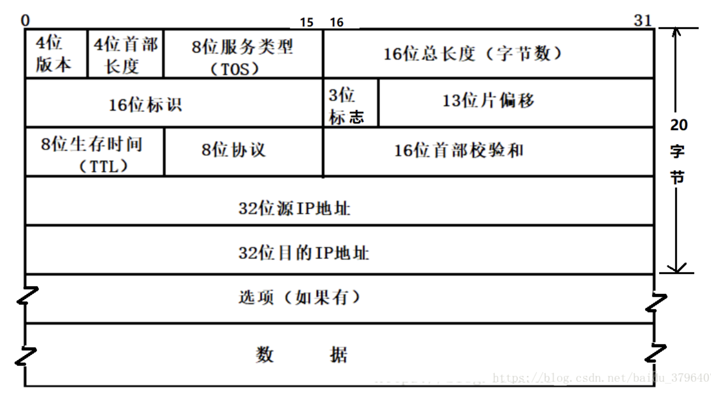

# IP 协议详解

## IP 报文

解析：

| 字段                             | 解释                                                         |
| -------------------------------- | ------------------------------------------------------------ |
| 4位版本号(version)               | 指定IP协议的版本, 对于IPv4来说，就是4                        |
| 4位头部长度(header length)       | IP头部的长度是多少个32bit, 也就是 length * 4 的字节数. 4bit表示最大的数字是15, 因此IP头部最大长度是60字节 |
| 8位服务类型(Type Of Service)     | 3位优先权字段(已经弃用), 4位TOS字段, 和1位保留字段(必须置0). 4位TOS（最小延时, 最大吞吐量, 最高可靠性, 最小成本),只能选其一. ssh/telnet这样的应用程序, 最小延时比较重要; 对于ftp这样的程序, 最大吞吐量比较重要 |
| 16位总长度(total length)         | IP数据报整体占多少个字节                                     |
| 16位标识(id)                     | 唯一的标识主机发送的报文. 如果IP报文在数据链路层被分片了, 那么每一个片里面的这个id是相同的 |
| 3位标志字段                      | 第一位保留，第二位置为1表示禁止分片, 这时候如果报文长度超MTU, IP模块就会丢弃报文. 第三位表示”更多分片”, 如果分片了的话, 最后一个分片置为1, 其他是0 |
| 13位分片偏移(framegament offset) | 是分片相对于原始IP报文开始处的偏移. 其实就是在表示当前分片在原报文中处在哪个位置 |
| 8位生存时间(Time To Live, TTL)   | 数据报到达目的地的最大报文跳数                               |
| 8位协议                          | 表示上层协议的类型                                           |
| 16位头部校验和                   | 使用CRC进行校验, 来鉴别头部是否损坏                          |
| 32位源地址和32位目标地址         | 表示发送端和接收端                                           |
| 选项字段                         | 不定长, 最多40字节                                           |

