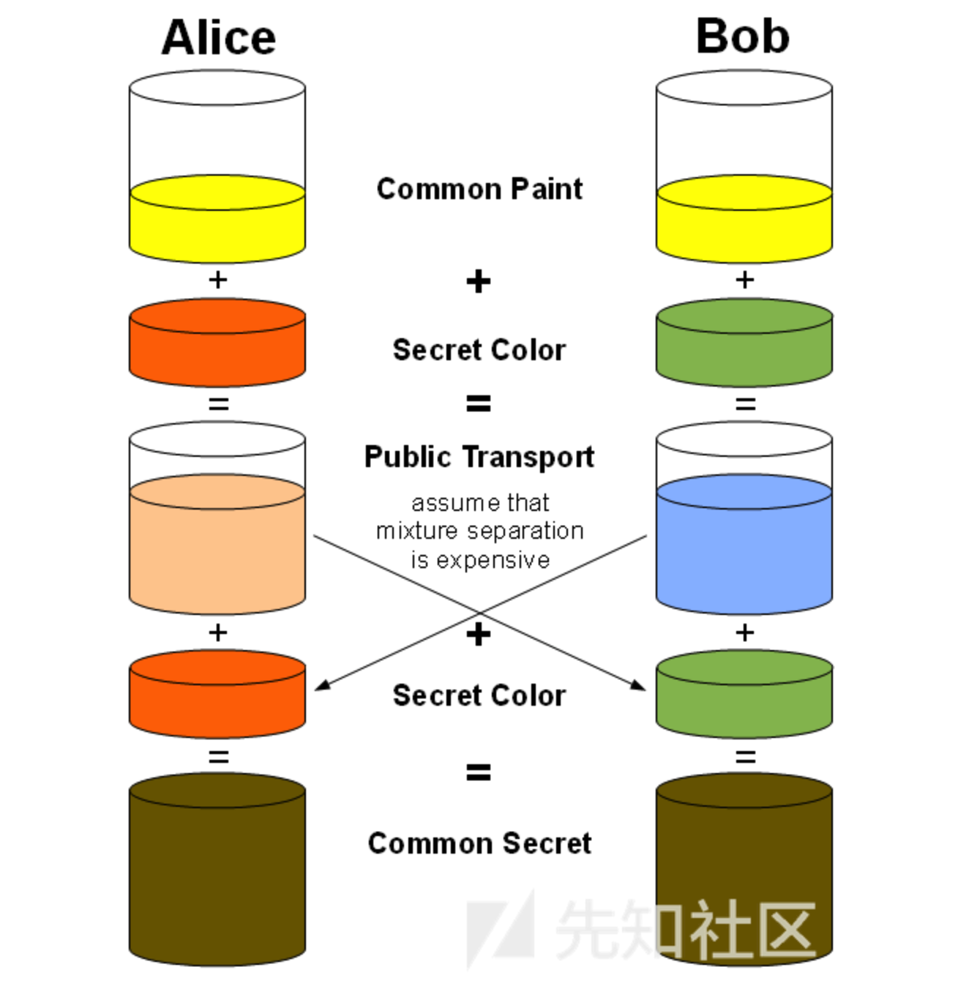

# TLS 协议详解

SSL (Secure Sockets Layer）安全套接层。是由Netscape公司于1990年开发，用于保障Word Wide Web（WWW）通讯的安全。主要任务是提供**私密性，信息完整性和身份认证**。1994年改版为SSLv2,1995年改版为SSLv3.

TLS(Transport Layer Security）安全传输层协议,）用于在两个通信应用程序之间提供保密性和数据完整性。该标准协议是由IETF于1999年颁布，整体来说TLS非常类似SSLv3，只是对SSLv3做了些增加和修改。

## 加密算法

加密算法大致包括三种：散列、对称加密，非对称加密。

#### 对称加密

对称加密就是双方使用的密钥一致，但是这种存在被暴力破解的可能性。如今，存在诸如AES（高级加密标准）和3DES（三重数据加密算法）的复杂算法。它们都被公认为很难破解。

很难被破解的原因是因为现代计算机的算力不够！

这是在发送和接收数据时在SSL/TLS中使用的加密技术。但客户端和服务器需要在开始加密数据之前就密钥达成一致并进行交换，是这样的吗？交换密钥的最初步骤显然是纯文本。如果攻击者在共享密钥时捕获密钥怎么办？那使用它也就没有了意义。因此，我们需要一种安全机制来交换密钥，而不会让攻击者真正看到它。所以就出现了**非对称密钥加密**的作用。

#### 非对称加密

与对称加密相比，在**非对称加密**中，将有两个关键点而不是一个。一个称为**公钥**，另一个称为**私钥**。理论上，在启动期间，我们可以生成公私钥匙对我们的机器。私钥应保存在安全的地方，绝不应与任何人共享。顾名思义，公钥可以与希望向您发送加密文本的任何人共享。现在，那些拥有您的公钥的人可以使用它加密秘密数据。如果密钥对是使用RSA算法生成的，那么它们应该在加密数据时使用相同的算法。一般来说，加密算法会在公钥中指定，加密数据只能使用您拥有的私钥。

非对称加密也称为**公钥基础结构**，又称**PKI**，这样命名的原因是自解释。不管怎样，只要您保持私钥安全，数据就是安全的。多好啊！所以，现在你可能会想，为什么我们仍然会在TLS中使用对称加密？我们有很多安全的**PKI**啊。是的，我也同意。但应该指出，必须在不影响可用性的情况下再处理安全的问题。由于PKI涉及双密钥架构并且密钥长度通常很大，因此加密-解密开销非常高。与对称密钥加密相比，它需要更多的时间和CPU占有率。

因此，当在客户端和服务器之间发送和接收数据时，用户会感觉到等待的时间更久，而且浏览器会开始吃掉CPU。因此PKI仅用于在客户端和服务器之间交换对称密钥，此后，才是对称密钥加密开始起作用并且新的数据传输也使用了这种技术。

## 密钥交换算法

非对称加密用于交换密钥，但用哪种算法呢？自从非对称密码学发明以来，提出了许多算法。在写这篇文章的过程中，TLS1.2是常用的标准，还有RSA、Diffie-Hellman密钥交换、ECDH（Elliptic Curve Diffie-Hellman）、SRP（安全远程密码）、由TLS 1.2支持密钥交换算法PSK（Pre Shared Key）。

在这里讨论所有算法可能是个麻烦事，相反我们将讨论最常见且易于理解的Diffie-Hellman密钥交换算法。

#### Diffie-Hellman Key Exchange

