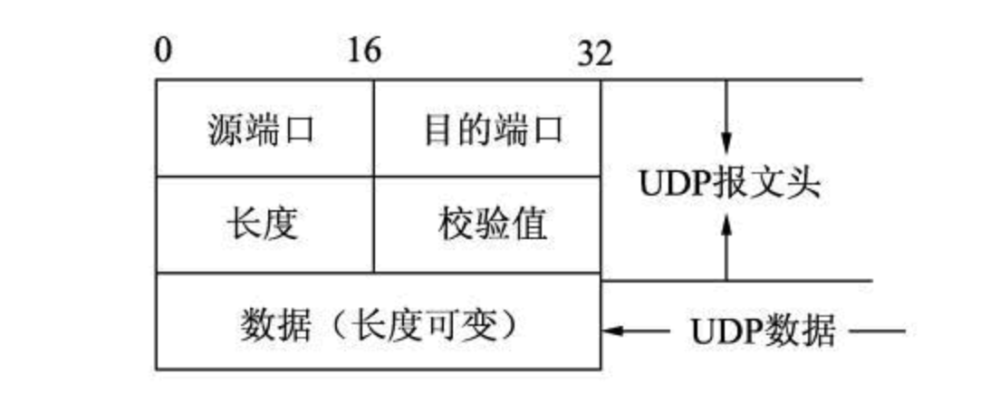

# UDP 报文

每个 UDP 报文分为 UDP 报头和 UDP 数据区两部分。报头由 4 个 16 位长（2 字节）字段组成，分别说明该报文的源端口、目的端口、报文长度和校验值。

UDP 报文中每个字段的含义如下：

- 源端口：这个字段占据 UDP 报文头的前 16 位，通常包含发送数据报的应用程序所使用的 UDP 端口。接收端的应用程序利用这个字段的值作为发送响应的目的地址。这个字段是可选的，所以发送端的应用程序不一定会把自己的端口号写入该字段中。如果不写入端口号，则把这个字段设置为 0。这样，接收端的应用程序就不能发送响应了。
- 目的端口：接收端计算机上 UDP 软件使用的端口，占据 16 位。
- 长度：该字段占据 16 位，表示 UDP 数据报长度，包含 UDP 报文头和 UDP 数据长度。因为 UDP 报文头长度是 8 个字节，所以这个值最小为 8。
- 校验值：该字段占据 16 位，可以检验数据在传输过程中是否被损坏。