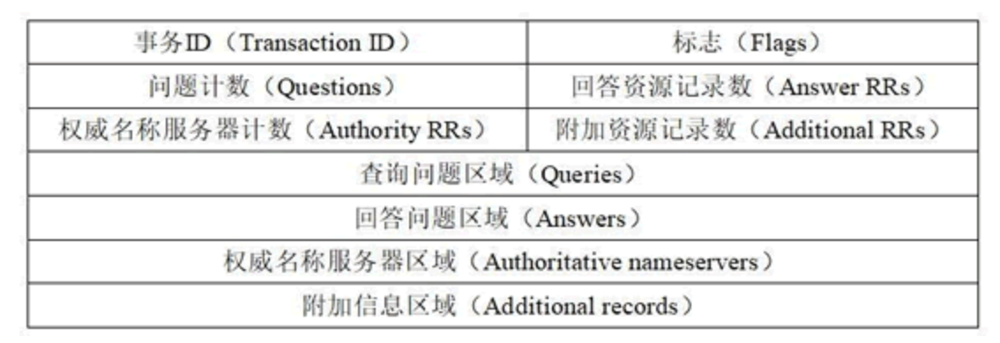
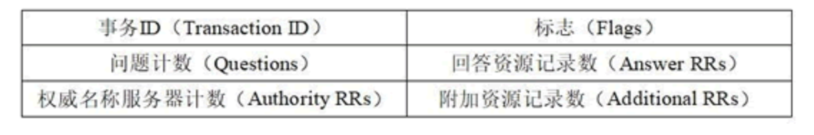
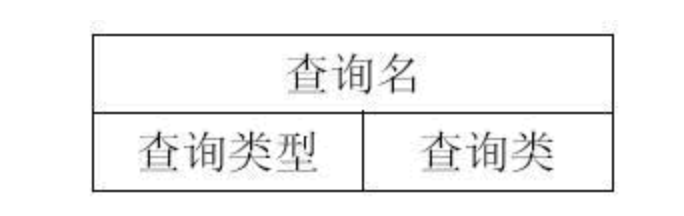
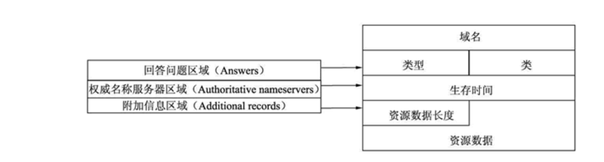
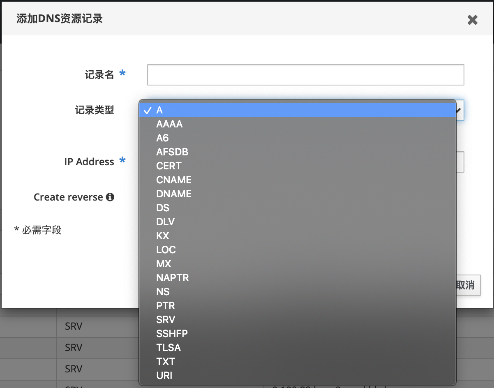

# DNS 协议详解

## 域名结构

域名系统并不像电话号码通讯录那么简单，通讯录主要是单个个体在使用，同一个名字出现在不同个体的通讯录里并不会出现问题，但域名是群体中所有人都在用的，必须要保持唯一性。为了达到唯一性的目的，因特网在命名的时候采用了层次结构的命名方法。每一个域名（本文只讨论英文域名）都是一个标号序列（labels），用字母（A-Z，a-z，大小写等价）、数字（0-9）和连接符（-）组成，标号序列总长度不能超过255个字符，它由点号分割成一个个的标号（label），每个标号应该在63个字符之内，每个标号都可以看成一个层次的域名。级别最低的域名写在左边，级别最高的域名写在右边。域名服务主要是基于UDP实现的，服务器的端口号为53。

比如：本网站的域名 xujiyou.work，由点号分割成了两个域名 xujiyou  和 work，其中 `work`是顶级域名（[TLD](https://icannwiki.org/Top-Level_Domain)，Top-Level Domain）， xujiyou是二级域名（[SLD](https://icannwiki.org/SLD)，Second Level Domain）。
**注意：**最开始的域名最后都是带了点号的，比如 `xujiyou.work` 搁以前的话应该是 `xujiyou.work.` ，最后面的点号表示根域名服务器，后来发现所有的网址都要加上最后的点，就简化了写法，干脆所有的都不加，但是你在网址后面加上点号也是可以正常解析的。

## 域名服务器

有域名结构还不行，还需要有一个东西去解析域名，手机通讯录是由通讯录软件解析的，域名需要由遍及全世界的域名服务器去解析，域名服务器实际上就是装有域名系统的主机。由高向低进行层次划分，可分为以下几大类：

- 根域名服务器：  

  最高层次的域名服务器，也是最重要的域名服务器，本地域名服务器如果解析不了域名就会向根域名服务器求助。全球共有13个不同IP地址的根域名服务器，它们的名称用一个英文字母命名，从a一直到m。这些服务器由各种组织控制，并由 ICANN（互联网名称和数字地址分配公司）授权，由于每分钟都要解析的名称数量多得令人难以置信，所以实际上每个根服务器都有镜像服务器，**每个根服务器与它的镜像服务器共享同一个 IP 地址，**中国大陆地区内只有6组根服务器镜像（F，I（3台），J，L）。当你对某个根服务器发出请求时，请求会被路由到该根服务器离你最近的镜像服务器。所有的根域名服务器都知道所有的顶级域名服务器的域名和地址，如果向根服务器发出对 `“xujiyou.work”` 的请求，则根服务器是不能在它的记录文件中找到与` “xujiyou.work”` 匹配的记录。但是它会找到 `“work”` 的顶级域名记录，并把负责` “work”` 地址的顶级域名服务器的地址发回给请求者。

- 顶级域名服务器：

  负责管理在该顶级域名服务器下注册的二级域名。当根域名服务器告诉查询者顶级域名服务器地址时，查询者紧接着就会到顶级域名服务器进行查询。比如还是查询`"xujiyou.work"`，根域名服务器已经告诉了查询者`“work”`顶级域名服务器的地址，`“work”`顶级域名服务器会找到 `“xujiyou.work”`的域名服务器的记录，域名服务器检查其区域文件，并发现它有与 `“xujiyou.work”` 相关联的区域文件。在此文件的内部，有该主机的记录。此记录说明此主机所在的 IP 地址，并向请求者返回最终答案。

- 权限域名服务器：

  负责一个区的域名解析工作

- 本地域名服务器：

  当一个主机发出DNS查询请求的时候，这个查询请求首先就是发给本地域名服务器的。

## 域名解析过程

域名解析总体可分为两大步骤，第一个步骤是本机向本地域名服务器发出一个DNS请求报文，报文里携带需要查询的域名；第二个步骤是本地域名服务器向本机回应一个DNS响应报文，里面包含域名对应的IP地址。从下面对`xujiyou.work`进行域名解析的报文中可明显看出这两大步骤。**注意：第二大步骤中采用的是迭代查询，其实是包含了很多小步骤的，详情见下面的流程分析。**

其具体的流程可描述如下：

1. 主机10.74.36.90先向本地域名服务器10.74.1.11进行**递归查询**
2. 本地域名服务器采用**迭代查询**，向一个根域名服务器进行查询
3. 根域名服务器告诉本地域名服务器，下一次应该查询的顶级域名服务器` dns.work`的IP地址
4. 本地域名服务器向顶级域名服务器 `dns.work`进行查询
5. 顶级域名服务器`me`告诉本地域名服务器，下一步查询权限服务器`dns.xujiyou.work` 的IP地址
6. 本地域名服务器向权限服务器 `dns.xujiyou.work`进行查询
7. 权限服务器 `dns.xujiyou.work`告诉本地域名服务器所查询的主机的IP地址
8. 本地域名服务器最后把查询结果告诉 10.74.36.90

其中有两个概念递归查询和迭代查询，其实在整个描述的过程中已经体现的很明显，这里再说明一下：

- **递归查询：**本机向本地域名服务器发出一次查询请求，就静待最终的结果。如果本地域名服务器无法解析，自己会以DNS客户机的身份向其它域名服务器查询，直到得到最终的IP地址告诉本机
- **迭代查询：**本地域名服务器向根域名服务器查询，根域名服务器告诉它下一步到哪里去查询，然后它再去查，每次它都是以客户机的身份去各个服务器查询

## DNS 报文格式

DNS 分为查询请求和查询响应，请求和响应的报文结构基本相同。DNS 报文格式如图所示：

上图中显示了 DNS 的报文格式。其中，事务 ID、标志、问题计数、回答资源记录数、权威名称服务器计数、附加资源记录数这 6 个字段是DNS的报文首部，共 12 个字节。

整个 DNS 格式主要分为 3 部分内容，即基础结构部分、问题部分、资源记录部分。下面将详细地介绍每部分的内容及含义。

#### 基础结构部分

- 事务 ID：DNS 报文的 ID 标识。对于请求报文和其对应的应答报文，该字段的值是相同的。通过它可以区分 DNS 应答报文是对哪个请求进行响应的。
- 标志：DNS 报文中的标志字段。
- 问题计数：DNS 查询请求的数目。
- 回答资源记录数：DNS 响应的数目。
- 权威名称服务器计数：权威名称服务器的数目。
- 附加资源记录数：额外的记录数目（权威名称服务器对应 IP 地址的数目）。

基础结构部分中的标志字段又分为若干个字段，如图所示：

- QR（Response）：查询请求/响应的标志信息。查询请求时，值为 0；响应时，值为 1。
- Opcode：操作码。其中，0 表示标准查询；1 表示反向查询；2 表示服务器状态请求。
- AA（Authoritative）：授权应答，该字段在响应报文中有效。值为 1 时，表示名称服务器是权威服务器；值为 0 时，表示不是权威服务器。
- TC（Truncated）：表示是否被截断。值为 1 时，表示响应已超过 512 字节并已被截断，只返回前 512 个字节。
- RD（Recursion Desired）：期望递归。该字段能在一个查询中设置，并在响应中返回。该标志告诉名称服务器必须处理这个查询，这种方式被称为一个递归查询。如果该位为 0，且被请求的名称服务器没有一个授权回答，它将返回一个能解答该查询的其他名称服务器列表。这种方式被称为迭代查询。
- RA（Recursion Available）：可用递归。该字段只出现在响应报文中。当值为 1 时，表示服务器支持递归查询。
- Z：保留字段，在所有的请求和应答报文中，它的值必须为 0。
- rcode（Reply code）：返回码字段，表示响应的差错状态。当值为 0 时，表示没有错误；当值为 1 时，表示报文格式错误（Format error），服务器不能理解请求的报文；当值为 2 时，表示域名服务器失败（Server failure），因为服务器的原因导致没办法处理这个请求；当值为 3 时，表示名字错误（Name Error），只有对授权域名解析服务器有意义，指出解析的域名不存在；当值为 4 时，表示查询类型不支持（Not Implemented），即域名服务器不支持查询类型；当值为 5 时，表示拒绝（Refused），一般是服务器由于设置的策略拒绝给出应答，如服务器不希望对某些请求者给出应答。

#### 问题部分

问题部分指的是报文格式中查询问题区域（Queries）部分。该部分是用来显示 DNS 查询请求的问题，通常只有一个问题。该部分包含正在进行的查询信息，包含查询名（被查询主机名字）、查询类型、查询类。

该部分中每个字段含义如下：

- 查询名：一般为要查询的域名，有时也会是 IP 地址，用于反向查询。
- 查询类型：DNS 查询请求的资源类型。通常查询类型为 A 类型，表示由域名获取对应的 IP 地址。
- 查询类：地址类型，通常为互联网地址，值为 1。

#### 资源记录部分

资源记录部分是指 DNS 报文格式中的最后三个字段，包括回答问题区域字段、权威名称服务器区域字段、附加信息区域字段。这三个字段均采用一种称为资源记录的格式，格式如图所示：

资源记录格式中每个字段含义如下：

- 域名：DNS 请求的域名。
- 类型：资源记录的类型，与问题部分中的查询类型值是一样的。
- 类：地址类型，与问题部分中的查询类值是一样的。
- 生存时间：以秒为单位，表示资源记录的生命周期，一般用于当地址解析程序取出资源记录后决定保存及使用缓存数据的时间。它同时也可以表明该资源记录的稳定程度，稳定的信息会被分配一个很大的值。
- 资源数据长度：资源数据的长度。
- 资源数据：表示按查询段要求返回的相关资源记录的数据。

资源记录部分只有在 DNS 响应包中才会出现。

## DNS 记录类型

FreeIPA 中的 DNS 一共支持 20 种记录类型，如下图所示：

维基百科中的类型：

|                             代码                             | 号码  |                          定义的 RFC                          |                             描述                             |                             功能                             |
| :----------------------------------------------------------: | :---: | :----------------------------------------------------------: | :----------------------------------------------------------: | :----------------------------------------------------------: |
|                              A                               |   1   |       [RFC 1035](https://tools.ietf.org/html/rfc1035)        |      [IPv4](https://zh.wikipedia.org/wiki/IPv4)地址记录      | 传回一个32位的IPv4地址，最常用于映射[主机名称](https://zh.wikipedia.org/wiki/主機名稱)到[IP地址](https://zh.wikipedia.org/wiki/IP地址)，但也用于[DNSBL](https://zh.wikipedia.org/w/index.php?title=DNSBL&action=edit&redlink=1)（[RFC 1101](https://tools.ietf.org/html/rfc1101)）等。 |
|                             AAAA                             |  28   |       [RFC 3596](https://tools.ietf.org/html/rfc3596)        |      [IPv6](https://zh.wikipedia.org/wiki/IPv6)地址记录      |   传回一个128位的IPv6地址，最常用于映射主机名称到IP地址。    |
|                            AFSDB                             |  18   |       [RFC 1183](https://tools.ietf.org/html/rfc1183)        | [AFS文件系统](https://zh.wikipedia.org/w/index.php?title=AFS檔案系統&action=edit&redlink=1) | （Andrew File System）数据库核心的位置，于域名以外的 AFS 客户端常用来联系 AFS 核心。这个记录的子类型是被过时的的 [DCE/DFS](https://zh.wikipedia.org/wiki/DCE/DFS)（DCE Distributed File System）所使用。 |
|                             APL                              |  42   |       [RFC 3123](https://tools.ietf.org/html/rfc3123)        |                         地址前缀列表                         | 指定地址栏表的范围，例如：CIDR 格式为各个类型的地址（试验性）。 |
|                             CAA                              |  257  |       [RFC 6844](https://tools.ietf.org/html/rfc6844)        |                         权威认证授权                         | [DNS认证机构授权](https://zh.wikipedia.org/wiki/DNS证书颁发机构授权)，限制主机/域的可接受的CA |
|                           CDNSKEY                            |  60   |       [RFC 7344](https://tools.ietf.org/html/rfc7344)        |                          子关键记录                          |             关键记录记录的子版本，用于转移到父级             |
|                             CDS                              |  59   |       [RFC 7344](https://tools.ietf.org/html/rfc7344)        |                         子委托签发者                         |            委托签发者记录的子版本，用于转移到父级            |
|                             CERT                             |  37   |       [RFC 4398](https://tools.ietf.org/html/rfc4398)        |                           证书记录                           | 存储 [PKIX](https://zh.wikipedia.org/wiki/PKIX)、[SPKI](https://zh.wikipedia.org/w/index.php?title=SPKI&action=edit&redlink=1)、[PGP](https://zh.wikipedia.org/wiki/Pretty_Good_Privacy)等。 |
|       [CNAME](https://zh.wikipedia.org/wiki/CNAME记录)       |   5   |       [RFC 1035](https://tools.ietf.org/html/rfc1035)        |                         规范名称记录                         | 一个主机名字的别名：[域名系统](https://zh.wikipedia.org/wiki/DNS)将会继续尝试查找新的名字。 |
|                            DHCID                             |  49   |       [RFC 4701](https://tools.ietf.org/html/rfc4701)        | [DHCP](https://zh.wikipedia.org/wiki/DHCP)（动态主机设置协议）标识符 | 用于将 FQDN 选项结合至 [DHCP](https://zh.wikipedia.org/wiki/DHCP)。 |
|                             DLV                              | 32769 |       [RFC 4431](https://tools.ietf.org/html/rfc4431)        | [DNSSEC](https://zh.wikipedia.org/wiki/DNSSEC)（域名系统安全扩展）来源验证记录 | 为不在DNS委托者内发布DNSSEC的信任锚点，与 DS 记录使用相同的格式，[RFC 5074](https://tools.ietf.org/html/rfc5074) 介绍了如何使用这些记录。 |
|       [DNAME](https://zh.wikipedia.org/wiki/DNAME记录)       |  39   |       [RFC 2672](https://tools.ietf.org/html/rfc2672)        |                           代表名称                           | DNAME 会为名称和其子名称产生别名，与 CNAME 不同，在其标签别名不会重复。但与 CNAME 记录相同的是，DNS将会继续尝试查找新的名字。 |
|                            DNSKEY                            |  48   |       [RFC 4034](https://tools.ietf.org/html/rfc4034)        |                         DNS 关键记录                         |       于DNSSEC内使用的关键记录，与 KEY 使用相同格式。        |
|                              DS                              |  43   |       [RFC 4034](https://tools.ietf.org/html/rfc4034)        |                          委托签发者                          |          此记录用于鉴定DNSSEC已授权区域的签名密钥。          |
|                             HIP                              |  55   |       [RFC 5205](https://tools.ietf.org/html/rfc5205)        |                         主机鉴定协议                         |           将端点标识符及IP 地址定位的分开的方法。            |
|                           IPSECKEY                           |  45   |       [RFC 4025](https://tools.ietf.org/html/rfc4025)        |                          IPSEC 密钥                          | 与 [IPSEC](https://zh.wikipedia.org/wiki/IPSEC) 同时使用的密钥记录。 |
|                             KEY                              |  25   | [RFC 2535](https://tools.ietf.org/html/rfc2535)[[1\]](https://zh.wikipedia.org/wiki/DNS记录类型列表#cite_note-1)[RFC 2930](https://tools.ietf.org/html/rfc2930)[[2\]](https://zh.wikipedia.org/wiki/DNS记录类型列表#cite_note-rfc3445_sec1_def-2) |                           关键记录                           | 只用于 SIG(0)（[RFC 2931](https://tools.ietf.org/html/rfc2931)）及 TKEY（[RFC 2930](https://tools.ietf.org/html/rfc2930)）。[[3\]](https://zh.wikipedia.org/wiki/DNS记录类型列表#cite_note-3)[RFC 3455](https://tools.ietf.org/html/rfc3455) 否定其作为应用程序键及限制DNSSEC的使用。[[4\]](https://zh.wikipedia.org/wiki/DNS记录类型列表#cite_note-rfc3445_sec1_subtype-4)[RFC 3755](https://tools.ietf.org/html/rfc3755) 指定了 DNSKEY 作为DNSSEC的代替。[[5\]](https://zh.wikipedia.org/wiki/DNS记录类型列表#cite_note-rfc3755_sec3-5) |
| [LOC记录](https://zh.wikipedia.org/w/index.php?title=LOC記錄&action=edit&redlink=1)（LOC record） |  29   |       [RFC 1876](https://tools.ietf.org/html/rfc1876)        |                           位置记录                           |                   将一个域名指定地理位置。                   |
| [MX记录](https://zh.wikipedia.org/wiki/MX记录)（MX record）  |  15   |       [RFC 1035](https://tools.ietf.org/html/rfc1035)        |                         电邮交互记录                         | 引导域名到该域名的[邮件传输代理](https://zh.wikipedia.org/w/index.php?title=郵件傳輸代理&action=edit&redlink=1)（MTA, Message Transfer Agents）列表。 |
| [NAPTR记录](https://zh.wikipedia.org/w/index.php?title=NAPTR記錄&action=edit&redlink=1)（NAPTR record） |  35   |       [RFC 3403](https://tools.ietf.org/html/rfc3403)        |                         命名管理指针                         | 允许基于正则表达式的域名重写使其能够作为 [URI](https://zh.wikipedia.org/wiki/URI)、进一步域名查找等。 |
|                              NS                              |   2   |       [RFC 1035](https://tools.ietf.org/html/rfc1035)        |                        名称服务器记录                        | 委托[DNS区域](https://zh.wikipedia.org/w/index.php?title=DNS區域&action=edit&redlink=1)（DNS zone）使用已提供的权威域名服务器。 |
|                             NSEC                             |  47   |       [RFC 4034](https://tools.ietf.org/html/rfc4034)        |                        下一代安全记录                        | DNSSEC 的一部分 — 用来验证一个未存在的服务器，使用与 NXT（已过时）记录的格式。 |
|                            NSEC3                             |  50   |       [RFC 5155](https://tools.ietf.org/html/rfc5155)        |                       NSEC 记录第三版                        | 用作允许未经允许的区域行走以证明名称不存在性的 DNSSEC 扩展。 |
|                          NSEC3PARAM                          |  51   |       [RFC 5155](https://tools.ietf.org/html/rfc5155)        |                          NSEC3 参数                          |                与 NSEC3 同时使用的参数记录。                 |
|                          OPENPGPKEY                          |  61   |       [RFC 7929](https://tools.ietf.org/html/rfc7929)        |                       OpenPGP公钥记录                        | 基于DNS的域名实体认证方法，用于使用OPENPGPKEY DNS资源记录在特定电子邮件地址的DNS中发布和定位OpenPGP公钥。 |
|                             PTR                              |  12   |       [RFC 1035](https://tools.ietf.org/html/rfc1035)        |                           指针记录                           | 引导至一个[规范名称](https://zh.wikipedia.org/w/index.php?title=規範名稱&action=edit&redlink=1)（Canonical Name）。与 CNAME 记录不同，DNS“不会”进行进程，只会传回名称。最常用来运行[反向 DNS 查找](https://zh.wikipedia.org/w/index.php?title=反向_DNS_查找&action=edit&redlink=1)，其他用途包括引作 [DNS-SD](https://zh.wikipedia.org/w/index.php?title=DNS-SD&action=edit&redlink=1)。 |
|                            RRSIG                             |  46   |       [RFC 4034](https://tools.ietf.org/html/rfc4034)        |                         DNSSEC 证书                          |      DNSSEC 安全记录集证书，与 SIG 记录使用相同的格式。      |
|                              RP                              |  17   |       [RFC 1183](https://tools.ietf.org/html/rfc1183)        |                            负责人                            |   有关域名负责人的信息，电邮地址的 **@** 通常写为 **a**。    |
|                             SIG                              |  24   |       [RFC 2535](https://tools.ietf.org/html/rfc2535)        |                             证书                             | SIG(0)（[RFC 2931](https://tools.ietf.org/html/rfc2931)）及 TKEY（[RFC 2930](https://tools.ietf.org/html/rfc2930)）使用的证书。[[5\]](https://zh.wikipedia.org/wiki/DNS记录类型列表#cite_note-rfc3755_sec3-5)[RFC 3755](https://tools.ietf.org/html/rfc3755) designated RRSIG as the replacement for SIG for use within DNSSEC.[[5\]](https://zh.wikipedia.org/wiki/DNS记录类型列表#cite_note-rfc3755_sec3-5) |
|                             SOA                              |   6   |       [RFC 1035](https://tools.ietf.org/html/rfc1035)        |                        权威记录的起始                        | 指定有关DNS区域的权威性信息，包含主要名称服务器、域名管理员的电邮地址、域名的流水式编号、和几个有关刷新区域的定时器。 |
| [SPF](https://zh.wikipedia.org/wiki/Sender_Policy_Framework) |  99   |       [RFC 4408](https://tools.ietf.org/html/rfc4408)        |                           SPF 记录                           | 作为 SPF 协议的一部分，优先作为先前在 TXT 存储 SPF 数据的临时做法，使用与先前在 TXT 存储的格式。 |
| [SRV记录](https://zh.wikipedia.org/wiki/SRV记录)（SRV record） |  33   |       [RFC 2782](https://tools.ietf.org/html/rfc2782)        |                          服务定位器                          | 广义为服务定位记录，被新式协议使用而避免产生特定协议的记录，例如：MX 记录。 |
|                            SSHFP                             |  44   |       [RFC 4255](https://tools.ietf.org/html/rfc4255)        |                       SSH 公共密钥指纹                       | DNS 系统用来发布 [SSH](https://zh.wikipedia.org/wiki/SSH) 公共密钥指纹的资源记录，以用作辅助验证服务器的真实性。 |
|                              TA                              | 32768 |                              无                              |                       DNSSEC 信任当局                        | DNSSEC 一部分无签订 DNS 根目录的部署提案，，使用与 DS 记录相同的格式[[6\]](https://zh.wikipedia.org/wiki/DNS记录类型列表#cite_note-6)[[7\]](https://zh.wikipedia.org/wiki/DNS记录类型列表#cite_note-7)。 |
| [TKEY记录](https://zh.wikipedia.org/w/index.php?title=TKEY記錄&action=edit&redlink=1)（TKEY record） |  249  |       [RFC 2930](https://tools.ietf.org/html/rfc2930)        |                         秘密密钥记录                         | 为[TSIG](https://zh.wikipedia.org/w/index.php?title=TSIG&action=edit&redlink=1)提供密钥材料的其中一类方法，that is 在公共密钥下加密的 accompanying KEY RR。[[8\]](https://zh.wikipedia.org/wiki/DNS记录类型列表#cite_note-8) |
|                             TSIG                             |  250  |       [RFC 2845](https://tools.ietf.org/html/rfc2845)        |                           交易证书                           | 用以认证动态更新（Dynamic DNS）是来自合法的客户端，或与 DNSSEC 一样是验证回应是否来自合法的递归名称服务器。[[9\]](https://zh.wikipedia.org/wiki/DNS记录类型列表#cite_note-9) |
|                             TXT                              |  16   |       [RFC 1035](https://tools.ietf.org/html/rfc1035)        |                           文本记录                           | 最初是为任意可读的文本 DNS 记录。自1990年起，些记录更经常地带有机读数据，以 [RFC 1464](https://tools.ietf.org/html/rfc1464) 指定：[机会性加密](https://zh.wikipedia.org/wiki/机会性加密)（opportunistic encryption）、[Sender Policy Framework](https://zh.wikipedia.org/wiki/Sender_Policy_Framework)（虽然这个临时使用的 TXT 记录在 SPF 记录推出后不被推荐）、DomainKeys、DNS-SD等。 |
|                             URI                              |  256  |       [RFC 7553](https://tools.ietf.org/html/rfc7553)        |                        统一资源标识符                        |               可用于发布从主机名到URI的映射。                |

常见的记录类型如下：

- A：记录地址（Address），返回域名指向的地址
- NS：域名服务器记录（Name Server），返回保存的下一级域名信息的服务器地址，该记录只能设置域名，不能设置 IP 地址。
- MX：邮件记录（Mail eXchange），返回接收电子邮件的服务器地址。
- CNAME：规范名称记录（Canonical Name），返回另一个域名，即当前查询的域名是另一个域名的跳转。
- PTR：逆向查询记录（Pointer Record），只用于从 IP 地址查询域名。

一般来说，为了服务的安全可靠，至少应该有两条`NS`记录，而`A`记录和`MX`记录也可以有多条，这样就提供了服务的冗余性，防止出现单点失败。

由于`CNAME`记录就是一个替换，所以域名一旦设置`CNAME`记录以后，就不能再设置其他记录了（比如`A`记录和`MX`记录）

