# TCP协议详解

一张图问遍所有关于 TCP 的面试题：

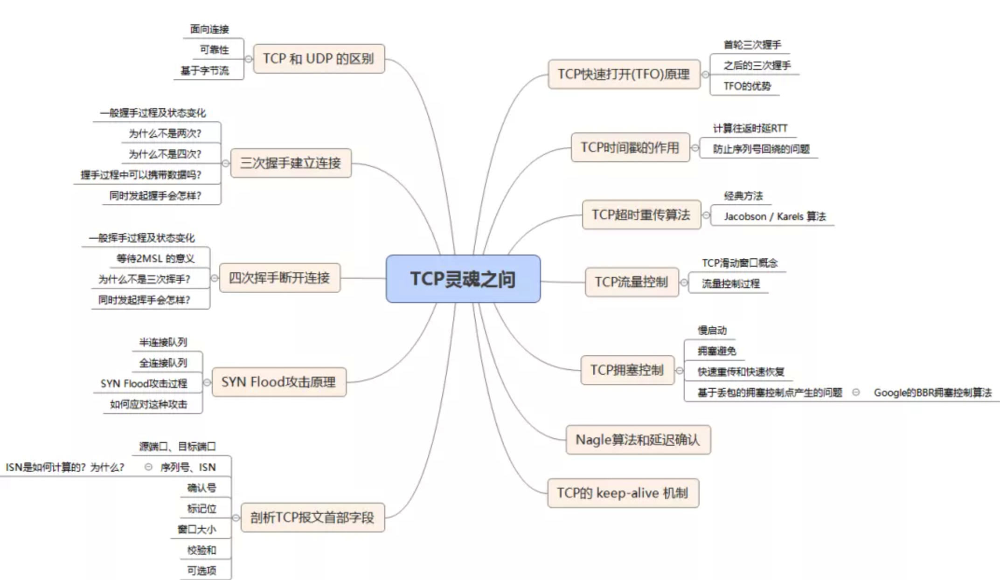


## TCP 与 UDP 的区别：

**TCP是一个面向连接的、可靠的、基于字节流的传输层协议。**

而**UDP是一个面向无连接的传输层协议。**(就这么简单，其它TCP的特性也就没有了)。

具体来分析，和 `UDP` 相比，`TCP` 的核心特性:

1. **面向连接**。所谓的连接，指的是客户端和服务器的连接，在双方互相通信之前，TCP 需要三次握手建立连接，而 UDP 没有相应建立连接的过程。
2. **可靠性**。TCP 花了非常多的功夫保证连接的可靠，这个可靠性体现在哪些方面呢？一个是有状态，另一个是可控制。

TCP 会精准记录哪些数据发送了，哪些数据被对方接收了，哪些没有被接收到，而且保证数据包按序到达，不允许半点差错。这是**有状态**。

当意识到丢包了或者网络环境不佳，TCP 会根据具体情况调整自己的行为，控制自己的发送速度或者重发。这是**可控制**。

相应的，UDP 就是`无状态`, `不可控`的。


## TCP 报文头部格式

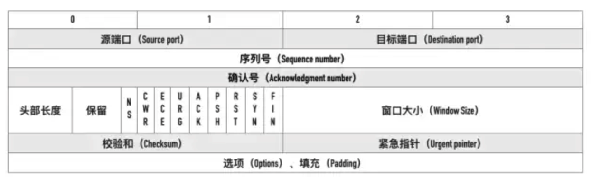

TCP 报文头部最小有 20 个字节，最大有 60个字节。


#### 源端口、目标端口

如何标识唯一标识一个连接？答案是 TCP 连接的`四元组`——源 IP、源端口、目标 IP 和目标端口。

那 TCP 报文怎么没有源 IP 和目标 IP 呢？这是因为在 IP 层就已经处理了 IP 。TCP 只需要记录两者的端口即可。


#### 序列号

即`Sequence number`, 指的是本报文段第一个字节的序列号。

从图中可以看出，序列号是一个长为 4 个字节，也就是 32 位的无符号整数，表示范围为 0 ~ 2^32 - 1。如果到达最大值了后就循环到0。

序列号在 TCP 通信的过程中有两个作用:

1. 在 SYN、FIN 报文中交换彼此的初始序列号。
2. 保证数据包按正确的顺序组装。


#### ISN

即`Initial Sequence Number（初始序列号）`,在三次握手的过程当中，双方会用过`SYN`报文来交换彼此的 `ISN`。

ISN 并不是一个固定的值，而是每 4 ms 加一，溢出则回到 0，这个算法使得猜测 ISN 变得很困难。那为什么要这么做？

如果 ISN 被攻击者预测到，要知道源 IP 和源端口号都是很容易伪造的，当攻击者猜测 ISN 之后，直接伪造一个 RST 后，就可以强制连接关闭的，这是非常危险的。

而动态增长的 ISN 大大提高了猜测 ISN 的难度。


#### 确认号

即`ACK(Acknowledgment number)`。用来告知对方下一个期望接收的序列号，**小于ACK**的所有字节已经全部收到。


#### 标记位

常见的标记位有`SYN`,`ACK`,`FIN`,`RST`,`PSH`。

`FIN`：即 Finish，表示发送方准备断开连接。

`RST`：即 Reset，用来强制断开连接。

`PSH`：即 Push, 告知对方这些数据包收到后应该马上交给上层的应用，不能缓存。


#### 窗口大小

占用两个字节，也就是 16 位，但实际上是不够用的。因此 TCP 引入了窗口缩放的选项，作为窗口缩放的比例因子，这个比例因子的范围在 0 ~ 14，比例因子可以将窗口的值扩大为原来的 2 ^ n 次方。


#### 校验和

占用两个字节，防止传输过程中数据包有损坏，如果遇到校验和有差错的报文，TCP 直接丢弃之，等待重传。


#### 可选项

可选项的格式如下:

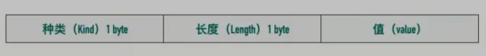

常用的可选项有以下几个:

- TimeStamp: TCP 时间戳，后面详细介绍。
- MSS: 指的是 TCP 允许的从对方接收的最大报文段。
- SACK: 选择确认选项。
- Window Scale：窗口缩放选项。


## TCP 握手为什么是三次

交流的双方都要发送一次 syn 和一次 ack ，表示一次问候和一次回答，在被动方可以将 syn 和 ack 一起发送，所以就是三次握手，分别是：

- 主动方发送 syn
- 被动方发送 ack 和 syn
- 主动方发送 ack

当第二次握手完成后，主动方完成就绪，第三次握手完成后，被动方完成就绪，两方就绪后，就可以发送数据了！

这个过程及状态如下：

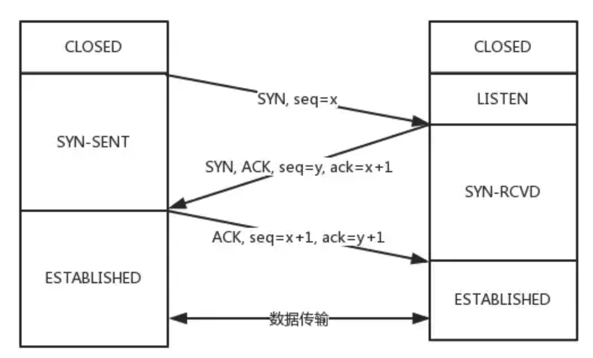

实际过程如下：

1. 从最开始双方都处于`CLOSED`状态。然后服务端开始监听某个端口，进入了`LISTEN`状态。
2. 然后客户端主动发起连接，发送 SYN , 自己变成了`SYN-SENT`状态。
3. 服务端接收到，返回`SYN`和`ACK`(对应客户端发来的SYN)，自己变成了`SYN-REVD`。
4. 之后客户端再发送`ACK`给服务端，自己变成了`ESTABLISHED`状态；
5. 服务端收到`ACK`之后，也变成了`ESTABLISHED`状态。

中间任何一步失败都不会建立起一个连接，连接建立后，双方就知道了对方的存在！

> 另外需要提醒你注意的是，从图中可以看出，SYN 是需要消耗一个序列号的，下次发送对应的 ACK 序列号要加1，为什么呢？只需要记住一个规则: **凡是需要对端确认的，一定消耗TCP报文的序列号**
>
> SYN 需要对端的确认， 而 ACK 并不需要，因此 SYN 消耗一个序列号而 ACK 不需要。


#### 三次握手过程中可以携带数据么

第三次握手的时候，可以携带。前两次握手不能携带数据。

如果前两次握手能够携带数据，那么一旦有人想攻击服务器，那么他只需要在第一次握手中的 SYN 报文中放大量数据，那么服务器势必会消耗更多的**时间**和**内存空间**去处理这些数据，增大了服务器被攻击的风险。

第三次握手的时候，客户端已经处于`ESTABLISHED`状态，并且已经能够确认服务器的接收、发送能力正常，这个时候相对安全了，可以携带数据。


#### 同时打开会怎样

如果双方同时发 `SYN`报文，状态变化会是怎样的呢？这是一个可能会发生的情况。

状态变迁如下:

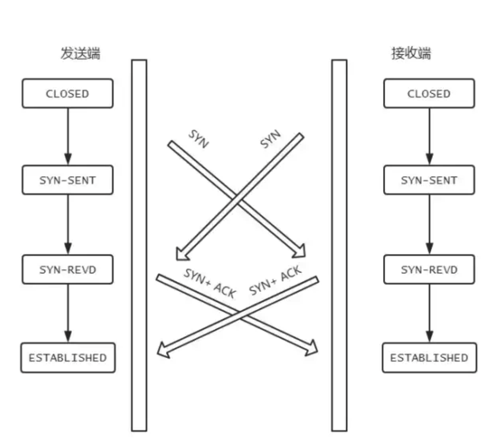

在发送方给接收方发`SYN`报文的同时，接收方也给发送方发`SYN`报文，两个人刚上了!

发完`SYN`，两者的状态都变为`SYN-SENT`。

在各自收到对方的`SYN`后，两者状态都变为`SYN-REVD`。

接着会回复对应的`ACK + SYN`，这个报文在对方接收之后，两者状态一起变为`ESTABLISHED`。

这就是同时打开情况下的状态变迁。这种情况下，服务端不调用 Listen 也能建立连接。


##  TCP 四次挥手的过程

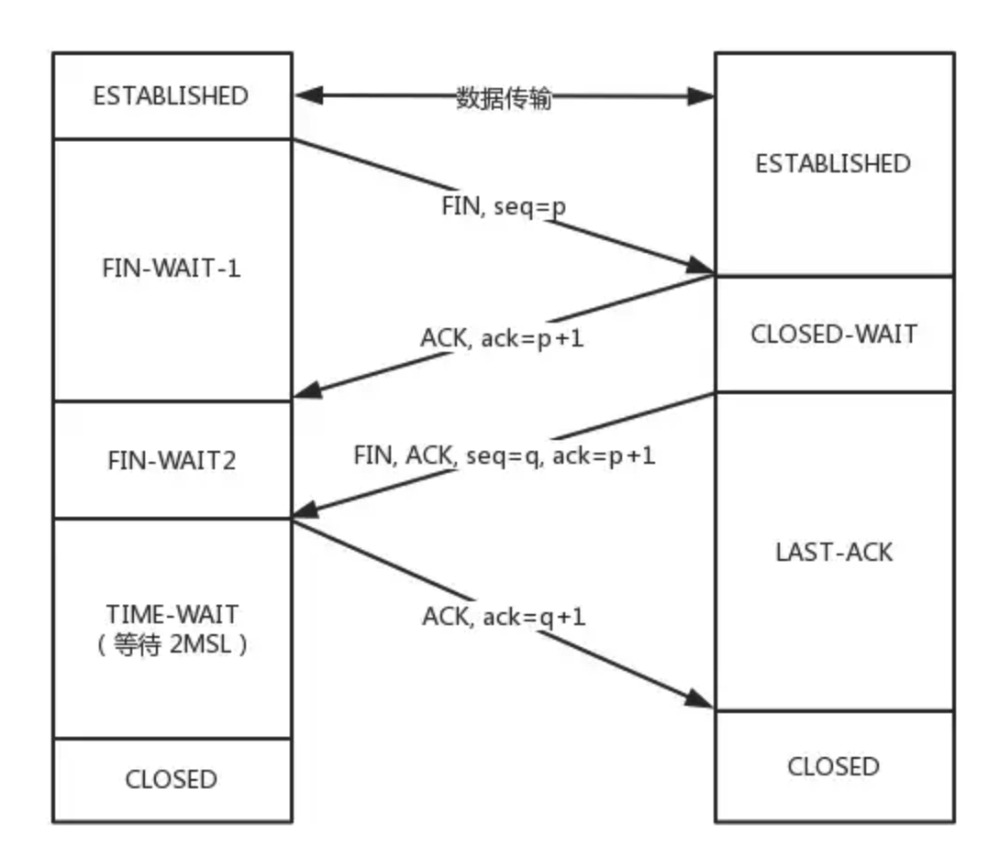

断开连接需要四次交流，即四次挥手，其实连接和断开连接的过程是差不多的，只是在被动方发送 ACK 和 FIN 时不是同时发送的！

具体过程如下：

1. 刚开始双方处于`ESTABLISHED`状态，这个状态处理连接中，可以传输数据。

2. 客户端要断开了，向服务器发送 `FIN` 报文，在 TCP 报文中的位置如下图:

   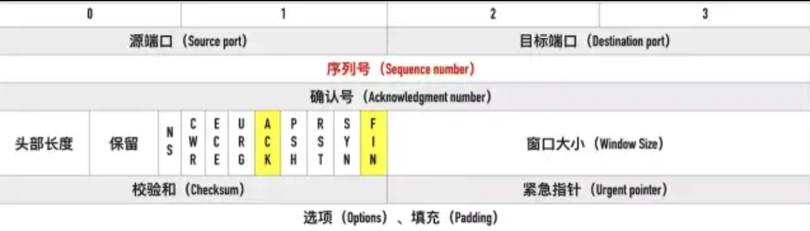

3. 发送后客户端变成了`FIN-WAIT-1`状态。注意, 这时候客户端同时也变成了`half-close(半关闭)`状态，即无法向服务端发送报文，只能接收。
4. 服务端接收后向客户端确认，变成了`CLOSED-WAIT`状态。
5. 客户端接收到了服务端的确认，变成了`FIN-WAIT2`状态。
6. 随后，服务端向客户端发送`FIN`，自己进入`LAST-ACK`状态，
7. 客户端收到服务端发来的`FIN`后，自己变成了`TIME-WAIT`状态，然后发送 ACK 给服务端。

> 注意了，这个时候，客户端需要等待足够长的时间，具体来说，是 2 个 `MSL`(`Maximum Segment Lifetime，报文最大生存时间`), 在这段时间内如果客户端没有收到服务端的重发请求，那么表示 ACK 成功到达，挥手结束，否则客户端重发 ACK。

#### 等待2MSL的意义

如果不等待会怎样？

如果不等待，客户端直接跑路，当服务端还有很多数据包要给客户端发，且还在路上的时候，若客户端的端口此时刚好被新的应用占用，那么就接收到了无用数据包，造成数据包混乱。所以，最保险的做法是等服务器发来的数据包都死翘翘再启动新的应用。

那，照这样说一个 MSL 不就不够了吗，为什么要等待 2 MSL?

- 1 个 MSL 确保四次挥手中主动关闭方最后的 ACK 报文最终能达到对端
- 1 个 MSL 确保对端没有收到 ACK 重传的 FIN 报文可以到达

这就是等待 2MSL 的意义。


#### 为什么是四次挥手而不是三次

因为服务端在接收到`FIN`, 往往不会立即返回`FIN`, 必须等到服务端所有的报文都发送完毕了，才能发`FIN`。因此先发一个`ACK`表示已经收到客户端的`FIN`，延迟一段时间才发`FIN`。这就造成了四次挥手。

如果是三次挥手会有什么问题？

等于说服务端将`ACK`和`FIN`的发送合并为一次挥手，这个时候长时间的延迟可能会导致客户端误以为`FIN`没有到达客户端，从而让客户端不断的重发`FIN`。


#### 同时关闭

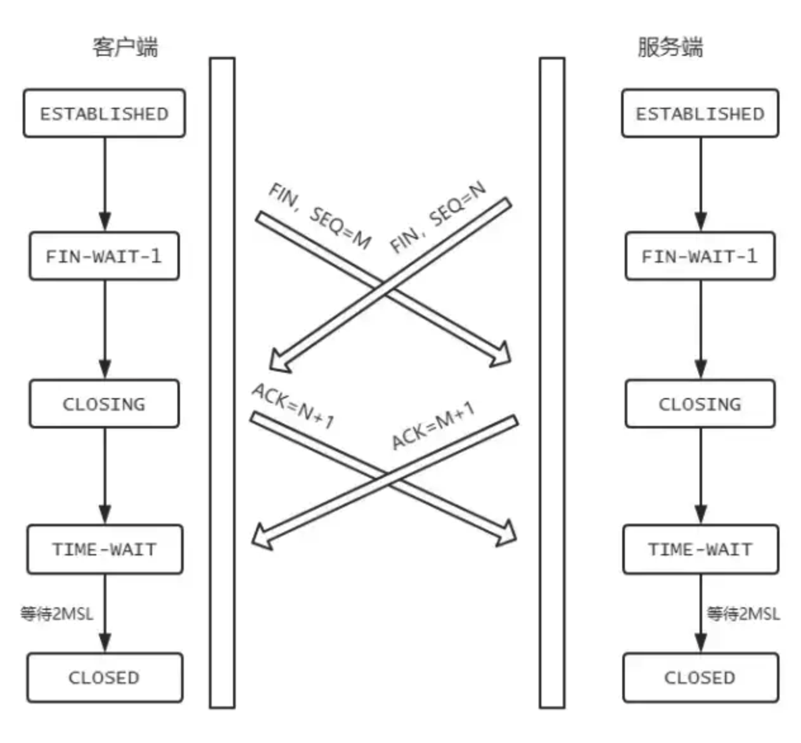

如果是双方同时关闭，就会多出来一个 CLOSING 状态！！！


## 半连接队列和 SYN Flood 攻击的关系

三次握手前，服务端的状态从`CLOSED`变为`LISTEN`, 同时在内部创建了两个队列：**半连接队列**和**全连接队列**，即**SYN队列**和**ACCEPT队列**。


#### 半连接队列

当客户端发送`SYN`到服务端，服务端收到以后回复`ACK`和`SYN`，状态由`LISTEN`变为`SYN_RCVD`，此时这个连接就被推入了**SYN队列**，也就是**半连接队列**。


#### 全连接队列

当客户端返回`ACK`, 服务端接收后，三次握手完成。这个时候连接等待被具体的应用取走，在被取走之前，它会被推入另外一个 TCP 维护的队列，也就是**全连接队列(Accept Queue)**。


####  SYN Flood 攻击原理

SYN Flood 属于典型的 DoS/DDoS 攻击。其攻击的原理很简单，就是用客户端在短时间内伪造大量不存在的 IP 地址，并向服务端疯狂发送`SYN`。对于服务端而言，会产生两个危险的后果:

1. 处理大量的`SYN`包并返回对应`ACK`, 势必有大量连接处于`SYN_RCVD`状态，从而占满整个**半连接队列**，无法处理正常的请求。
2. 由于是不存在的 IP，服务端长时间收不到客户端的`ACK`，会导致服务端不断重发数据，直到耗尽服务端的资源。


#### 如何应对 SYN Flood 攻击？

1. 增加 SYN 连接，也就是增加半连接队列的容量。
2. 减少 SYN + ACK 重试次数，避免大量的超时重发。
3. 利用 SYN Cookie 技术，在服务端接收到`SYN`后不立即分配连接资源，而是根据这个`SYN`计算出一个Cookie，连同第二次握手回复给客户端，在客户端回复`ACK`的时候带上这个`Cookie`值，服务端验证 Cookie 合法之后才分配连接资源。

> 服务端增加 半连接队列 的原因是怕忘记客户端是谁，而使用了 Cookie 之后，可以将这个信息记录到第二次、第三次握手过程中，这样服务端再受到第三次连接后也能记起客户端是谁了！


##  TCP 快速打开的原理(TFO)

第一节讲了 TCP 三次握手，可能有人会说，每次都三次握手好麻烦呀！能不能优化一点？

可以啊。今天来说说这个优化后的 TCP 握手流程，也就是 TCP 快速打开(TCP Fast Open, 即TFO)的原理。

优化的过程是这样的，还记得我们说 SYN Flood 攻击时提到的 SYN Cookie 吗？这个 Cookie 可不是浏览器的`Cookie`, 用它同样可以实现 TFO。

下面看下TFO 流程


#### 首轮三次握手

首先客户端发送`SYN`给服务端，服务端接收到。

注意哦！现在服务端不是立刻回复 SYN + ACK，而是通过计算得到一个`SYN Cookie`, 将这个`Cookie`放到 TCP 报文的 `Fast Open`选项中，然后才给客户端返回。

客户端拿到这个 Cookie 的值缓存下来。后面正常完成三次握手。

首轮三次握手就是这样的流程。而后面的三次握手就不一样啦！


#### 后面的三次握手

在后面的三次握手中，客户端会将之前缓存的 `Cookie`、`SYN` 和`HTTP请求`(是的，你没看错)发送给服务端，服务端验证了 Cookie 的合法性，如果不合法直接丢弃；如果是合法的，那么就正常返回`SYN + ACK`。

重点来了，现在服务端能向客户端发 HTTP 响应了！这是最显著的改变，三次握手还没建立，仅仅验证了 Cookie 的合法性，就可以返回 HTTP 响应了。

当然，客户端的`ACK`还得正常传过来，不然怎么叫三次握手嘛。

流程如下:

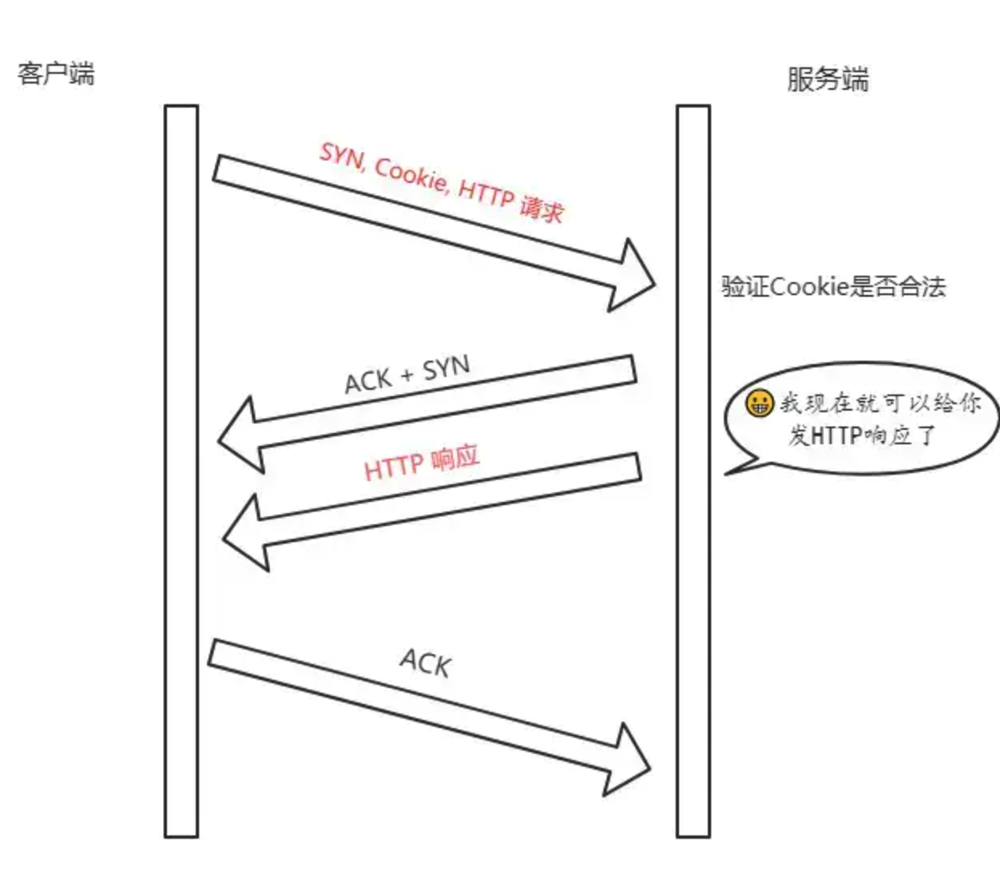

> 注意: 客户端最后握手的 ACK 不一定要等到服务端的 HTTP 响应到达才发送，两个过程没有任何关系。


#### TFO 的优势

TFO 的优势并不在与首轮三次握手，而在于后面的握手，在拿到客户端的 Cookie 并验证通过以后，可以直接返回 HTTP 响应，充分利用了**1 个RTT**(Round-Trip Time，往返时延)的时间**提前进行数据传输**，积累起来还是一个比较大的优势。


## TCP报文中时间戳的作用

`timestamp`是 TCP 报文首部的一个可选项，一共占 10 个字节，格式如下:

```
kind(1 字节) + length(1 字节) + info(8 个字节)
```

其中 kind = 8， length = 10， info 有两部分构成: **timestamp**和**timestamp echo**，各占 4 个字节。

那么这些字段都是干嘛的呢？它们用来解决那些问题？

接下来我们就来一一梳理，TCP 的时间戳主要解决两大问题:

- 计算往返时延 RTT(Round-Trip Time)
- 防止序列号的回绕问题


#### 计算往返时延 RTT

在没有时间戳的时候，计算 RTT 会遇到的问题如下图所示:

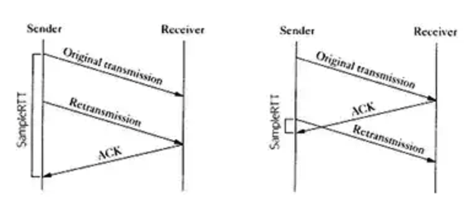

如果以第一次发包为开始时间的话，就会出现左图的问题，RTT 明显偏大，开始时间应该采用第二次的；

如果以第二次发包为开始时间的话，就会导致右图的问题，RTT 明显偏小，开始时间应该采用第一次发包的。

实际上无论开始时间以第一次发包还是第二次发包为准，都是不准确的。

那这个时候引入时间戳就很好的解决了这个问题。

比如现在 a 向 b 发送一个报文 s1，b 向 a 回复一个含 ACK 的报文 s2 那么：

- **step 1:** a 向 b 发送的时候，`timestamp` 中存放的内容就是 a 主机发送时的内核时刻 `ta1`。
- **step 2:** b 向 a 回复 s2 报文的时候，`timestamp` 中存放的是 b 主机的时刻 `tb`, `timestamp echo`字段为从 s1 报文中解析出来的 ta1。
- **step 3:** a 收到 b 的 s2 报文之后，此时 a 主机的内核时刻是 ta2, 而在 s2 报文中的 timestamp echo 选项中可以得到 `ta1`, 也就是 s2 对应的报文最初的发送时刻。然后直接采用 ta2 - ta1 就得到了 RTT 的值。


#### 防止序列号回绕问题

现在我们来模拟一下这个问题。

序列号的范围其实是在0 ~ 2 ^ 32 - 1, 为了方便演示，我们缩小一下这个区间，假设范围是 0 ~ 4，那么到达 4 的时候会回到 0。

| 第几次发包 | 发送字节 | 对应序列号 | 状态                    |
| :--------- | :------- | :--------- | :---------------------- |
| 1          | 0 ~ 1    | 0 ~ 1      | 成功接收                |
| 2          | 1 ~ 2    | 1 ~ 2      | 滞留在网络中            |
| 3          | 2 ~ 3    | 2 ~ 3      | 成功接收                |
| 4          | 3 ~ 4    | 3 ~ 4      | 成功接收                |
| 5          | 4 ~ 5    | 0 ~ 1      | 成功接收，序列号从0开始 |
| 6          | 5 ~ 6    | 1 ~ 2      | ？？？                  |

假设在第 6 次的时候，之前还滞留在网路中的包回来了，那么就有两个序列号为`1 ~ 2`的数据包了，怎么区分谁是谁呢？这个时候就产生了序列号回绕的问题。

那么用 timestamp 就能很好地解决这个问题，因为每次发包的时候都是将发包机器当时的内核时间记录在报文中，那么两次发包序列号即使相同，时间戳也不可能相同，这样就能够区分开两个数据包了。


## TCP 的超时重传时间是如何计算的

TCP 具有超时重传机制，即间隔一段时间没有等到数据包的回复时，重传这个数据包。

那么这个重传间隔是如何来计算的呢？

今天我们就来讨论一下这个问题。

这个重传间隔也叫做**超时重传时间**(Retransmission TimeOut, 简称RTO)，它的计算跟上一节提到的 RTT 密切相关。这里我们将介绍两种主要的方法，一个是经典方法，一个是标准方法。


#### 经典方法

经典方法引入了一个新的概念——SRTT(Smoothed round trip time，即平滑往返时间)，每产生一次新的 RTT. 就根据一定的算法对 SRTT 进行更新，具体而言，计算方式如下(SRTT 初始值为0):

```
SRTT =  (α * SRTT) + ((1 - α) * RTT)
```

其中，α 是**平滑因子**，建议值是`0.8`，范围是`0.8 ~ 0.9`。

拿到 SRTT，我们就可以计算 RTO 的值了:

```
RTO = min(ubound, max(lbound, β * SRTT))
```

β 是加权因子，一般为`1.3 ~ 2.0`， **lbound** 是下界，**ubound** 是上界。

其实这个算法过程还是很简单的，但是也存在一定的局限，就是在 RTT 稳定的地方表现还可以，而在 RTT 变化较大的地方就不行了，因为平滑因子 α 的范围是`0.8 ~ 0.9`, RTT 对于 RTO 的影响太小。


#### 标准方法

为了解决经典方法对于 RTT 变化不敏感的问题，后面又引出了标准方法，也叫`Jacobson / Karels 算法`。

一共有三步。

**第一步**: 计算`SRTT`，公式如下:

```
SRTT = (1 - α) * SRTT + α * RTT
```

注意这个时候的 `α`跟经典方法中的`α`取值不一样了，建议值是`1/8`，也就是`0.125`。

**第二步**: 计算`RTTVAR`(round-trip time variation)这个中间变量。

```
RTTVAR = (1 - β) * RTTVAR + β * (|RTT - SRTT|)
```

β 建议值为 0.25。这个值是这个算法中出彩的地方，也就是说，它记录了最新的 RTT 与当前 SRTT 之间的差值，给我们在后续感知到 RTT 的变化提供了抓手。

**第三步**: 计算最终的`RTO`:

```
RTO = µ * SRTT + ∂ * RTTVAR
```

`µ`建议值取`1`, `∂`建议值取`4`。

这个公式在 SRTT 的基础上加上了最新 RTT 与它的偏移，从而很好的感知了 RTT 的变化，这种算法下，RTO 与 RTT 变化的差值关系更加密切。


## TCP 的流量控制

对于发送端和接收端而言，TCP 需要把发送的数据放到**发送缓存区**, 将接收的数据放到**接收缓存区**。

而流量控制所要做的事情，就是在通过控制接收缓存区的大小，控制发送端的发送。如果对方的接收缓存区满了，就不能再继续发送了。

要具体理解流量控制，首先需要了解`滑动窗口`的概念。

TCP 滑动窗口分为两种: **发送窗口**和**接收窗口**。


#### TCP 滑动窗口 - 发送窗口

发送端的滑动窗口结构如下:

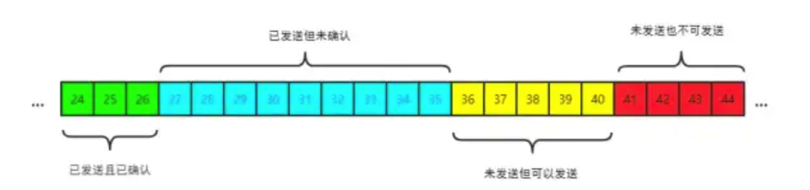

其中包含四大部分:

- 已发送且已确认
- 已发送但未确认
- 未发送但可以发送
- 未发送也不可以发送

其中有一些重要的概念，我标注在图中:

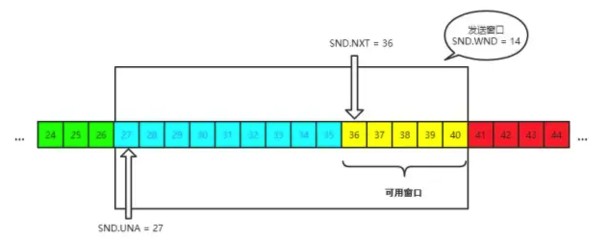

发送窗口就是图中被框住的范围。SND 即`send`, WND 即`window`, UNA 即`unacknowledged`, 表示未被确认，NXT 即`next`, 表示下一个发送的位置。


#### TCP 滑动窗口 - 接收窗口

接收端的窗口结构如下:

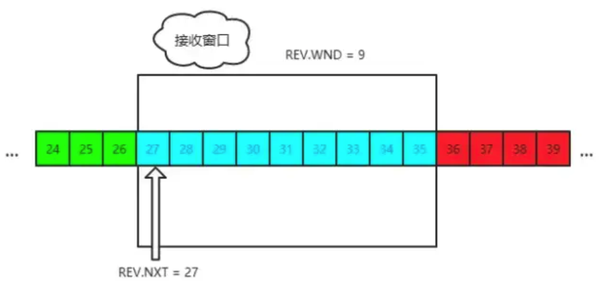

REV 即 `receive`，NXT 表示下一个接收的位置，WND 表示接收窗口大小。


#### 流量控制过程

这里我们不用太复杂的例子，以一个最简单的来回来模拟一下流量控制的过程，方便大家理解。

首先双方三次握手，初始化各自的窗口大小，均为 200 个字节。

假如当前发送端给接收端发送 100 个字节，那么此时对于发送端而言，SND.NXT 当然要右移 100 个字节，也就是说当前的`可用窗口`减少了 100 个字节，这很好理解。

现在这 100 个到达了接收端，被放到接收端的缓冲队列中。不过此时由于大量负载的原因，接收端处理不了这么多字节，只能处理 40 个字节，剩下的 `60` 个字节被留在了缓冲队列中。

注意了，此时接收端的情况是处理能力不够用啦，你发送端给我少发点，所以此时接收端的接收窗口应该缩小，具体来说，缩小 60 个字节，由 200 个字节变成了 140 字节，因为缓冲队列还有 60 个字节没被应用拿走。

因此，接收端会在 ACK 的报文首部带上缩小后的滑动窗口 140 字节，发送端对应地调整发送窗口的大小为 140 个字节。

此时对于发送端而言，已经发送且确认的部分增加 40 字节，也就是 SND.UNA 右移 40 个字节，同时**发送窗口**缩小为 140 个字节。

这也就是**流量控制**的过程。尽管回合再多，整个控制的过程和原理是一样的。


##  TCP 的拥塞控制

上一节所说的**流量控制**发生在发送端跟接收端之间，并没有考虑到整个网络环境的影响，如果说当前网络特别差，特别容易丢包，那么发送端就应该注意一些了。而这，也正是`拥塞控制`需要处理的问题。

对于拥塞控制来说，TCP 每条连接都需要维护两个核心状态:

- 拥塞窗口（Congestion Window，cwnd）
- 慢启动阈值（Slow Start Threshold，ssthresh）

涉及到的算法有这几个:

- 慢启动
- 拥塞避免
- 快速重传和快速恢复

接下来，我们就来一一拆解这些状态和算法。首先，从拥塞窗口说起。


#### 拥塞窗口

拥塞窗口（Congestion Window，cwnd）是指目前自己还能传输的数据量大小。

那么之前介绍了接收窗口的概念，两者有什么区别呢？

- 接收窗口(rwnd)是`接收端`给的限制
- 拥塞窗口(cwnd)是`发送端`的限制

限制谁呢？

限制的是`发送窗口`的大小。

有了这两个窗口，如何来计算`发送窗口`？

```
发送窗口大小 = min(rwnd, cwnd)
```

取两者的较小值。而拥塞控制，就是来控制`cwnd`的变化。


#### 慢启动

刚开始进入传输数据的时候，你是不知道现在的网路到底是稳定还是拥堵的，如果做的太激进，发包太急，那么疯狂丢包，造成雪崩式的网络灾难。

因此，拥塞控制首先就是要采用一种保守的算法来慢慢地适应整个网路，这种算法叫`慢启动`。运作过程如下:

- 首先，三次握手，双方宣告自己的接收窗口大小
- 双方初始化自己的**拥塞窗口**(cwnd)大小
- 在开始传输的一段时间，发送端每收到一个 ACK，拥塞窗口大小加 1，也就是说，每经过一个 RTT，cwnd 翻倍。如果说初始窗口为 10，那么第一轮 10 个报文传完且发送端收到 ACK 后，cwnd 变为 20，第二轮变为 40，第三轮变为 80，依次类推。

难道就这么无止境地翻倍下去？当然不可能。它的阈值叫做**慢启动阈值**，当 cwnd 到达这个阈值之后，好比踩了下刹车，别涨了那么快了，老铁，先 hold 住！

在到达阈值后，如何来控制 cwnd 的大小呢？

这就是拥塞避免做的事情了。


#### 拥塞避免

原来每收到一个 ACK，cwnd 加1，现在到达阈值了，cwnd 只能加这么一点: **1 / cwnd**。那你仔细算算，一轮 RTT 下来，收到 cwnd 个 ACK, 那最后拥塞窗口的大小 cwnd 总共才增加 1。

也就是说，以前一个 RTT 下来，`cwnd`翻倍，现在`cwnd`只是增加 1 而已。

当然，**慢启动**和**拥塞避免**是一起作用的，是一体的。


#### 快速重传和快速恢复

**快速重传**

在 TCP 传输的过程中，如果发生了丢包，即接收端发现数据段不是按序到达的时候，接收端的处理是重复发送之前的 ACK。

比如第 5 个包丢了，即使第 6、7 个包到达的接收端，接收端也一律返回第 4 个包的 ACK。当发送端收到 3 个重复的 ACK 时，意识到丢包了，于是马上进行重传，不用等到一个 RTO 的时间到了才重传。

这就是**快速重传**，它解决的是**是否需要重传**的问题。


**选择性重传**

那你可能会问了，既然要重传，那么只重传第 5 个包还是第5、6、7 个包都重传呢？

当然第 6、7 个都已经到达了，TCP 的设计者也不傻，已经传过去干嘛还要传？干脆记录一下哪些包到了，哪些没到，针对性地重传。

在收到发送端的报文后，接收端回复一个 ACK 报文，那么在这个报文首部的可选项中，就可以加上`SACK`这个属性，通过`left edge`和`right edge`告知发送端已经收到了哪些区间的数据报。因此，即使第 5 个包丢包了，当收到第 6、7 个包之后，接收端依然会告诉发送端，这两个包到了。剩下第 5 个包没到，就重传这个包。这个过程也叫做**选择性重传(SACK，Selective Acknowledgment)**，它解决的是**如何重传**的问题。


**快速恢复**

当然，发送端收到三次重复 ACK 之后，发现丢包，觉得现在的网络已经有些拥塞了，自己会进入**快速恢复**阶段。

在这个阶段，发送端如下改变：

- 拥塞阈值降低为 cwnd 的一半
- cwnd 的大小变为拥塞阈值
- cwnd 线性增加

以上就是 TCP 拥塞控制的经典算法: **慢启动**、**拥塞避免**、**快速重传和快速恢复**。


##  Nagle 算法和延迟确认

#### Nagle 算法 - 延迟发送

试想一个场景，发送端不停地给接收端发很小的包，一次只发 1 个字节，那么发 1 千个字节需要发 1000 次。这种频繁的发送是存在问题的，不光是传输的时延消耗，发送和确认本身也是需要耗时的，频繁的发送接收带来了巨大的时延。

而避免小包的频繁发送，这就是 Nagle 算法要做的事情。

具体来说，Nagle 算法的规则如下:

- 当第一次发送数据时不用等待，就算是 1byte 的小包也立即发送

- 后面发送满足下面条件之一就可以发了:

- - 数据包大小达到最大段大小(Max Segment Size, 即 MSS)
  - 之前所有包的 ACK 都已接收到


#### Nagle 算法 - 延迟确认 

试想这样一个场景，当我收到了发送端的一个包，然后在极短的时间内又接收到了第二个包，那我是一个个地回复，还是稍微等一下，把两个包的 ACK 合并后一起回复呢？

**延迟确认**(delayed ack)所做的事情，就是后者，稍稍延迟，然后合并 ACK，最后才回复给发送端。TCP 要求这个延迟的时延必须小于500ms，一般操作系统实现都不会超过200ms。

不过需要主要的是，有一些场景是不能延迟确认的，收到了就要马上回复:

- 接收到了大于一个 frame 的报文，且需要调整窗口大小
- TCP 处于 quickack 模式（通过`tcp_in_quickack_mode`设置）
- 发现了乱序包


#### 两者一起使用会怎样？

前者意味着延迟发，后者意味着延迟接收，会造成更大的延迟，产生性能问题。


##  TCP 的 keep-alive

大家都听说过 http 的`keep-alive`, 不过 TCP 层面也是有`keep-alive`机制，而且跟应用层不太一样。

试想一个场景，当有一方因为网络故障或者宕机导致连接失效，由于 TCP 并不是一个轮询的协议，在下一个数据包到达之前，对端对连接失效的情况是一无所知的。

这个时候就出现了 keep-alive, 它的作用就是探测对端的连接有没有失效。

在 Linux 下，可以这样查看相关的配置:

```bash
sudo sysctl -a | grep keepalive

// 每隔 7200 s 检测一次
net.ipv4.tcp_keepalive_time = 7200
// 一次最多重传 9 个包
net.ipv4.tcp_keepalive_probes = 9
// 每个包的间隔重传间隔 75 s
net.ipv4.tcp_keepalive_intvl = 75
```

不过，现状是大部分的应用并没有默认开启 TCP 的`keep-alive`选项，为什么？

站在应用的角度:

- 7200s 也就是两个小时检测一次，时间太长
- 时间再短一些，也难以体现其设计的初衷, 即检测长时间的死连接

因此是一个比较尴尬的设计。


## TCP 状态

在 TCP 连接的过程中，连接的双方会处于多种状态。

client/server两条路线讲述TCP状态迁移路线图：

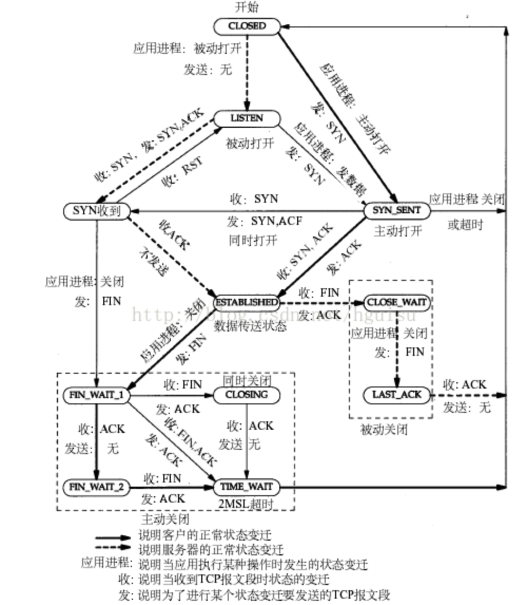

一共 11 种状态，上面在学习过程中都有涉及到。


## sack 介绍

上面也说过，在早期的TCP拥塞控制中都是通过收到重复 ack（默认3个）来触发快速重传，但是当有多个丢包时，这样每次重传一个包，收到重传包的ack后，再通过 重复ack触发重传下一个包，容易造成timeout，于是有人提出了sack来解决这个问题。

什么是sack

sack的全称是selective acknowledgment，也就是选择性确认，添加sack功能需要在TCP包
头加两个选项，一个是开启选项（enabling option），另一个是sack选项（sack option）本身。开启sack选项后，receiver会将自己收到了哪些包，没收到哪些包的信息记录在sack段中告诉给sender，这样sender便可以一次性重传所有的丢包。

要注意的是开启sack选项，也是有弊端的，因为丢包意味着网络很可能已经拥塞，这时如果一次重传多个包，很可能会造成网络更加拥塞。


