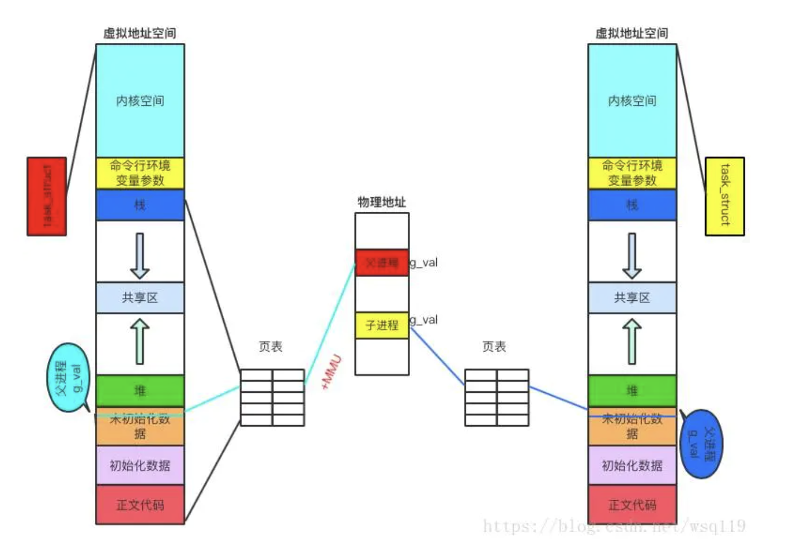

# Linux 内存页表管理


## 虚拟内存

在用户的视角里，每个进程都有自己独立的地址空间，A进程的4GB和B进程4GB是完全独立不相关的，他们看到的都是操作系统虚拟出来的地址空间。但是呢，虚拟地址最终还是要落在实际内存的物理地址上进行操作的。操作系统就会通过页表的机制来实现进程的虚拟地址到物理地址的翻译工作。其中每一页的大小都是固定的。页表管理有两个关键点，分别是页面大小和页表级数。


#### 页面大小

Linux 中获取页面大小：

```bash
$ getconf PAGE_SIZE
4096
```

Linux 默认的页面大小就是 4k 。


#### 页表级数

页表级数越少，虚拟地址到物理地址的映射会很快，但是需要管理的页表项会很多，能支持的地址空间也有限。相反页表级数越多，需要的存储的页表数据就会越少，而且能支持到比较大的地址空间，但是虚拟地址到物理地址的映射就会越慢。

举个例子。如果想支持32位的操作系统下的4GB进程虚拟地址空间，假设页表大小为4K，则共有2的20次方页面。如果采用速度最快的1级页表，对应则需要2的20次方个页表项。一个页表项假如4字节，那么一个进程就需要（1048576*4=4M）的内存来存页表项。如果是采用2级页表，则只需要页目录1024个，页表项1024个，总共2028个页表管理条目，（2048*4=）8k就可以支持起4GB的地址空间转换。更何况操作系统需要支持的可是64位地址空间，而且要支持成百上千的进程，这个开销会大道不可忍。**所以每个操作系统制定页表级数的时候都是在映射速度和页表占用空间中取折中。**


Linux在v2.6.11以后，最终采用的方案是4级页表，分别是：

- PGD：page Global directory(47-39), 页全局目录
- PUD：Page Upper Directory(38-30)，页上级目录
- PMD：page middle directory(29-21)，页中间目录
- PTE：page table entry(20-12)，页表项


#### 64位系统中的分页

对于32位的系统两级页表已经足够了, 但是对于64位系统的计算机, 这远远不够.

首先假设一个大小为4KB的标准页. 因为1KB覆盖210210个地址的范围, 4KB覆盖212212个地址, 所以offset字段需要12位.

这样线性地址空间就剩下64-12=52位分配给页中间表Table和页目录表Directory. 如果我们现在决定仅仅使用64位中的48位来寻址(这个限制其实已经足够了, 2^48=256TB, 即可达到256TB的寻址空间). 剩下的48-12=36位被分配给Table和Directory字段. 即使我们现在决定位两个字段各预留18位, 那么每个进程的页目录和页表都包含218218个项, 即超过256000个项.

基于这个原因, 所有64位处理器的硬件分页系统都使用了额外的分页级别. 使用的级别取决于处理器的类型

| 平台名称 | 页大小 | 寻址所使用的位数 | 分页级别数 | 线性地址分级       |
| -------- | ------ | ---------------- | ---------- | ------------------ |
| alpha    | 8KB    | 43               | 3          | 10 + 10 + 10 + 13  |
| ia64     | 4KB    | 39               | 3          | 9 + 9 + 9 + 12     |
| ppc64    | 4KB    | 41               | 3          | 10 + 10 + 9 + 12   |
| sh64     | 4KB    | 41               | 3          | 10 + 10 + 9 + 12   |
| x86_64   | 4KB    | 48               | 4          | 9 + 9 + 9 + 9 + 12 |


#### 页表作用

在  [进程内存空间布局.md](进程内存空间布局.md) 中讲的是虚拟地址空间的布局，页表就是用来将虚拟地址映射为物理地址。



过程：当访问虚拟内存时，会访问MMU（内存管理单元）去匹配对应的物理地址，而如果虚拟内存的页并不存在于物理内存中，会产生缺页中断，从磁盘中取得缺的页放入内存，如果内存已满，还会根据某种算法将磁盘中的页换出。（MMU中存储页表，用来匹配虚拟内存和物理内存）


