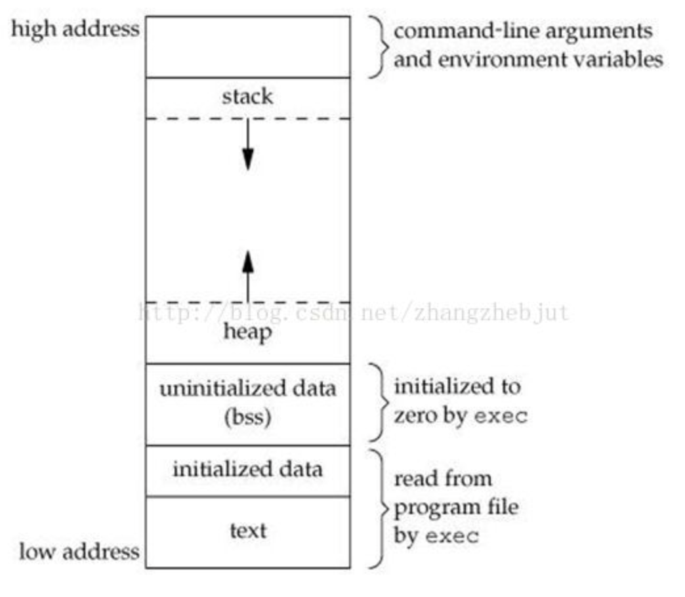
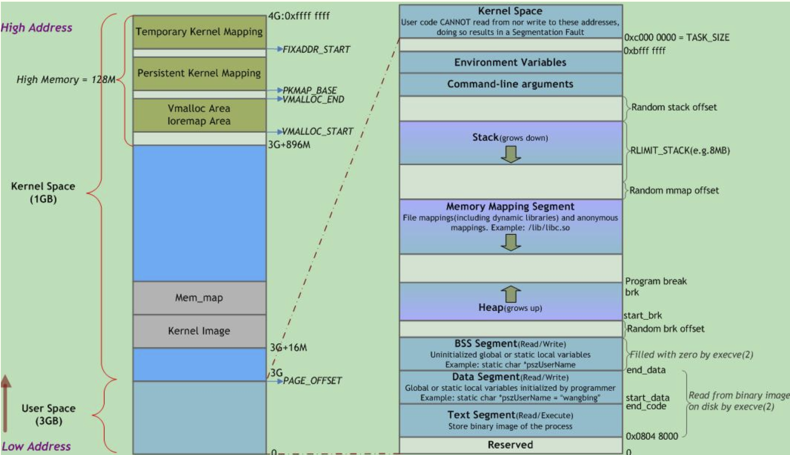

# 进程内存空间布局

Linux进程在虚拟内存中的标准内存段布局如下图所示：

| 栈     | 局部变量、函数参数、返回地址等            |
| ------ | ----------------------------------------- |
| 堆     | 动态分配的内存                            |
| BSS段  | 未初始化或初值为0的全局变量和静态局部变量 |
| 数据段 | 已初始化且初值非0的全局变量和静态局部变量 |
| 代码段 | 可执行代码、字符串字面值、只读变量        |

