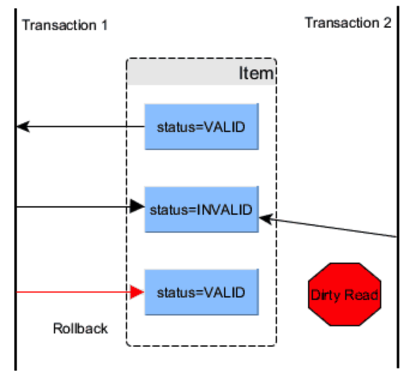
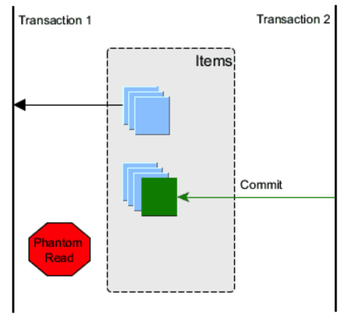

# MySQL事务隔离级别详解

## ACID 四大特性

ACID规则原来是在1970被Jim Gray定义，ACID事务解决了很多问题，但是仍然需要和性能做平衡协调，事务越强，性能可能越低，安全可靠性和高性能是一对矛盾。

- **Atomic原子性**: 

  一个事务的所有系列操作步骤被看成是一个动作，所有的步骤要么全部完成要么一个也不会完成，如果事务过程中任何一点失败，将要被改变的数据库记录就不会被真正被改变。

- **Consistent一致性**: 

  数据库的**约束 级联和触发机制Trigger**都必须满足事务的一致性。也就是说，通过各种途径包括外键约束等任何写入数据库的数据都是有效的，不能发生表与表之间存在外键约束，但是有数据却违背这种约束性。所有改变数据库数据的动作事务必须完成，没有事务会创建一个无效数据状态，这是不同于CAP理论的一致性"consistency".

- **Isolated**隔离性: 

  主要用于实现并发控制, 隔离能够确保并发执行的事务能够顺序一个接一个执行，通过隔离，一个未完成事务不会影响另外一个未完成事务。

- **Durable**持久性: 
   事务完成之后，它对于系统的影响是永久性的。该修改即使出现致命的系统故障也将一直保持。

## ACID 与 CAP 的关系

事务机制ACID和CAP理论是数据管理和分布式系统中两个重要的概念，很不巧，这两个概念中都有相同的“C”代表 "Consistency" 一致性，但是实际上是完全不同的意义。

> 当跨分布式系统提供ACID时，这两个概念会混淆在一起，[Google’s Spanner system](http://blog.acolyer.org/2015/01/08/spanner-googles-globally-distributed-database/)能够提供分布式系统的ACID，其包含ACID+CAP设计：

#### 什么是CAP

CAP是分布式系统中进行平衡的理论，它是由 Eric Brewer发布在2000年。

- **Consistent一致性**: 同样数据在分布式系统中所有地方都是被复制成相同。
- **Available可用性**: 所有在分布式系统活跃的节点都能够处理操作且能响应查询。
- **Partition Tolerant**分区容错性: 在两个复制系统之间，如果发生了计划之外的网络连接问题，对于这种情况，有一套容错性设计来保证。

通常 CAP 只能取其二，不要或弱化第三个。

#### CAP 和 ACID一致性区别

ACID一致性是有关数据库规则，如果数据表结构定义一个字段值是唯一的，那么一致性系统将解决所有操作中导致这个字段值非唯一性的情况，如果带有一个外键的一行记录被删除，那么其外键相关记录也应该被删除，这就是ACID一致性意思。

CAP理论的一致性是保证同样一个数据在所有不同服务器上的拷贝都是相同的，这是一种逻辑保证，而不是物理，因为光速限制，在不同服务器上这种复制是需要时间的，集群通过阻止客户端查看不同节点上还未同步的数据维持逻辑视图。

## 隔离级别

隔离级别对应的是隔离性。

SQL标准定义了4类隔离级别，包括了一些具体规则，用来限定事务内外的哪些改变是可见的，哪些是不可见的。低级别的隔离级一般支持更高的并发处理，并拥有更低的系统开销。

- **Read Uncommitted（读取未提交内容）**

  在该隔离级别，所有事务都可以看到其他未提交事务的执行结果。本隔离级别很少用于实际应用，因为它的性能也不比其他级别好多少。读取未提交的数据，也被称之为脏读（Dirty Read）。

- **Read Committed（读取提交内容）**

  这是大多数数据库系统的默认隔离级别（但不是MySQL默认的）。它满足了隔离的简单定义：一个事务只能看见已经提交事务所做的改变。这种隔离级别 也支持所谓的不可重复读（Nonrepeatable Read），因为同一事务的其他实例在该实例处理其间可能会有新的commit，所以同一select可能返回不同结果。

- **Repeatable Read（可重读）**

  这是MySQL的默认事务隔离级别，它确保同一事务的多个实例在并发读取数据时，会看到同样的数据行。不过理论上，这会导致另一个棘手的问题：幻读 （Phantom Read）。简单的说，幻读指当用户读取某一范围的数据行时，另一个事务又在该范围内插入了新行，当用户再读取该范围的数据行时，会发现有新的“幻影” 行。InnoDB和Falcon存储引擎通过多版本并发控制（MVCC，Multiversion Concurrency Control）和间隙锁机制解决了该问题。

- **Serializable（可串行化）** 

  这是最高的隔离级别，它通过强制事务排序，使之不可能相互冲突，从而解决幻读问题。简言之，它是在每个读的数据行上加上共享锁。在这个级别，可能导致大量的超时现象和锁竞争。

#### 事务存在的问题

- 脏读(Drity Read)

  当一个事务允许读取一个被其他事务改变但是未提交的状态时，这是因为并没有锁阻止读取，如上图，你看到第二个事务读取了一个并不一致的值，不一致的意思是，这个值是无效的，因为修改这个值的第一个事务已经回滚，也就是说，第一个事务修改了这个值，但是未提交确认，却被第二个事务读取，第一个事务又放弃修改，悔棋了，而第二个事务就得到一个脏数据。

  

- 不可重复读(Non-repeatable read)

  反复读同一个数据却得到不同的结果，这是因为在反复几次读取的过程中，数据被修改了，这就导致我们使用了stale数据，这可以通过一个共享读锁来避免。这是隔离级别READ_COMMITTED会导致可重复读的原因。设置共享读锁也就是隔离级别提高到REPETABLE_READ。

  

  > 可以这样理解，就是有一个大事务，这个大事务需要执行很长时间，另外还有一堆小事务，小事务很快就执行完了，小事务改完数据，进行了提交，大事务也读到了提交后的内容，但是小事务很多可能改了不止一次，这就造成了不可重复读！

- 幻读(Phantom Read)

  当第二个事务插入一行记录，而正好之前第一个事务查询了应该包含这个新纪录的数据，那么这个查询事务的结果里肯定没有包含这个刚刚新插入的数据，这时幻影读发生了，通过变化锁和[predicate locking](http://research.microsoft.com/en-us/um/people/gray/papers/On the Notions of Consistency and Predicate Locks in a Database System CACM.pdf)避免。

  

在MySQL中，实现了这四种隔离级别，分别有可能产生问题如下所示：

| 隔离级别                     | 脏读   | 不可重复读 | 幻读   |
| ---------------------------- | ------ | ---------- | ------ |
| Read Uncommitted（读未提交） | 可能   | 可能       | 可能   |
| Read Committed（读已提交）   | 不可能 | 可能       | 可能   |
| Repeatable Read（可重读）    | 不可能 | 不可能     | 可能   |
| Serializable（可串行化）     | 不可能 | 不可能     | 不可能 |

