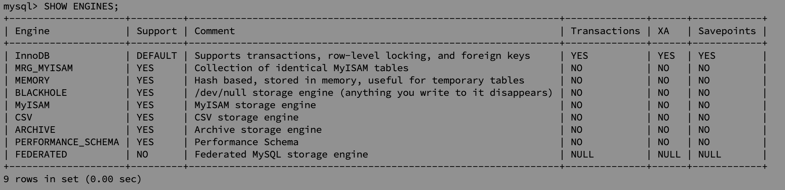
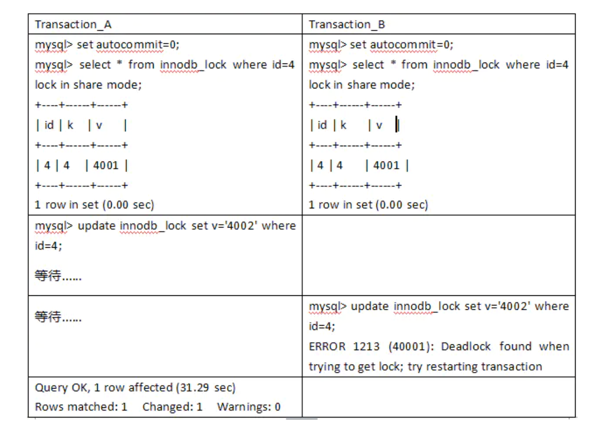
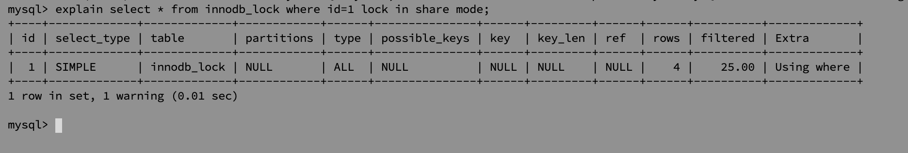
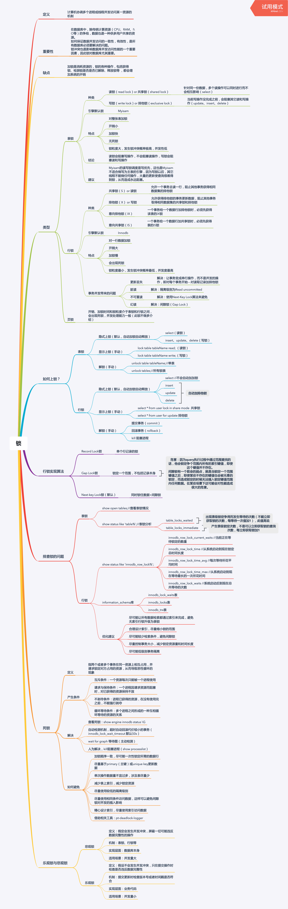

# MySQL 锁机制

## 储存引擎

在众多的存储引擎中，有两种引擎被比较多的使用，他们分别是：

- MyISAM 存储引擎，它不支持事务、表锁设计，支持全文索引，主要面向一些在线分析处理(OLAP)数据库应用。说白了主要就是查询数据，对数据的插入，更新操作比较少。
- InnoDB 存储引擎，它支持事务，其设计目标主要面向在线事务处理(OLTP)的应用。

其特点是行锁设计、支持外键，并支持类似于 Oracle 的非锁定读，即默认读取操作不会产生锁。

查看数据库拥有的存储引擎类型

```bash
mysql> SHOW ENGINES;
```




## 锁类型

这里锁类型只说悲观锁，MySQL 没实现乐观锁的机制，需要自己添加版本。


#### 共享锁

共享锁又称读锁 (read lock)，是读取操作创建的锁。其他用户可以并发读取数据，但任何事务都不能对数据进行修改（获取数据上的排他锁），直到已释放所有共享锁。当如果事务对读锁进行修改操作，很可能会造成死锁。如下图所示。



> 实践，在一个命令行中执行：
>
> ```mysql
> mysql> create database test;
> mysql> use test;
> mysql> create table innodb_lock (id int, k int, v int);
> mysql> insert into innodb_lock values(1,1,1);
> mysql> insert into innodb_lock values(2,2,2);
> mysql> insert into innodb_lock values(4,4,4001);
> 
> mysql> set autocommit = 0; #关闭自动提交事务
> mysql> select * from innodb_lock where id = 4 lock in share mode;
> mysql> update innodb_lock set v = 4002 where id = 4;
> ```
>
> 在第二个窗口执行：
>
> ```mysql
> mysql> set autocommit = 0;
> mysql> select * from innodb_lock where id = 4 lock in share mode;
> mysql> update innodb_lock set v = 4002 where id = 4;
> ```
>
> 发现不能更新，如果手动 commit; 了就可以更新了。


> 第二个实验
>
> 第一个命令行：
>
> ```mysql
> mysql> start transaction;
> mysql> SELECT * from innodb_lock where id = 1  lock in share mode;
> ```
>
> 第二个命令行：
>
> ```mysql
> mysql> update innodb_lock set v = 1002 where id =1;
> ERROR 1205 (HY000): Lock wait timeout exceeded; try restarting transaction
> mysql> update innodb_lock set v = 2002 where id =2;
> ERROR 1205 (HY000): Lock wait timeout exceeded; try restarting transaction
> ```
>
> 第二个命令行的两个命令都将失败超时。说明在获取共享锁期间不能修改数据

以上两个例子都说明了在有线程获取共享锁期间不能更新数据（获取排他锁），只能查询数据（获取排他锁）

读取为什么要加读锁呢？防止数据在被读取的时候被别的线程加上写锁。


#### 排它锁

排他锁 exclusive lock（也叫writer lock）又称写锁。

若某个事物对某一行加上了排他锁，只能这个事务对其进行读写，在此事务结束之前，其他事务不能对其进行加任何锁，其他进程可以读取,不能进行写操作，需等待其释放。 **排它锁是悲观锁的一种实现**，在上面悲观锁也介绍过。

若事务 1 对数据对象A加上X锁，事务 1 可以读A也可以修改A，其他事务不能再对A加任何锁，直到事物 1 释放A上的锁。这保证了其他事务在事物 1 释放A上的锁之前不能再读取和修改A。**排它锁会阻塞所有的排它锁和共享锁**

排他锁使用方式：在需要执行的语句后面加上**for update**就可以了 `select status from TABLE where id=1 for update;`

实战：

```mysql
mysql> set autocommit = 0;
mysql> start transaction;
mysql> select * from innodb_lock where id=1 for update;
mysql> insert into innodb_lock values(3,3,3);
mysql> update innodb_lock set v = 3001 where id=3;
```

在第二个命令行：

```mysql
mysql> select * from innodb_lock where id=1 lock in share mode; # 报错
mysql> select * from innodb_lock where id=1; # 可以执行
```


#### 行锁

多个事务操作同一行数据时，后来的事务处于阻塞等待状态。这样可以避免了脏读等数据一致性的问题。后来的事务可以操作其他行数据，解决了表锁高并发性能低的问题。

当执行批量修改数据脚本的时候，行锁升级为表锁。其他对订单的操作都处于等待中，，， 原因：**InnoDB只有在通过索引条件检索数据时使用行级锁，否则使用表锁！** 而模拟操作正是通过id去作为检索条件，而id又是MySQL自动创建的唯一索引，所以才忽略了行锁变表锁的情况

**总结：InnoDB的行锁是针对索引加的锁，不是针对记录加的锁。并且该索引不能失效，否则都会从行锁升级为表锁。**

- 行锁的劣势：开销大；加锁慢；会出现死锁

- 行锁的优势：锁的粒度小，发生锁冲突的概率低；处理并发的能力强

- 加锁的方式：自动加锁。对于UPDATE、DELETE和INSERT语句，InnoDB会自动给涉及数据集加排他锁；对于普通SELECT语句，InnoDB不会加任何锁；当然我们也可以显示的加锁。


从上面的案例看出，行锁变表锁似乎是一个坑，可MySQL没有这么无聊给你挖坑。这是因为MySQL有自己的执行计划。 当你需要更新一张较大表的大部分甚至全表的数据时。而你又傻乎乎地用索引作为检索条件。一不小心开启了行锁(没毛病啊！保证数据的一致性！)。可MySQL却认为大量对一张表使用行锁，会导致事务执行效率低，从而可能造成其他事务长时间锁等待和更多的锁冲突问题，性能严重下降。所以MySQL会将行锁升级为表锁，即实际上并没有使用索引。 我们仔细想想也能理解，既然整张表的大部分数据都要更新数据，在一行一行地加锁效率则更低。其实我们可以通过explain命令查看MySQL的执行计划，你会发现key为null。表明MySQL实际上并没有使用索引，行锁升级为表锁也和上面的结论一致。

> 查看执行计划：
>
> ```mysql
> mysql> explain select * from innodb_lock where id=1 lock in share mode;
> ```
>
> expain出来的信息有10列，分别是id、select_type、table、type、possible_keys、key、key_len、ref、rows、Extra,下面对这些字段出现的可能进行解释：
>
> 


#### 间隙锁

当我们用范围条件而不是相等条件检索数据，并请求共享或排他锁时，InnoDB会给符合条件的已有数据记录的索引项加锁；对于键值在条件范围内但并不存在的记录，叫做“间隙（GAP)”，InnoDB也会对这个“间隙”加锁，这种锁机制就是所谓的间隙锁（Next-Key锁）。 举例来说，假如emp表中只有101条记录，其empid的值分别是 1,2,...,100,101，下面的SQL：

```mysql
mysql> Select * from  emp where empid > 100 for update;
```

是一个范围条件的检索，InnoDB不仅会对符合条件的empid值为101的记录加锁，也会对empid大于101（这些记录并不存在）的“间隙”加锁。

InnoDB使用间隙锁的目的，一方面是为了防止幻读，以满足相关隔离级别的要求，对于上面的例子，要是不使用间隙锁，如果其他事务插入了empid大于100的任何记录，那么本事务如果再次执行上述语句，就会发生幻读；另外一方面，是为了满足其恢复和复制的需要。有关其恢复和复制对锁机制的影响，以及不同隔离级别下InnoDB使用间隙锁的情况，在后续的章节中会做进一步介绍。

很显然，在使用范围条件检索并锁定记录时，InnoDB这种加锁机制会阻塞符合条件范围内键值的并发插入，这往往会造成严重的锁等待。因此，在实际应用开发中，尤其是并发插入比较多的应用，我们要尽量优化业务逻辑，尽量使用相等条件来访问更新数据，避免使用范围条件。

还要特别说明的是，InnoDB除了通过范围条件加锁时使用间隙锁外，如果使用相等条件请求给一个不存在的记录加锁，InnoDB也会使用间隙锁！

**危害(坑)：若执行的条件是范围过大，则InnoDB会将整个范围内所有的索引键值全部锁定，很容易对性能造成影响。**


## 一张图总结

图来自于网上：https://learnku.com/articles/39212?order_by=vote_count&

