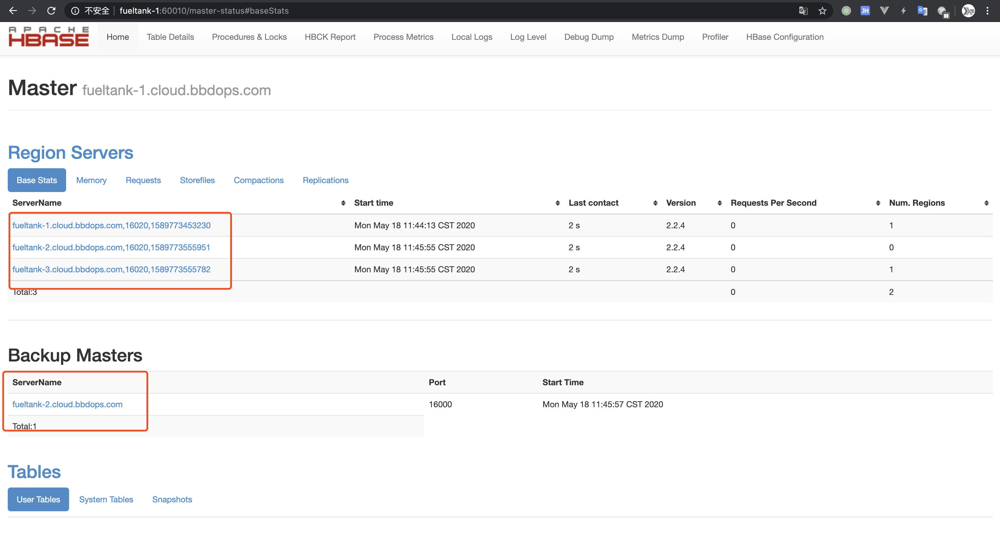
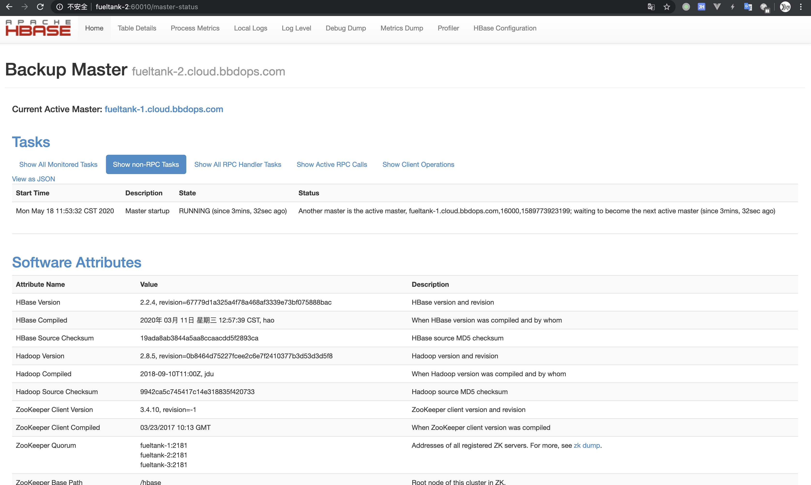

# HBase 高可用部署

首先下载 HBase 的二进制文件，我这里下载的当前最新的 2.2.4 版本：

```bash
$ wget http://ftp.cuhk.edu.hk/pub/packages/apache.org/hbase/2.2.4/hbase-2.2.4-bin.tar.gz
```

解压：

```bash
$ tar zxvf hbase-2.2.4-bin.tar.gz
$ mv hbase-2.2.4 hbase
$ cd hbase
```

本文采用3台机器，fueltank-1，fueltank-2，fueltank-3机器搭建。

- fueltank-1 : 主Master
- fueltank-2 : 备用的Master
- fueltank-1，fueltank-2，fueltank-3 : 分别为Worker


## 集群安装

先修改配置，配置文件全部在 conf 目录下。

修改`hbase-env.sh`文件，加入以下配置：

```bash
export JAVA_HOME=/usr/lib/jvm/java-1.8.0-openjdk-1.8.0.242.b08-0.el7_7.x86_64
# 不使用Hbase的zookeeper
export HBASE_MANAGES_ZK=false
```

修改hbase-site.xml文件：

```xml
<configuration>
    <!--使用HDFS，不使用本地文件系统 -->
    <property>
        <name>hbase.unsafe.stream.capability.enforce</name>
        <value>false</value>
    </property>
    <!-- 指定hbase在HDFS上存储的路径 -->
    <property>
        <name>hbase.rootdir</name>
        <value>hdfs://fueltank-1:9000/hbase</value>
    </property>
    <!-- 指定hbase是分布式的 -->
    <property>
        <name>hbase.cluster.distributed</name>
        <value>true</value>
    </property>
    <!-- 指定zk的地址，多个用“,”分割 -->
    <property>
        <name>hbase.zookeeper.quorum</name>
        <value>fueltank-1:2181,fueltank-2:2181,fueltank-3:2181</value>
    </property>
    <property>
        <name>hbase.master.info.port</name>
        <value>60010</value>
    </property>
</configuration>
```

编辑 regionservers 文件， 配置Worker机器：

```
fueltank-1
fueltank-2
fueltank-3
```

编辑 backup-masters 文件， 配置备份的Master机器，如果backup-masters文件没有则创建：

```
fueltank-2
```

将 hbase 目录分发到 fueltank-2，fueltank-3 机器上。

配置环境变量：

```bash
sudo vim /etc/profile

# 在结尾写入以下内容
export HBASE_HOME=/opt/hbase
export PATH=$PATH:$HBASE_HOME/bin

# 配置生效
source /etc/profile
```

启动 HBase 集群：

```bash
$ start-hbase.sh 
```

>如果在 `hbase shell` 中出现 `hbase Server is not running yet` 的异常，可以执行：
>
>```bash
>$ hadoop dfsadmin -safemode leave 
>```

## 检查

浏览器打开：http://fueltank-1:60010/



备份 Master：http://fueltank-2:60010/




