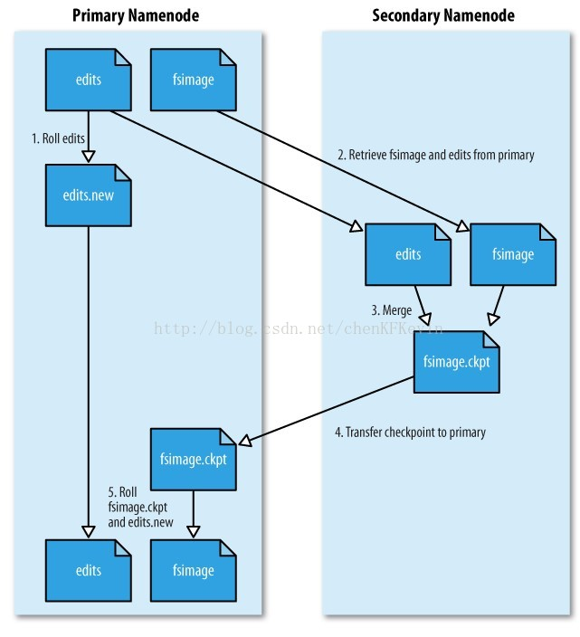

# HDFS 原理详解

HDFS 主要分为两种角色：NameNode 和 DataNode，NameNode 负责记录一些数据的元信息，DataNode 是实际储存数据的地方。

客户端连接时，需要先连接 NameNode，然后获取到数据的地址，再与 DataNode 交互来获取数据。

HDFS 的主要特性 ：

- 支持超大文件，这个文件可以超过一个磁盘的大小，因为 HDFS 会将一个大文件分成一个一个的块，储存在不同的磁盘中。
- 监测和应对硬件故障，针对每个块文件，HDFS都可以配置副本策略，在不同的 DataNode 中会存在两个或更多的块，当一个 DataNode 挂了之后，还会有其他副本，这就保证了数据安全。
- 流式数据访问，HDFS 注重数据的吞吐量，而不是数据的访问速度。HDFS 并没有实现 POSIX 文件访问协议，而是自己实现了一套。
- 简化的一致性模型，大部分的 HDFS 程序需要的是 一次写入，多次读取，在 HDFS 中，只支持文件的创建，写入，追加，关闭操作，而不支持修改操作。

HDFS 是被设计为面向大数据的，所以有以下情况并不适用：

- 低延迟数据访问，HDFS 是面向吞吐量的，而不是这种低延迟数据访问的，对于低延迟访问，可以考虑使用 HBase。
- 大量的小文件，NameNode 上的内存大小，决定了 HDFS 文件系统可以保存文件的数量。
- 多用户写入文件、修改文件，HDFS只支持有一个写入者，并且也不支持对文件的修改 。

## NameNode

NameNode 中，主要维护两个文件，一个是fsimage，一个是editlog，它主要就是通过这两个文件实现的元数据记录。

fsimage保存了最新的元数据检查点，包含了整个HDFS文件系统的所有目录和文件的信息。对于文件来说包括了数据块描述信息、修改时间、访问时间等；对于目录来说包括修改时间、访问权限控制信息(目录所属用户，所在组)等。

editlog主要是在NameNode已经启动情况下对HDFS进行的各种更新操作进行记录，HDFS客户端执行所有的写操作都会被记录到editlog中。

简单来想，NameNode维护了文件与数据块的映射表以及数据块与数据节点的映射表，什么意思呢？就是一个文件，它切分成了几个数据块，以及这些数据块分别存储在哪些datanode上，namenode一清二楚。Fsimage就是在某一时刻，整个hdfs 的快照，就是这个时刻hdfs上所有的文件块和目录，分别的状态，位于哪些个datanode，各自的权限，各自的副本个数。然后客户端对hdfs所有的更新操作，比如说移动数据，或者删除数据，都会记录在editlog中。

为了避免editlog不断增大，secondary namenode会周期性合并fsimage和edits成新的fsimage，新的操作记录会写入新的editlog中，这个周期可以自己设置（editlog到达一定大小或者定时）。

### FSImage 和 EditLog 的合并过程如下：

可以很清晰看出，第一步：将hdfs更新记录写入一个新的文件——edits.new。

第二步：将fsimage和editlog通过http协议发送至secondary namenode。

第三步：将fsimage与editlog合并，生成一个新的文件——fsimage.ckpt。这步之所以要在secondary namenode中进行，是因为比较耗时，如果在namenode中进行，或导致整个系统卡顿。

第四步：将生成的fsimage.ckpt通过http协议发送至namenode。

第五步：重命名fsimage.ckpt为fsimage，edits.new为edits。

这样的话，fsimage与editlog合并的过程就完成了。所以如果namenode宕机，其实secondary namenode还保存这一份不久前的fsimage，还能挽回一些损失吧。

一旦有datanode挂掉了（宕机或者是网络阻塞），namenode能很快感知到，并且将宕机的节点上的数据块转移至其余空闲节点。这点是因为hdfs中心跳机制（heartbeat）。

心跳机制默认3s中一次，datanode会向namenode发送一次一跳，告知namenode当前节点上存放的数据文件是什么。如果namenode中记录的是该datanode存放了文件A的两个数据块和文件B的一个数据块，但是心跳中只有文件A的一个数据块信息，namenode就会知道该datanode数据块损坏了，会把损坏的数据块在别的datanode上补充。

