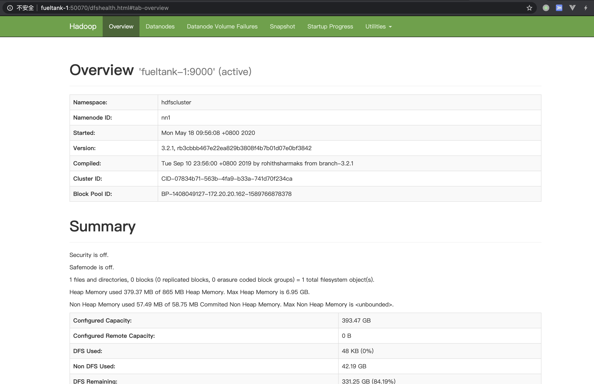
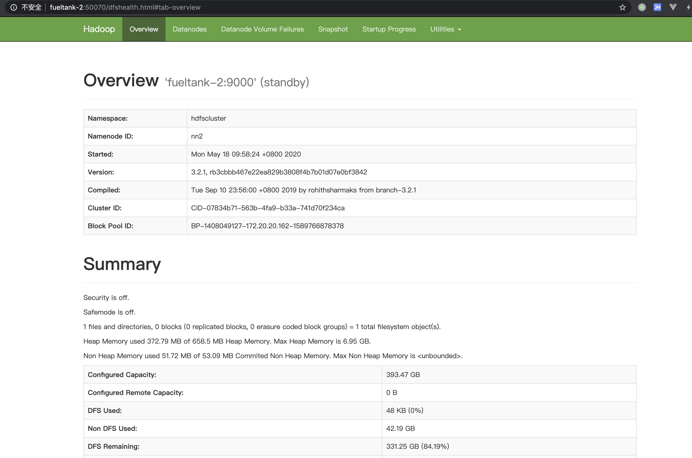
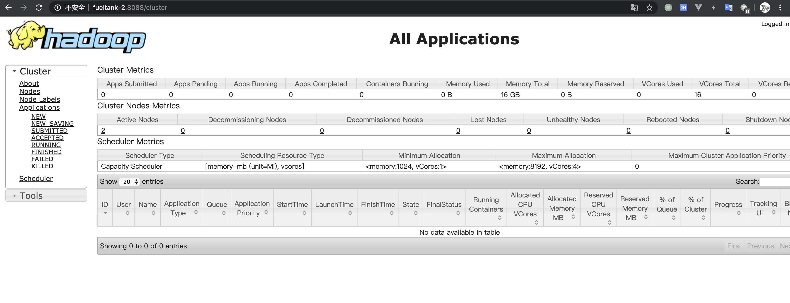
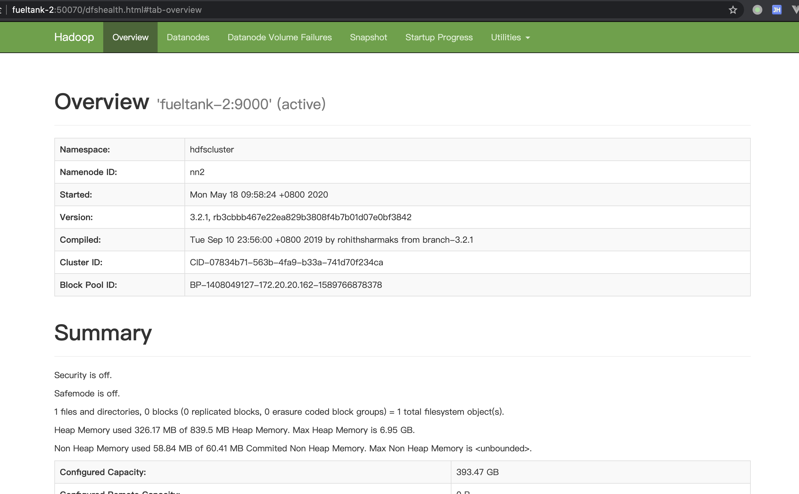

# Hadoop 高可用部署

在安装 Hadoop 前，需要安装 ZooKeeper，可参考： [ZooKeeper高可用部署.md](../ZooKeeper/ZooKeeper高可用部署.md) 

教程：https://ken.io/note/hadoop-cluster-deploy-guide

---


## 部署集群

首先下载二进制安装包：

```bash
$ wget http://ftp.cuhk.edu.hk/pub/packages/apache.org/hadoop/common/hadoop-3.2.1/hadoop-3.2.1.tar.gz
```

解压后，进入目录，查看版本：

```bash
$ ./bin/hadoop version
```

这时候报错说找不到 JAVA_HOME，我是 RPM 安装的 JDK，怎么找 JAVA_HOME 那，可以这样：

```bash
$ which java
$ ls -al /bin/java
$ ls -al /etc/alternatives/java
```

确定了我的 JAVA_HOME 应该是 `/usr/lib/jvm/java-1.8.0-openjdk-1.8.0.242.b08-0.el7_7.x86_64`

设置 JAVA_HOME:

```bash
$ echo "export JAVA_HOME=/usr/lib/jvm/java-1.8.0-openjdk-1.8.0.242.b08-0.el7_7.x86_64" >> /etc/profile
$ source /etc/profile
```

同时在 `etc/hadoop/hadoop-env.sh ` 中，也需要重新定义一下 JAVA_HOME！！！

```bash
$ echo "export JAVA_HOME=/usr/lib/jvm/java-1.8.0-openjdk-1.8.0.242.b08-0.el7_7.x86_64" >> ./etc/hadoop/hadoop-env.sh
```

另外还要注意，hadoop 不可以使用 root 启动！！！

创建目录：

```bash
sudo mkdir /mnt/vde/hadoop #存储hadoop数据
sudo mkdir /mnt/vde/hadoop/data #存储DataNode数据
sudo mkdir /mnt/vde/hadoop/name #存储NameNode数据
sudo mkdir /mnt/vde/hadoop/tmp #存储临时文件
sudo mkdir /mnt/vde/hadoop/log #存储日志
sudo mkdir /mnt/vde/hadoop/checkpoint #存储NameNode的CheckPoint数据
sudo mkdir /mnt/vde/hadoop/journalnode #存储JournalNode数据
sudo chown -R admin:admin /mnt/vde/hadoop/
```

配置 Hadoop 环境变量：

```bash
#修改环境变量
sudo vim /etc/profile

#增加以下内容
export HADOOP_HOME=/opt/hadoop
export HADOOP_CONF_DIR=$HADOOP_HOME/etc/hadoop
export PATH=$PATH:$HADOOP_HOME/bin:$HADOOP_HOME/sbin

#使环境变量生效
source /etc/profile
```

修改配置文件：

```bash
vim $HADOOP_HOME/etc/hadoop/core-site.xml
```

加入以下配置：

```xml
<configuration>
  <property>
    <name>fs.defaultFS</name>
    <value>hdfs://fueltank-1:9000</value>
  </property>
  <property>
    <name>dfs.journalnode.edits.dir</name>
    <value>/mnt/vde/hadoop/journalnode</value>
  </property>
  <property>
    <name>hadoop.tmp.dir</name>
    <value>/mnt/vde/hadoop/tmp</value>
  </property>
  <property>
    <name>fs.trash.interval</name>
    <value>1440</value>
  </property>
  <property>
    <name>io.file.buffer.size</name>
    <value>65536</value>
  </property>
  <property>
    <name>ha.zookeeper.quorum</name>
    <value>fueltank-1:2181,fueltank-2:2181,fueltank-3:2181</value>
  </property>
</configuration>
```

修改 hdfs 配置：

```bash
vim $HADOOP_HOME/etc/hadoop/hdfs-site.xml
```

新增配置如下：

```xml
<configuration>
  <property>
    <name>dfs.replication</name>
    <value>2</value>
  </property>
  <property>
    <name>dfs.namenode.name.dir</name>
    <value>/mnt/vde/hadoop/name</value>
  </property>
  <property>
    <name>dfs.blocksize</name>
    <value>67108864</value>
  </property>
  <property>
    <name>dfs.datanode.data.dir</name>
    <value>/mnt/vde/hadoop/data</value>
  </property>
  <property>
    <name>dfs.namenode.checkpoint.dir</name>
    <value>/mnt/vde/hadoop/checkpoint</value>
  </property>
  <property>
    <name>dfs.namenode.handler.count</name>
    <value>10</value>
  </property>
  <property>
    <name>dfs.datanode.handler.count</name>
    <value>10</value>
  </property>
  <property>
    <name>dfs.nameservices</name>
    <value>hdfscluster</value>
  </property>
  <property>
    <name>dfs.ha.namenodes.hdfscluster</name>
    <value>nn1,nn2</value>
  </property>
  <property>
    <name>dfs.namenode.rpc-address.hdfscluster.nn1</name>
    <value>fueltank-1:9000</value>
  </property>
  <property>
    <name>dfs.namenode.rpc-address.hdfscluster.nn2</name>
    <value>fueltank-2:9000</value>
  </property>
  <property>
    <name>dfs.namenode.http-address.hdfscluster.nn1</name>
    <value>fueltank-1:50070</value>
  </property>
  <property>
    <name>dfs.namenode.http-address.hdfscluster.nn2</name>
    <value>fueltank-2:50070</value>
  </property>
  <property>
    <name>dfs.namenode.shared.edits.dir</name>
    <value>qjournal://fueltank-1:8485;fueltank-2:8485;fueltank-3:8485/hdfscluster</value>
  </property>
  <property>
    <name>dfs.client.failover.proxy.provider</name>
    <value>org.apache.hadoop.hdfs.server.namenode.ha.ConfiguredFailoverProxyProvider</value>
  </property>
  <property>
    <name>dfs.ha.automatic-failover.enabled</name>
    <value>true</value>
  </property>
  <property>
    <name>dfs.ha.fencing.methods</name>
    <value>shell(/bin/true)</value>
  </property>
</configuration>
```

修改关于 mapreduce 的配置文件：

```bash
vim $HADOOP_HOME/etc/hadoop/mapred-site.xml
```

加入以下内容：

```xml
<configuration>
    <property>
        <name>mapreduce.framework.name</name>
        <value>yarn</value>
    </property>
</configuration>
```

修改yarn-site.xml：

```
vim $HADOOP_HOME/etc/hadoop/yarn-site.xml
```

加入以下配置：

```xml
<configuration>
  <property>
    <name>yarn.nodemanager.aux-services</name>
    <value>mapreduce_shuffle</value>
  </property>
  <property>
    <name>yarn.resourcemanager.ha.enabled</name>
    <value>true</value>
  </property>
  <property>
    <name>yarn.resourcemanager.cluster-id</name>
    <value>hdfscluster</value>
  </property>
  <property>
    <name>yarn.resourcemanager.ha.rm-ids</name>
    <value>rm1,rm2</value>
  </property>
  <property>
    <name>yarn.resourcemanager.hostname.rm1</name>
    <value>fueltank-2</value>
  </property>
  <property>
    <name>yarn.resourcemanager.hostname.rm2</name>
    <value>fueltank-3</value>
  </property>
  <property>
    <name>yarn.resourcemanager.webapp.address.rm1</name>
    <value>fueltank-2:8088</value>
  </property>
  <property>
    <name>yarn.resourcemanager.webapp.address.rm2</name>
    <value>fueltank-3:8088</value>
  </property>
  <property>
    <name>yarn.resourcemanager.zk-address</name>
    <value>fueltank-1:2181,fueltank-2:2181,fueltank-3:2181</value>
  </property>
</configuration>
```

配置slave节点，创建文件：

```bash
vim $HADOOP_HOME/etc/hadoop/slaves
```

加入以下内容：

```
fueltank-2
fueltank-3
```

配置log4j日志目录：

```bash
vim $HADOOP_HOME/etc/hadoop/log4j.properties
```

修改的配置如下：

```
hadoop.log.dir=/mnt/vde/hadoop/log
```

将上面的配置复制到其他两台主机。


Hadoop 初始化启动：

```bash
# 启动 journalnode（fueltank-1，fueltank-2，fueltank-3）
hdfs journalnode 

# 格式化 namenode（fueltank-1）
hdfs namenode -format

# 初始化 HA 状态到 zk（fueltank-1）
hdfs zkfc -formatZK 
# 有日志：Successfully created /hadoop-ha/hdfscluster in ZK.

# 启动 namenode active（fueltank-1）
hdfs namenode 

# 同步 namenode（fueltank-2）
hdfs namenode -bootstrapStandby
# 有日志：Storage directory /mnt/vde/hadoop/name has been successfully formatted.

# 启动 namenode standby（fueltank-2）
hdfs namenode 

# 启动ZookeeperFailoverController（fueltank-1，fueltank-2）
hdfs zkfc 

# 启动 datanode（fueltank-2，fueltank-3）
hdfs datanode 

# 启动 resourcemanager（fueltank-2，fueltank-3）
yarn resourcemanager 

# 启动 nodemanager（fueltank-2，fueltank-3）
yarn nodemanager
```

启动后在各个节点查看进程运行情况：

```bash
[admin@fueltank-1 ~]$ jps
2449 jboss-modules.jar
607037 JournalNode
1545456 DFSZKFailoverController
1540765 NameNode
1549192 Jps

[admin@fueltank-2 ~]$ jps
3441876 DFSZKFailoverController
3442181 DataNode
3441041 NameNode
3444241 Jps
3443586 NodeManager
3438718 JournalNode
3442799 ResourceManager

[admin@fueltank-3 ~]$ jps
71780 ResourceManager
73940 Jps
70120 DataNode
61242 JournalNode
72557 NodeManager
```

- 顺序启动备忘

Hadoop集群启动过一次之后，就不需要再进行fomat等操作了，另外正常启动过一次之后，就不要关注启动的输出信息了，可以使用nohup命令，启动更方便。后续正常启动顺序：

```bash
# 启动 journalnode（fueltank-1，fueltank-2，fueltank-3）
nohup hdfs journalnode > journalnode.log &

# 启动 namenode active（fueltank-1,fueltank-2）
nohup hdfs namenode > namenode.log  &

# 启动ZookeeperFailoverController（fueltank-1，fueltank-2）
nohup hdfs zkfc > zkfc.log &

# 启动 datanode（fueltank-2，fueltank-3）
nohup hdfs datanode > datanode.log &

# 启动 resourcemanager（fueltank-2，fueltank-3）
nohup yarn resourcemanager > resourcemanager.log  &

# 启动 nodemanager（fueltank-2，fueltank-3）
nohup yarn nodemanager > nodemanager.log &

#启动完成之后使用jps命令查看各节点服务是否正常启动即可
jps
```


---


## 检查状态

NameNode状态查看，访问：http://fueltank-1:50070



Standby NameNode状态查看，访问：http://fueltank-2:50070



查看 Yarn，ResourceManager状态：访问：http://fueltank-2:8088




#### NameNode高可用测试

```bash
[admin@fueltank-1 ~]$ jps
2449 jboss-modules.jar
1562549 Jps
607037 JournalNode
1545456 DFSZKFailoverController
1540765 NameNode
[admin@fueltank-1 ~]$ kill 1540765
```

查看 Standy 节点（fueltank-2）状态

在 fueltank-1 节点 NameNode 服务挂掉之后，fueltank-2 的 NameNode 自动切换到了 active 状态



在 fueltank-1 上重新执行 `hdfs namenode ` 后，fueltank-1 上的 NameNode 将变为 Standy。

查看 Yarn：

```bash
$ yarn node -list -all
```

#### 插入数据

```bash
$ echo "hello world" > abc.txt
$ hdfs dfs -fs hdfs://fueltank-2:9000 -put abc.txt /
$ hdfs dfs -fs hdfs://fueltank-2:9000 -ls /
```

查看 namenode 状态：

```bash
$ hdfs haadmin -getServiceState nn1
$ hdfs haadmin -getServiceState nn2
```

查看 resourcemanager 的状态：

```bash
$ yarn rmadmin -getServiceState rm1
$ yarn rmadmin -getServiceState rm2
```


---


## Hadoop配置项说明

### 1、core-site.xml配置项说明

| 配置项                    | 说明                                                         |
| ------------------------- | ------------------------------------------------------------ |
| fs.defaultFS              | 表示集群NameNode的Namespace，也是NameNodeCluster ID          |
| dfs.journalnode.edits.dir | 表示journalnode的数据文件路径                                |
| hadoop.tmp.dir            | 临时文件路径                                                 |
| fs.trash.interval         | 表示回收站的保留时间（分钟），也即hdfs的文件删除后，在回收站里面保留的时长 |
| io.file.buffer.size       | 表示读取文件的字节数（byte）                                 |
| ha.zookeeper.quorum       | 表示zookeeper集群的主机与端口                                |

### 2、hdfs-site.xml配置项说明

| 配置项                                    | 说明                                                         |
| ----------------------------------------- | ------------------------------------------------------------ |
| dfs.replication                           | 表示hdfs的数据块备份数量，默认是3                            |
| dfs.namenode.name.dir                     | NameNode数据目录                                             |
| dfs.datanode.data.dir                     | DataNode数据目录                                             |
| dfs.namenode.checkpoint.dir               | checkpoint数据目录                                           |
| dfs.blocksize                             | 表示数据块的大小，默认为64M，可根据需要改为128M，甚至256M    |
| dfs.namenode.handler.count                | NameNode进程数                                               |
| dfs.datanode.handler.count                | DataNode进程数                                               |
| dfs.nameservices                          | NameNode集群ID，跟core-size.xml配置项fs.defaultFS保持一致    |
| dfs.ha.namenodes.hdfscluster              | 表示NameNode各节点的ID，配置两个NameNode节点为例，命名为nn1、nn2，后需要以此ID配置各节点属性 |
| dfs.namenode.rpc-address.hdfscluster.nn1  | 配置nn1节点的远程访问地址和端口                              |
| dfs.namenode.rpc-address.hdfscluster.nn2  | 配置nn2节点的远程访问地址和端口                              |
| dfs.namenode.http-address.hdfscluster.nn1 | 配置nn1节点的http访问地址和端口                              |
| dfs.namenode.http-address.hdfscluster.nn2 | 配置nn1节点的http访问地址和端口                              |
| dfs.namenode.shared.edits.dir             | NameNode共享的元数据路径，在配置HA时，使用journalnode来保存元数据，维持NameNode元数据的一致性 |
| dfs.client.failover.proxy.provider        | 表示HDFS客户端连接到Active NameNode的一个java类（默认）      |
| dfs.ha.automatic-failover.enabled         | 表示当namenode ha的active namenode出现故障时，是否自动切换   |
| dfs.ha.fencing.methods                    | 表示故障时自动切换使用的方法                                 |

### 3、yarn-site.xml配置项说明

| 配置项                                  | 说明                                                         |
| --------------------------------------- | ------------------------------------------------------------ |
| yarn.nodemanager.aux-services           | NodeManager上运行的附属服务，需配置成mapreduce_shuffle，才可运行MapReduce程序，否则会报错 |
| yarn.resourcemanager.ha.enabled         | resourcemanager HA高可用                                     |
| yarn.resourcemanager.cluster-id         | resourcemanager的集群ID，不要与别的集群混淆即可，这里命名为hdfscluster |
| yarn.resourcemanager.ha.rm-ids          | resourcemanager的节点ID，以配置两个节点为例，使用rm1，rm2作为ID，后需要以此ID配置各节点属性 |
| yarn.resourcemanager.hostname.rm1       | 配置resourcemanager的rm1节点地址                             |
| yarn.resourcemanager.hostname.rm2       | 配置resourcemanager的rm2节点地址                             |
| yarn.resourcemanager.webapp.address.rm1 | 配置rm1节点网页访问地址和端口                                |
| yarn.resourcemanager.webapp.address.rm2 | 配置rm2节点网页访问地址和端口                                |
| yarn.resourcemanager.zk-address         | 配置zookeeper来协助管理resourcemanager主备的zookeeper集群主机与端口 |


---


## 重启

上面的启动方式是直接在命令行启动的，一旦关闭了命令行，服务就全部关闭了，nohup 那种方式也不够优雅，但是没办法，Hadoop 就是这么蛋疼。

比较简便的一种方式是，经过上面的启动后，下次再启动可以直接在 fueltank-1 上执行以下命令来启动：

```bash
$ start-all.sh 
```

这会在后台启动所有组件。。

如果想关掉，就执行：

```bash
$ stop-all.sh 
```

也可以分别启动：

```bash
$ start-dfs.sh 
$ start-yarn.sh 
```

但这种方式并不和上面的部署方式一样，组件和机器相对应！！！

也可以写成一个 service ，使用 systemctl 启动。


