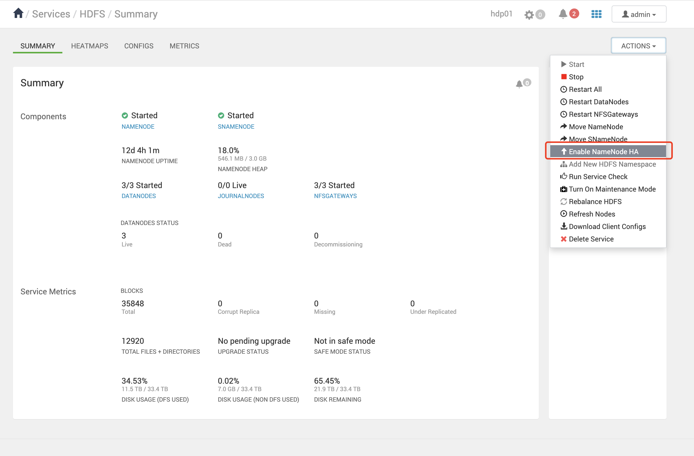
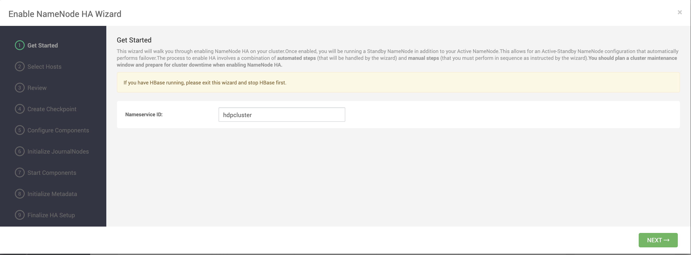
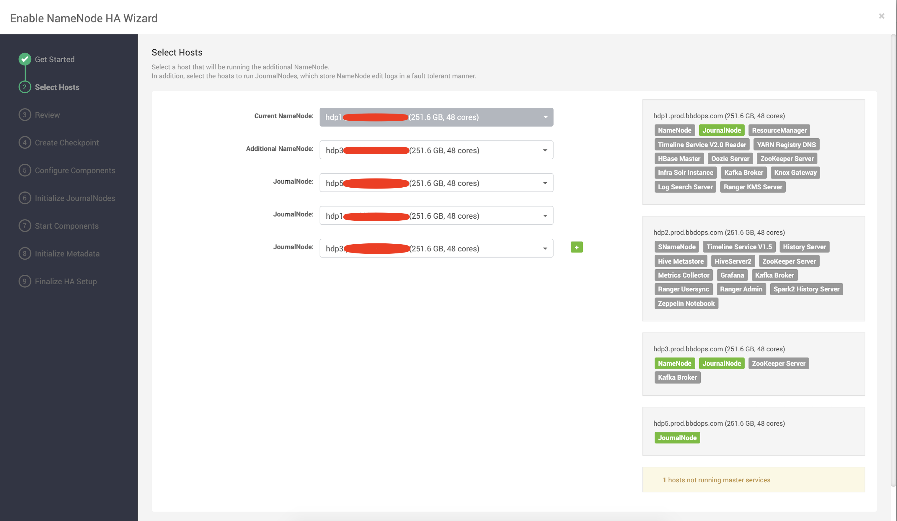
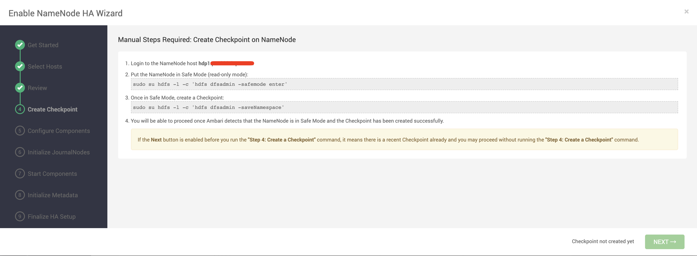
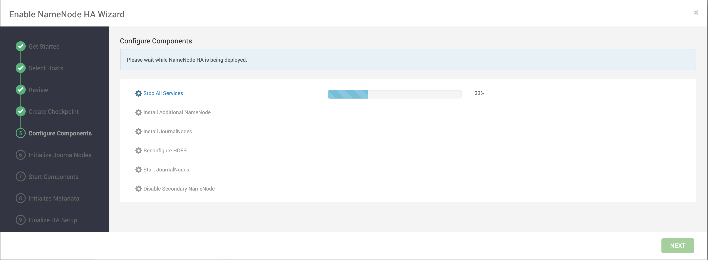
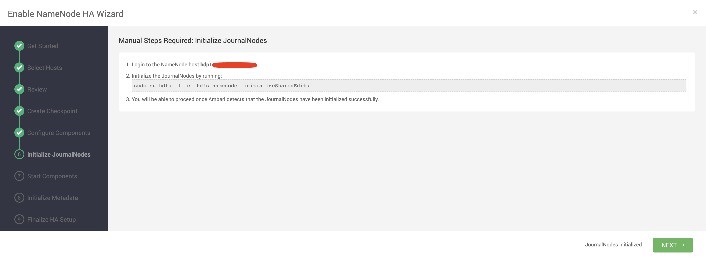
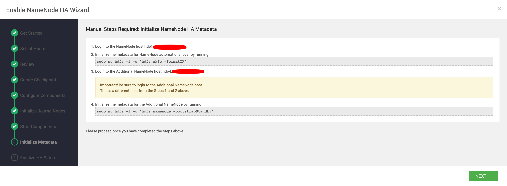

# HDP 之上的 HDFS 启用 HA

在 HDP 中安装的 HDFS 默认是不启用 HA 的，需要手动启用 HA。

## 启用 HA

在界面上点击：

然后输入一个 Nameservice ID，可自定义，这个ID决定着连接HDFS的地址：

选择服务所在主机：

这里选择附加的NameNode安装在哪一台服务器上，建议选择SNameNode安装的服务器。因为启用HA后，会删除SNameNode。

还需要配置JournalNode的服务器，JournalNode建议选择3个节点。

然后 review 一下，进入下一步：

按照步骤进行操作，执行完成后，点击 Next。

等待安装完成，点击 Next

在机器上手动执行这条命令后，点 Next。

之后 HDP 会启动组件，我这里启动 NameNode 失败，无奈恢复了一次配置，恢复方法： [HDP恢复配置.md](HDP恢复配置.md) 

第二次的时候启动组件发现启动成功了！

然后进入下一步：

按照提示手动在机器上执行。

但是在下一步，启动 zkfc 的时候，发现有些节点启动不起来，是因为我多次启用 HA，弄了多个 NameNode，所以要先删掉多余的 NameNode。

参考：https://docs.cloudera.com/HDPDocuments/Ambari-2.7.5.0/managing-high-availability/content/amb_delete_the_additional_namenode.html

同理删除多余的 ZKFC。

