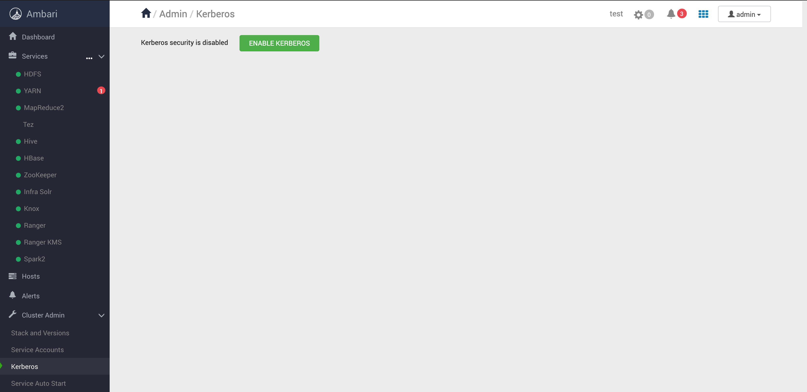
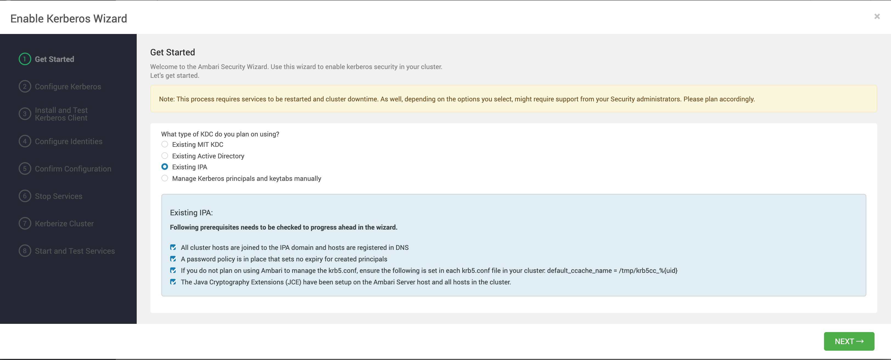
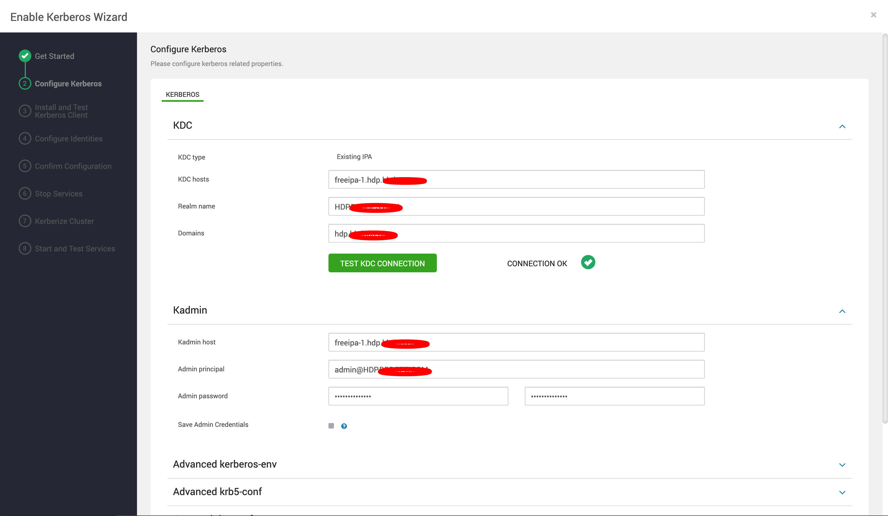
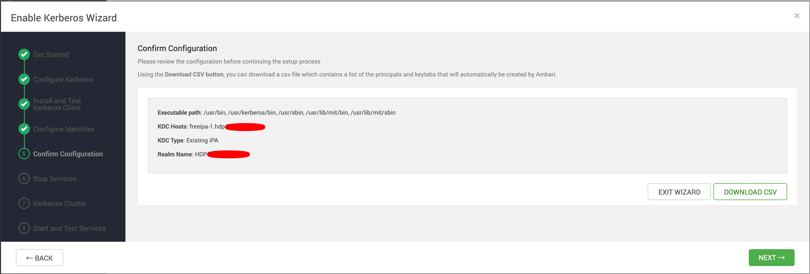
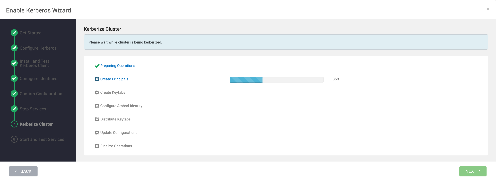

# HDP 集成 Kerberos

Kerberos 是一个安全协议，想获得 Kerberos 服务需要安装一系列服务，比较繁琐，这里使用 FreeIPA 来快速安装这套服务。

FreeIPA 安装教程： [FreeIPA安装.md](../../DevOps/FreeIPA/FreeIPA安装.md) 


大致思路是：

1. 在 FreeIPA 中新建 ambari 组，用于管理 Ambari 的相关操作。
2. 在集群服务器上安装 IPA-Client 程序。
3. 在 Ambari-Server 所在机器上安装 IPA-Admin 管理工具。


## 新建 ambari 组

```bash
$ sudo kinit admin
$ sudo ipa group-add ambari-managed-principals
```


## 安装 IPA-Client

```bash
$ sudo yum install ipa-client
```

安装：

```bash
$ sudo ipa-client-install --domain=hdp.bbdops.com --server=freeipa-1.hdp.bbdops.com --realm=HDP.BBDOPS.COM --principal=admin@HDP.BBDOPS.COM --enable-dns-updates
```

注册完成后，主机名会自动显示在 FreeIPA web 界面的主机列表里面。


## 安装 IPA-Admin 管理工具

```bash
$ sudo yum install ipa-admintools
```


## 集成 IPA



点击开启 Kerberos。

选择 IPA：



配置：



中间略过。

下载 CSV：



下面这一步比较慢，页面上也没日志，需要耐心等待：



如果想看进度，可以运行以下命令：

```bash
$ tail -f /var/log/ambari-server/ambari-server.log
```


## 测试

这时在命令行执行 HDFS 查询命令会报错。 

这时应该先进行登录再进行查询：

先查看 keytab 中的 principals:

```bash
$ klist -t -k /etc/security/keytabs/hdfs.headless.keytab
```

再进行认证：

```bash
$ sudo kinit -kt /etc/security/keytabs/hdfs.headless.keytab hdfs-test@HDP.TESTING.COM
```

其中 test 是 HDP 的集群名称。

查询：

```bash
$ sudo hdfs dfs -ls /
```

---

MacOS 浏览器访问有 Kerberos 认证的 WebUI：https://docs.cloudera.com/HDPDocuments/HDP3/HDP-3.1.5/authentication-with-kerberos/content/authe_spnego_enabling_browser_access_to_a_spnego_enabled_web_ui.html

MacOS 自带 kinit 工具。

将集群任意节点的 `/etc/krb5.conf` 文件拷贝到 MacOS 的相同位置。

拷贝集群任意节点的 `/etc/security/keytabs/smokeuser.headless.keytab` 到本地电脑。

在集群节点查看 smokeuser.headless.keytab 中的 principals：

```bash
$ sudo klist -t -k smokeuser.headless.keytab 
```

在 MacOS 上进行认证：

```bash
$ sudo kinit -kt smokeuser.headless.keytab ambari-qa-test@HDP.TESTING.COM
```

在 MacOS 上执行：

```bash
$ sudo /Applications/Google\ Chrome.app/Contents/MacOS/Google\ Chrome --auth-server-whitelist="*.hdp.testing.com"
```

记住一定加 sudo。

在自动打开的 Chrome 中就打开带有 Kerberos 认证的 WebUI 了。


