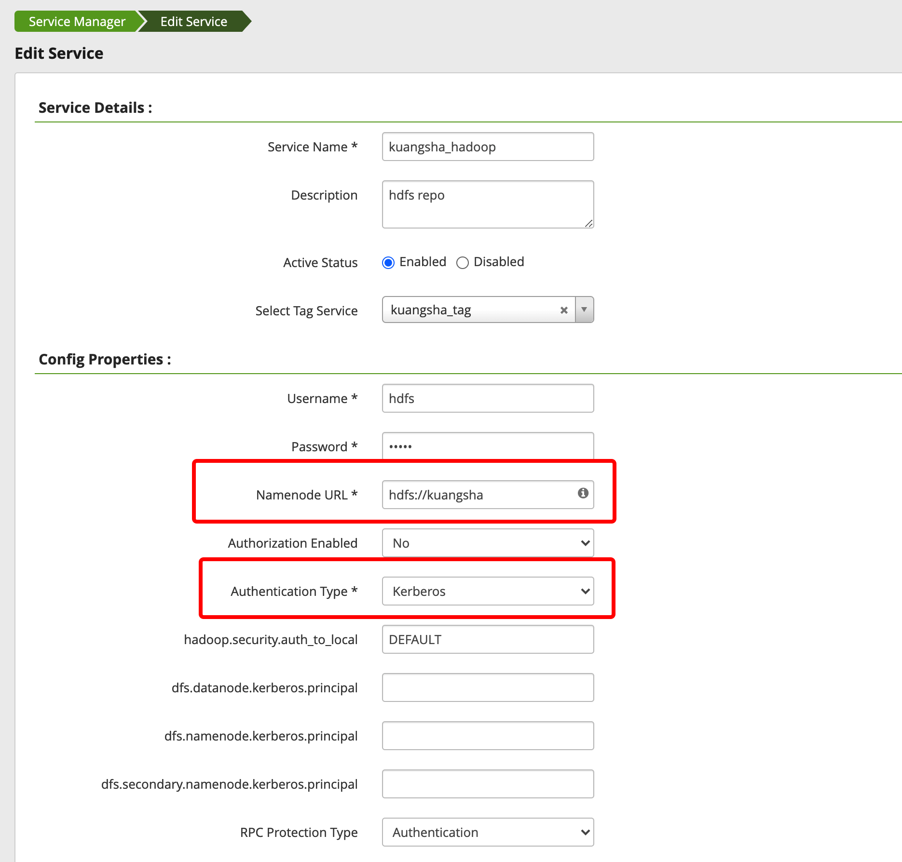
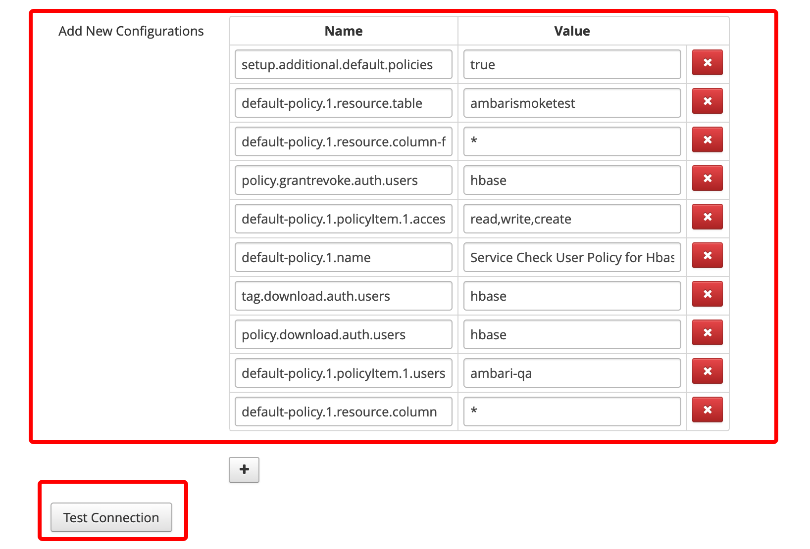
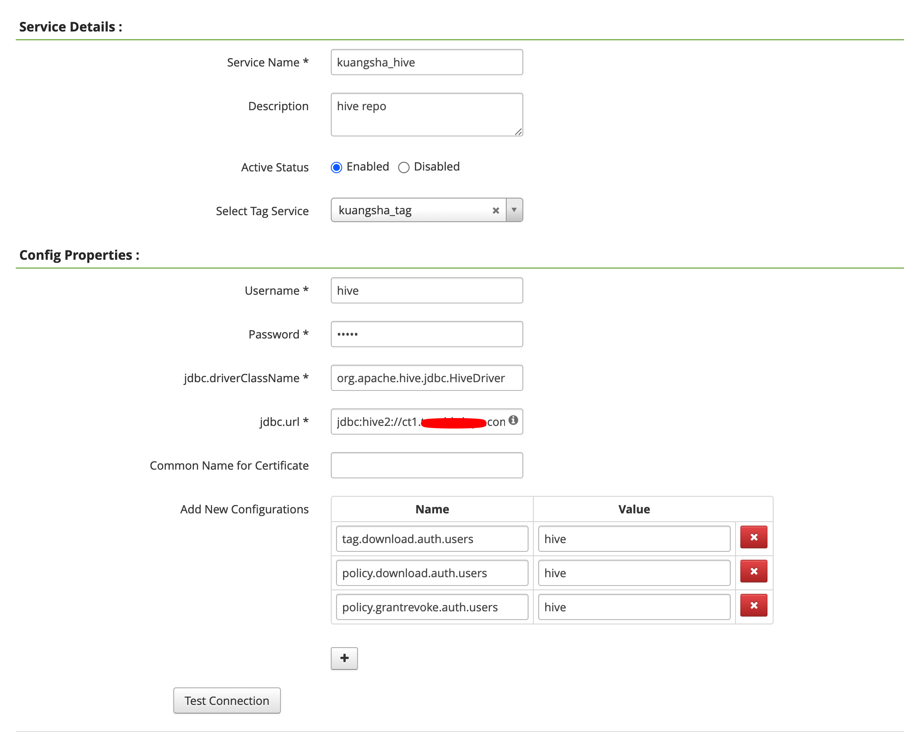

# Ranger 与 Kerberos 结合

在开启了 Kerberos 之后，开启 Plugin 后发现 Ranger 中不会自动出现相应的 Service，不知道是不是 Bug，还是故意这样的。

我这里手动添加，需要特别注意几个参数。

## HDFS Plugin Service

我集群中的 HDFS 是开启了 HA 的，所以这里配置的时候也要配置 HA。

只要连接测试通过即可。

## HBase Plugin Service

## Hive Plugin Service

