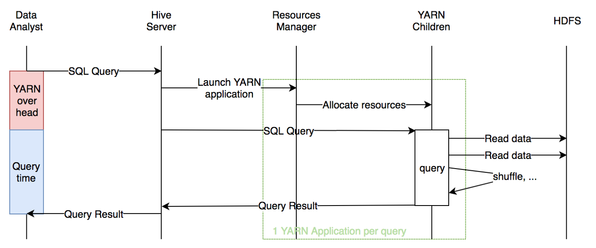
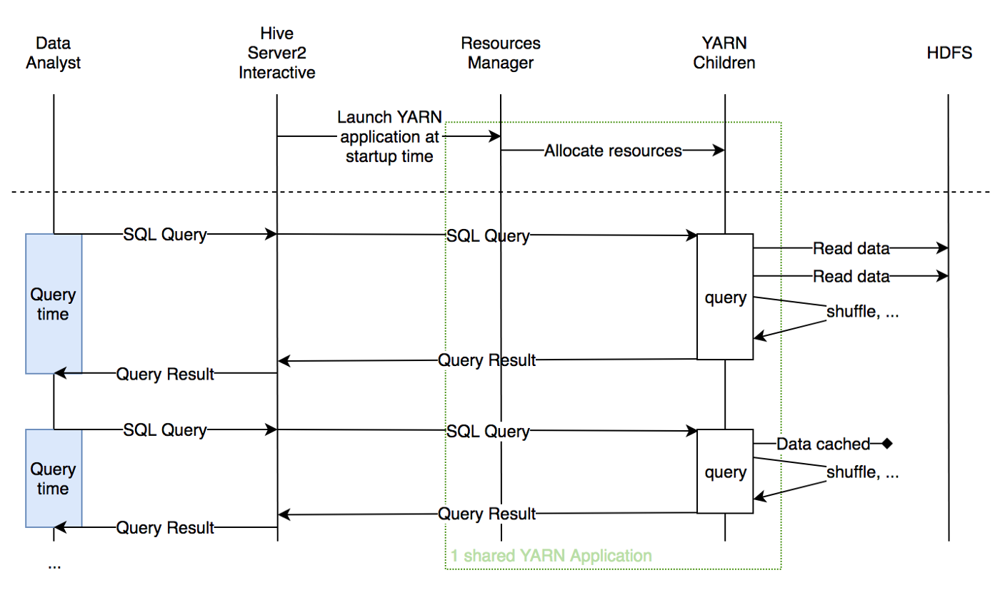
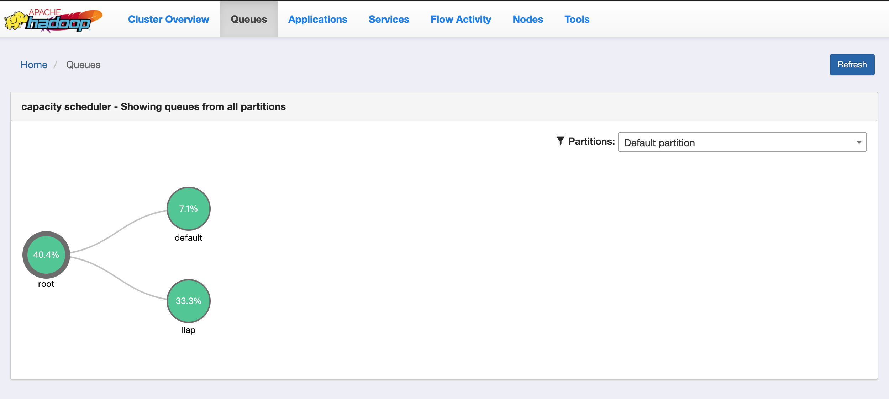
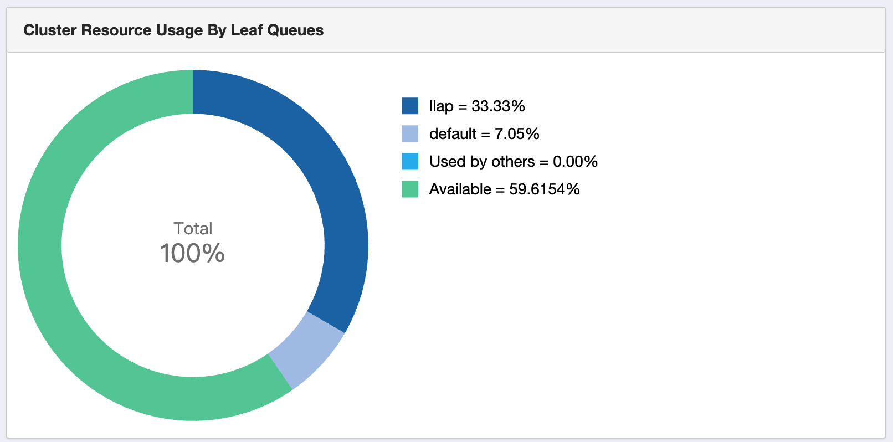
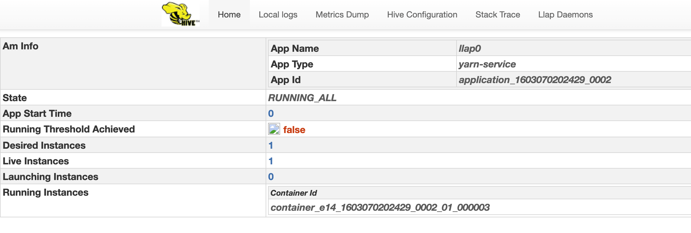

# LLAP

参考：https://medium.com/sqooba/hive-llap-brings-interactive-sql-queries-on-hadoop-8f876ef116d8

官方文档：https://cwiki.apache.org/confluence/display/Hive/LLAP

Live Long And Process (LLAP) 是 Hive 2.0 中新添加的功能。代表长期分析处理。

## Hive 面临的问题

提交 SQL 到 Hive 服务器时，都会启动 Yarn 容器，启动 Yarn 容器的时间算到了执行 SQL 所消耗的时间中了。在查询比较大的时候，启动时间相对于处理时间微不足道，可以忽略不计。但在查询较小时（交互式，比如 BI），想要实时查询，这时启动时间就会变得很难忍。

下面的（简化的）序列图显示了Hive查询中隐含的所有涉众之间的交互，包括最终用户对延迟的感知中考虑的间接费用时间。

每次插叙都包含一个 Yarn 启动的时间。

自Hive首次发布以来，它进行了许多改进，其中Tez是最重要的。简而言之，代替在连续的Map和Reduce阶段中编译SQL，更复杂的DAG可以大大缩短执行时间。

其他功能试图减轻这种开销时间，例如，在Hive中称为“容器重用”（在YARN中）或“容器预热”的功能：第一个SQL查询将启动YARN应用程序，随后的查询将重用相同的应用程序。但是这种方法带来了另一个问题：虽然Data Analyst不执行查询，即键入新查询或查看结果，但她的YARN应用程序所拥有的资源不能被其他处理使用，而只是浪费了。另一个问题，取决于您的配置，状态不会在不同用户之间共享（例如，数据缓存等）。

**在所有这些试验中，还有 LLAP，这是 YARN 之上的共享，可重用的 SQL 查询层。**

## LLAP是共享的YARN应用程序

LLAP 进程，叫做 HiveServer2-interactive，可以在 HDP 中开启。它在启动时将启动运行时间较长的 YARN 容器。此 YARN 容器独立于查询的用户执行所有SQL查询。

LLAP守护程序具有可配置的占用空间（即，可以全局定义分配给LLAP的最小和最大RAM / CPU）

LLAP 以最小大小处理短/小查询，并可以根据以下情况动态缩放该YARN应用程序消耗的资源：在给定时间运行的查询数和这些查询的大小。这使得小型查询的等待时间短，而大型查询则可以扩展，而不会通过使用资源的严格配置而浪费过多的资源。

Yarn 容器只需要启动一次即可。

由于LLAP应用程序的运行时间比普通的Hive应用程序长，因此经常访问的数据将保存在跨YARN应用程序成员分布的缓存中，从而使使用同一基础表的查询可以快速进行交互式分析。

## HDP 中启用 LLAP

在 HDP 的 Hive 的 Config 界面中，可以启用 Interactive，HIVESERVER2 INTERACTIVE 启用后，Yarn 中会添加一个名为 llap 的分区，并且自动为它分配了一些资源，比如：

Hive WebUI 中，关于 LLAP 的部分：

