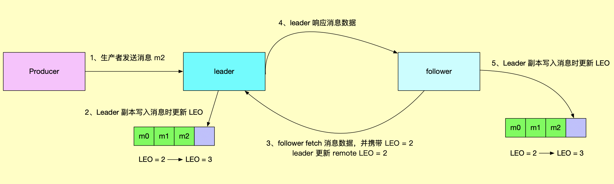

ISR（in-sync replica） 就是 Kafka 为某个分区维护的一组同步集合，即每个分区都有自己的一个 ISR 集合，处于 ISR 集合中的副本，意味着 follower 副本与 leader 副本保持同步状态，只有处于 ISR 集合中的副本才有资格被选举为 leader。一条 Kafka 消息，只有被 ISR 中的副本都接收到，才被视为“已同步”状态。这跟 zk 的同步机制不一样，zk 只需要超过半数节点写入，就可被视为已写入成功。

follwer 副本与 leader 副本之间的数据同步流程如下：

