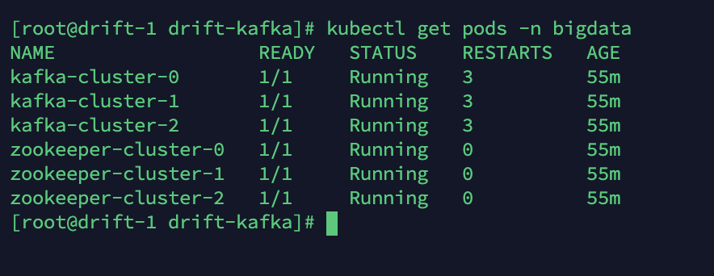
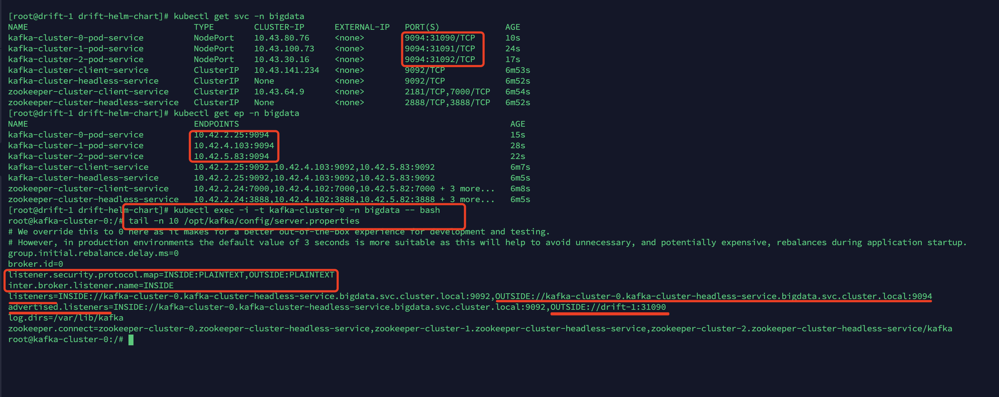
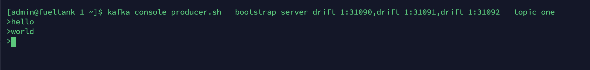

在 Kubernetes 集群中，使用 StatefulSet 和 Headless Service 可以部署一个 Kafka 集群。Headless Service 会为每个 Pod 都提供一个DNS 地址，Kafka 利用这个地址来实现自身的高可用策略。在 Kubernetes 集群内部，是可以顺利访问每一个 Kafka 节点的，但是在 Kubernetes 外部，就没办法访问 Pod 的 DNS 地址了。

想在 Kubernetes 外部访问 Kafka 集群，可以按照以下思路实现。


## 在外部访问 Pod

若想在 k8s 外部访问每一个 Pod，需要为每一个 Pod 都绑定一个 Service，这个 Service 和 Pod 是一一关联的，Service 的类型可以使用 LoadBalancer 或 NodePort，由于条件有限，我这里使用 NodePort来实现。

首先要为每个 Pod 绑定一个唯一的 Label，比如加一个名为 pod-name 的 Label：

```yaml
apiVersion: v1
kind: Pod
metadata:
	name: kafka-cluster-0
	namespace: bigdata
	labels:
    app: kafka-cluster
    pod-name: kafka-cluster-0
```

Pod 对应的 Service 如下，要选择上面的唯一的 Label：

```yaml
apiVersion: v1
kind: Service
metadata:
	name: kafka-cluster-0-pod-service
  labels:
    app: kafka-cluster
    pod-name: kafka-cluster-0
  namespace: bigdata
spec:
  ports:
  - name: client
    nodePort: 31090
    port: 9094
    protocol: TCP
    targetPort: 9094
  selector:
    app: kafka-cluster
    pod-name: kafka-cluster-0
  type: NodePort
```

这样通过 `kafka-cluster-0-pod-service` 这个 Service 就可以访问到固定的名为 `kafka-cluster-0` 的 Pod 了，其他 Pod 同理。

这里注意 31090 和 9094 这俩端口，后面会用到。


## Kafka 配置外部访问

只在外部通过 Service 连通是不行的，还需要配置 Kafka。

Kafka 中，允许外部访问的配置如下：

```properties
listener.security.protocol.map=INSIDE:PLAINTEXT,OUTSIDE:PLAINTEXT
inter.broker.listener.name=INSIDE
listeners=INSIDE://kafka-cluster-0.kafka-cluster-headless-service.bigdata.svc.cluster.local:9092,OUTSIDE://kafka-cluster-0.kafka-cluster-headless-service.bigdata.svc.cluster.local:9094
advertised.listeners=INSIDE://kafka-cluster-0.kafka-cluster-headless-service.bigdata.svc.cluster.local:9092,OUTSIDE://drift-1:31090
log.dirs=/var/lib/kafka
```

`listener.security.protocol.map` 和 `inter.broker.listener.name=INSIDE` 是必须要配置的。`listener.security.protocol.map` 为内外部的 `PLAINTEXT` 协议配置了俩别名，Kafka 内部选举时，使用 `inter.broker.listener.name` 配置项中的别名，即 INSIDE。

`listeners` 和 `advertised.listeners` 中的 INSIDE 地址要一致，并且可以在其他 Pod 中访问到。

OUTSIDE 就是外部可以访问的地址。注意 `advertised.listeners` 中的 OUTSIDE 是外部客户端实际使用的地址，`listeners` 中的 OUTSIDE 是 Kafka 内部服务端实际绑定的地址。`drift-1` 是宿主机的主机名。

所以在上边的 Service 中，`nodePort` 要为 31090，`port` 和 `targetPort` 要为 9094，与 Kafka 的配置文件相对应。

名为 `kafka-cluster-0` 的 Pod 使用 NodePort 是 31090，`kafka-cluster-1` 使用的是 31091，`kafka-cluster-2` 使用的是 31092。


## 测试访问

在另外一台主机上测试生产者：

```bash
$ kafka-console-producer.sh --bootstrap-server drift-1:31090,drift-1:31091,drift-1:31092 --topic one
```

测试消费者：

```bash
$ kafka-console-consumer.sh --bootstrap-server drift-1:31090,drift-1:31091,drift-1:31092 --topic one --from-beginning
```


## 截图为证

Pod 列表



Service 及配置



在另一台机器上使用生产者：



消费者；


