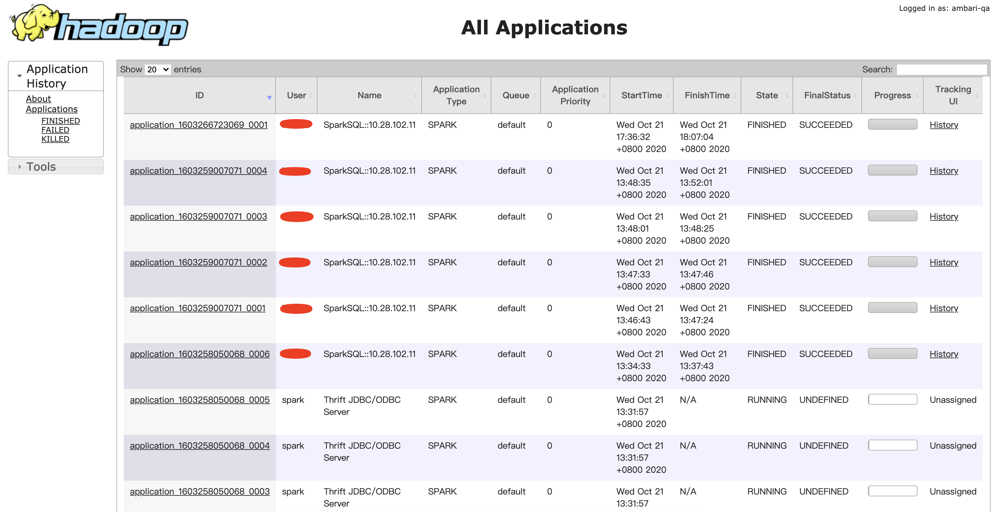

# Timeline V2.0

官方文档：https://hadoop.apache.org/docs/current/hadoop-yarn/hadoop-yarn-site/TimelineServiceV2.html

YARN Timeline Service v.2是Timeline Server的下一个主要版本，紧随v.1和v.1.5之后。创建V.2是为了应对v.1的两个主要挑战。

- 可扩展性

  V.1仅限于写入器/读取器和存储的单个实例，并且不能很好地扩展到小型群集之外。 V.2使用更具扩展性的分布式写入器体系结构和可扩展的后端存储。

  YARN Timeline 服务v.2将数据的收集（写入）与数据的提供（读取）分开。它使用分布式收集器，每个YARN应用程序实质上是一个收集器。读取器是专用于通过REST API服务查询的单独实例。

  YARN Timeline Service v.2选择Apache HBase作为主要的后备存储，因为Apache HBase可以很好地扩展到较大的大小，同时保持良好的读写响应时间。

- 可用性改进

  在许多情况下，用户对YARN应用程序的“流”级别或逻辑组级别的信息感兴趣。启动一组或一系列YARN应用程序以完成逻辑应用程序更为常见。时间轴服务v.2明确支持流的概念。此外，它支持在流级别汇总指标。

  此外，诸如配置和度量标准之类的信息也被视为一等公民。

  下图说明了不同YARN实体建模流程之间的关系。

  

  

## 架构

YARN Timeline Server v.2使用一组收集器（写入器）将数据写入后端存储。收集器与专用的应用程序主机一起分布并位于同一位置。属于该应用程序的所有数据都将发送到应用程序级别的 timeline collector ，资源管理器timeline collector 除外。

对于给定的应用程序，应用程序主机可以将应用程序的数据写入位于同一位置的timeline collector （在此版本中是NM辅助服务）。此外，其他正在运行应用程序容器的节点的节点管理器也将数据写入运行应用程序主机的节点上的timeline collector 。

资源管理器还维护自己的 timeline 收集器。它仅发出YARN通用生命周期事件，以保持其合理的写入量。

timeline readers 是与时间线收集器分开的单独的守护程序，它们专用于通过REST API提供查询。

下图从高层次说明了该设计。

每个 ApplicationMaster 中都有一个收集器，收集器是直接将信息写入储存的。

## Web UI

Timeline Server 的 Web 界面如下：

