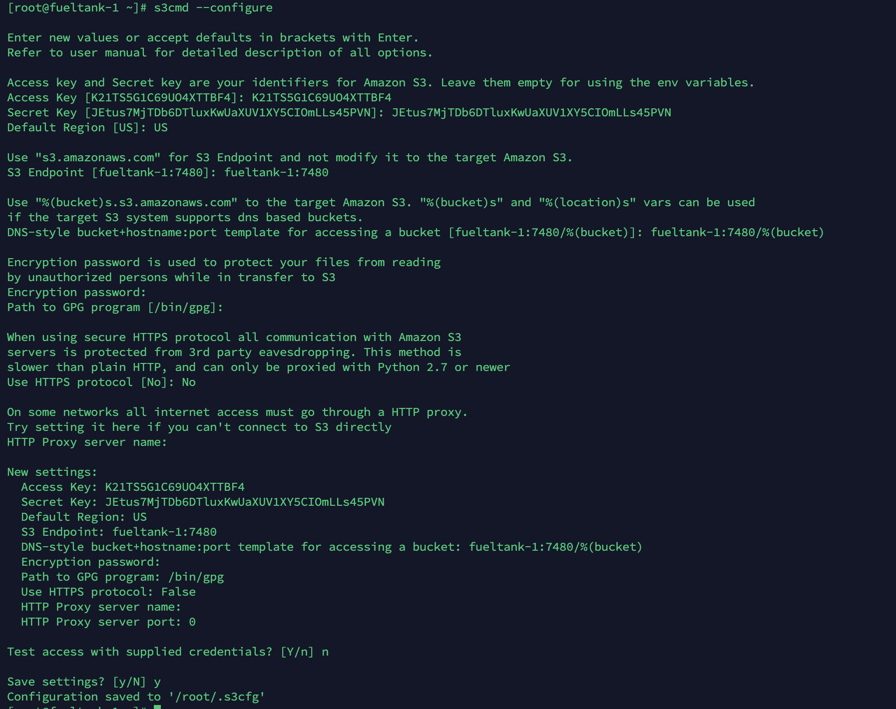

# S3 API

先使用命令来测试一下。

安装命令

```bash
$ yum install -y s3cmd
```

先获取用户信息：

```bash
$ radosgw-admin user info --uid=xujiyou_id
```

主要获取其中的 key：

```yaml
    "keys": [
        {
            "user": "xujiyou_id",
            "access_key": "K21TS5G1C69UO4XTTBF4",
            "secret_key": "JEtus7MjTDb6DTluxKwUaXUV1XY5CIOmLLs45PVN"
        }
    ],
```

配置：

```
$ s3cmd --configure
```

我的配置过程如下：



注意 

- Access Key 和 Secret Key 使用上边用户的信息。
- Default Region 要填 US。
- S3 Endpoint 要填本地集群中 RGW 的地址
- bucket 要填 RGW 地址加上 `/%(bucket)`
- 其他默认，不要填安全信息，第一次学习。

最后会生成一个 `/root/.s3cfg` 配置文件。

创建桶：

```bash
$ s3cmd mb s3://one
```

查看桶列表：

```bash
$ radosgw-admin bucket list
```

通过 s3cmd 来查看：

```bash
$ s3cmd ls
```

删除：

```bash
$ s3cmd mb s3://mybucket1
$ s3cmd rb s3://mybucket1
```

上传对象：

```bash
$ s3cmd put testfile.txt s3://one
```

查看对象列表：

```bash
$ s3cmd ls s3://one
```

下载对象：

```bash
$ s3cmd get s3://one/testfile.txt
```

删除桶内的所有对象：

```bash
$ s3cmd del -rf s3://one
```


## curl 访问

```bash
#!/bin/bash

bucket="two"
dateValue=`date -R`
resource="/${bucket}/"
contentType="application/octet-stream"
stringToSign="PUT\n\n\n${dateValue}\n${resource}"
s3Key="K21TS5G1C69UO4XTTBF4"
s3Secret="JEtus7MjTDb6DTluxKwUaXUV1XY5CIOmLLs45PVN"
signature=`echo -en ${stringToSign} | openssl sha1 -hmac ${s3Secret} -binary | base64`
curl -v -X PUT "http://fueltank-1:7480/${bucket}" \
        -H "Host: fueltank-1:7480" \
        -H "Date: ${dateValue}"\
        -H "Authorization: AWS ${s3Key}:${signature}"
```

curl 还是挺复杂的，不要搞了。


