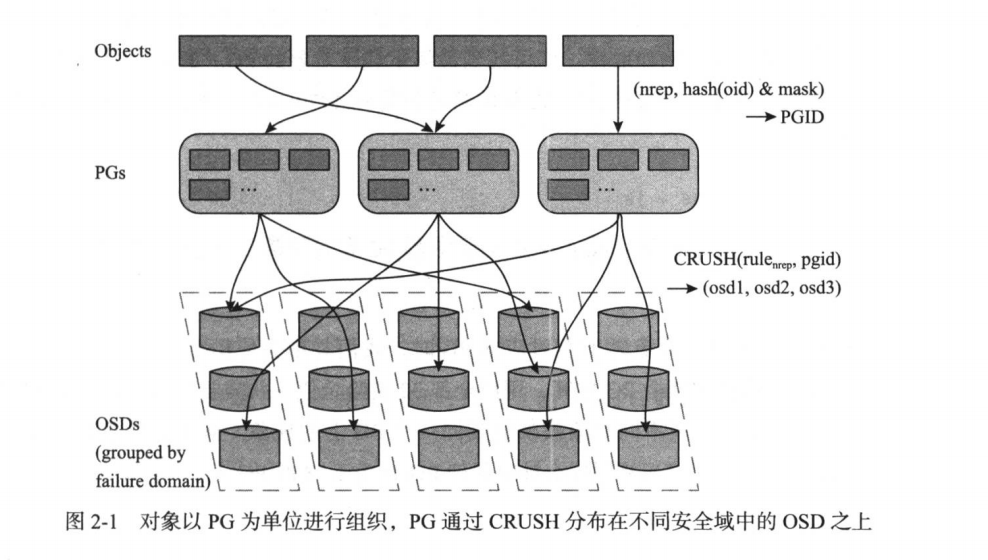

BlueStore 是 Ceph 最新的储存引擎，不同于 FileStore，BlueStore 会绕过 Linux 的文件系统，直接接管裸设备（磁盘），直接进行对象操作，不再进行对象与文件之间的转换，从而使得整个对象的 I/O 路径大大缩短，除此之外，BlueStore 还对 SSD 进行了优化。

## 磁盘数据结构

像 Pool，PG 这些概念其实都是磁盘的数据结构。

由于 BlueStore 自己接管了磁盘，所以它的数据结构远比 FileStore 要复杂。

在 BuleStore 中，元数据对性能有着至关重要的影响，元数据被设计成和用户数据分开存放，目前统一以键值对的形式存放于 kvDB 中，推荐使用高性能的 SSD 存放元数据！


## Pool

Pool，资源池、储存池，是一个虚拟概念，可以理解为命名空间，表示一组约束条件，可以单独针对一个 pool 设置一组 CRUSH 规则。


## PG

一个 Pool 中有多个 PG，具体数量可以通过以下命令查看：

```bash
$ ceph osd pool get test pg_num
pg_num: 32
```

其中，test 是 pool 的名称。

在储存数据的时候，Ceph 会将文件切割成一个一个的对象，每个对象都采用一定的策略生成一个全局唯一的对象标示，即 Object ID。

为了实现不同 Pool 之间的隔离，Ceph 并不是将任何上层对象直接映射到 OSD，而是引入了一层中间结构，名为 PG。



对象会均匀的分布在 PG 之上，PG 又会均匀的分布在 OSD 之上，CRUSH 对计算规则进行调整，以帮助 PG 在不同的 OSD 之间灵活的调整，进而实现数据的可靠性、自动平衡等高级特性。

查看 Pool 中 PG 的分布：

```bash
$ ceph pg ls-by-pool test
```

查看对象的位置：

```bash
$ ceph osd map test test-object
osdmap e264282 pool 'test' (4) object 'test-object' -> pg 4.bf8f6aea (4.a) -> up ([1,0,2], p1) acting ([1,0,2], p1)
```

test-object 是对象名，test 是 pool。

- osdmap e264282 是 osdmap 的版本号
- pool 'test' (4) 是 pool 名字及 ID
- object 'test-object' 是对象名称
- pg 4.bf8f6aea (4.a) 是对象所在 PG 的编号

结果显示这个对象在 ID 为 4.a 的 PG 上，并且位于 OSD1，OSD0，OSD2 上，三个副本。

查看 pg 中有哪些对象：

```bash
$ rados --pgid 4.a ls
```

像 Pool，PG 这些东西都是有 id 的，查看 Pool 的 ID：

```bash
$ ceph osd lspools
```

我这里名为 test 的 pool 的 ID 为 4，所以 test 下面的 PG 的 ID 都是以 4 开头的。


