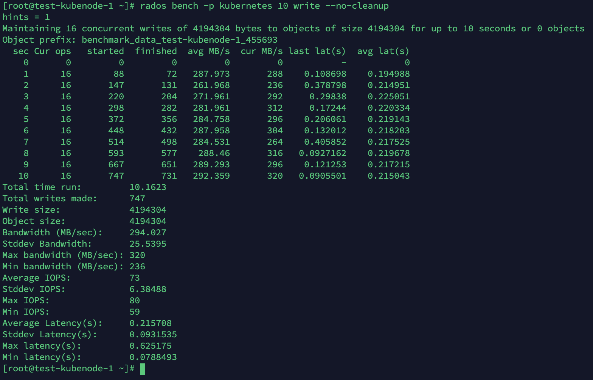
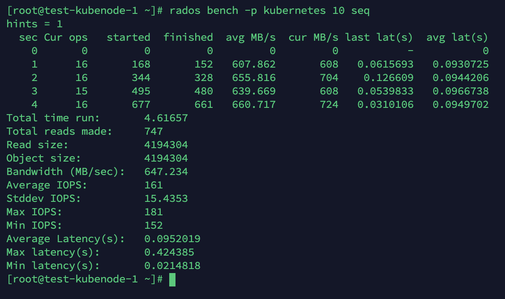
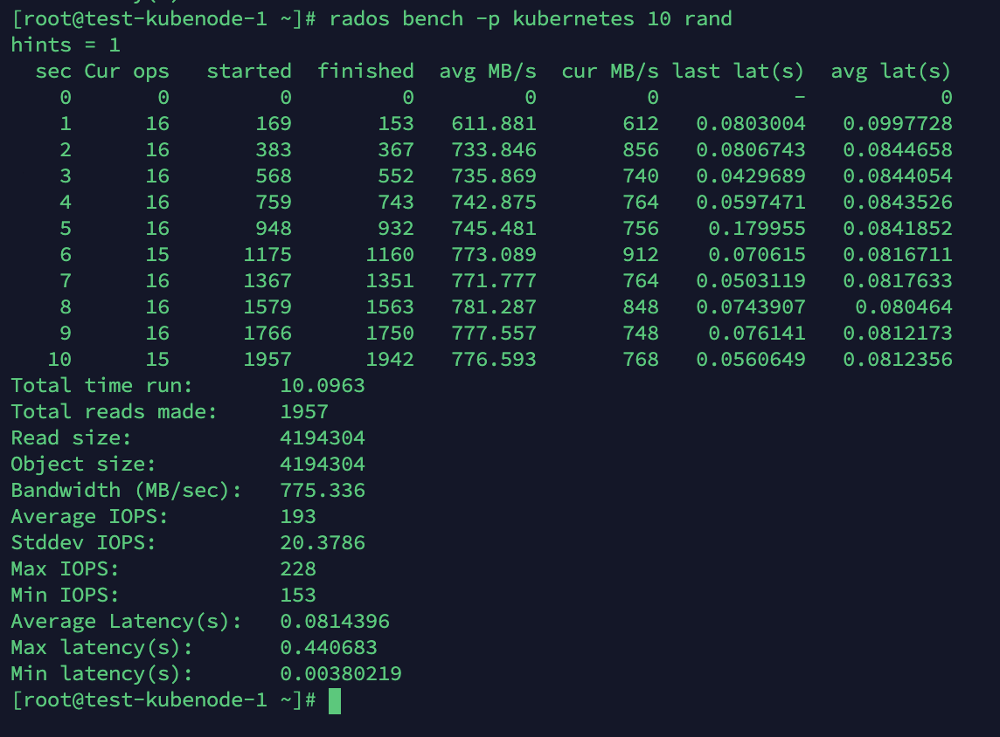
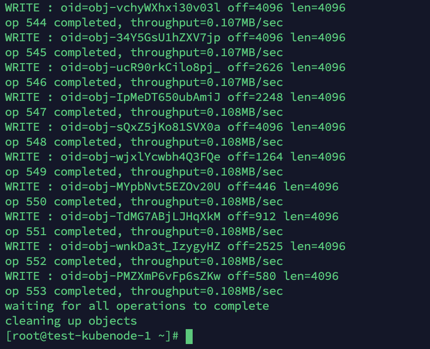
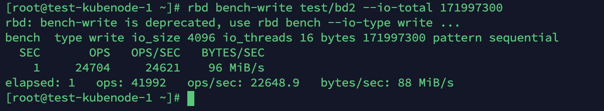
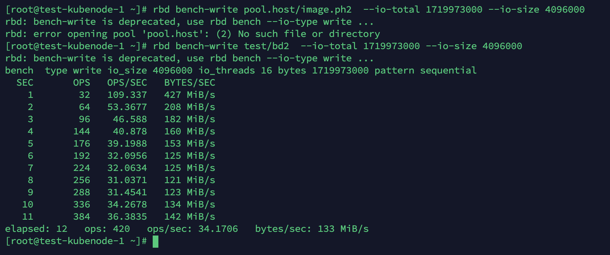

# Ceph 性能测试

参考：https://www.cnblogs.com/Alysa-lrr/p/6027194.html

Ceph 性能的测试包括：RADOS 性能测试和 RBD 性能测试；

Rados 性能测试工具：使用 Ceph 自带的 `rados bench` 、`rados load-gen`；

RBD 性能测试工具：`rbd bench-write` 进行块设备写性能测试；


## Rados性能测试


#### rados bench

使用 Ceph 自带的 `rados bench` 工具进行测试

语法是：

```bash
rados bench -p <pool_name> <seconds> <write|seq|rand> -b <block size> -t --no-cleanup
```

**pool_name**：测试所针对的存储池；

**seconds**：测试所持续的秒数；

** <write|seq|rand>**：操作模式，write：写，seq：顺序读；rand：随机读；

**-b**：block size，即块大小，默认为 4M；

 **-t**：读/写并行数，默认为 16；

**--no-cleanup** 表示测试完成后不删除测试用数据。在做读测试之前，需要使用该参数来运行一遍写测试来产生测试数据，在全部测试结束后可以运行 rados -p <pool_name>   cleanup 来清理所有测试数据。

实际写测试：

```bash
$ rados bench -p kubernetes 10 write --no-cleanup
```

测试结果：



顺序读测试：

```bash
$ rados bench -p kubernetes 10 seq
```

测试结果：



`Latency` 是延迟，这个延迟还是比较小的。

随机读测试：

```
rados bench -p kubernetes 10 rand
```

测试结果：



测试完成后，使用下面的命令来清空 pool 中的数据：

```bash
$ rados -p kubernetes cleanup
```


#### rados load-gen

该工具的语法为：

```
rados -p rbd load-gen 
--num-objects     初始生成测试用的对象数，默认 200
--min-object-size 测试对象的最小大小，默认 1KB，单位byte 
--max-object-size 测试对象的最大大小，默认 5GB，单位byte

--min-op-len      压测IO的最小大小，默认 1KB，单位byte
--max-op-len      压测IO的最大大小，默认 2MB，单位byte
--max-ops         一次提交的最大IO数，相当于iodepth
--target-throughput 一次提交IO的历史累计吞吐量上限，默认 5MB/s，单位B/s
--max-backlog     一次提交IO的吞吐量上限，默认10MB/s，单位B/s
--read-percent    读写混合中读的比例，默认80，范围[0, 100]

--run-length      运行的时间，默认60s，单位秒
```

测试4KB写，iodepth=1，速度不限：

```bash
$ rados -p kubernetes load-gen --num-objects 128 --min-object-size 8192 --max-object-size 8192 --run-length 20 --read-percent 0 --min-op-len 4096 --max-op-len 4096 --target-throughput 104857600 --max_backlog 104857600 --max-ops 1
```

部分结果如下：




## RBD 性能测试

先创建一个块设备，映射后挂载：

```bash
$ ceph osd pool create test
$ rbd create bd2 --size 1024 -p test
$ rbd device map test/bd2
$ rbd showmapped
$ mkfs.xfs /dev/rbd0
$ mkdir -p /mnt/rbd0
$ mount /dev/rbd0 /mnt/rbd0
$ df -h /mnt/rbd0/
```

rbd bench-write 的语法为：rbd bench-write <RBD image name>，可以带如下参数：

- --io-size：单位 byte，默认 4096 bytes = 4K
- --io-threads：线程数，默认 16
- --io-total：总写入字节，单位为字节，默认 1024M
- --io-pattern <seq|rand>：写模式，默认为 seq 即顺序写

4k 写测试：

```bash
$ rbd bench-write test/bd2 --io-total 171997300
```

测试结果：



4k写 16 线程 一秒中就写进去 164MB。

4096 * 22649 = 92770304 约等于 88MB。


4M 写测试：

```bash
$ rbd bench-write pool.host/image.ph2  --io-total 1719973000 --io-size 4096000
```



此时 block size 为 4M，IOPS 为 34， BW 为 133 MB/s。


