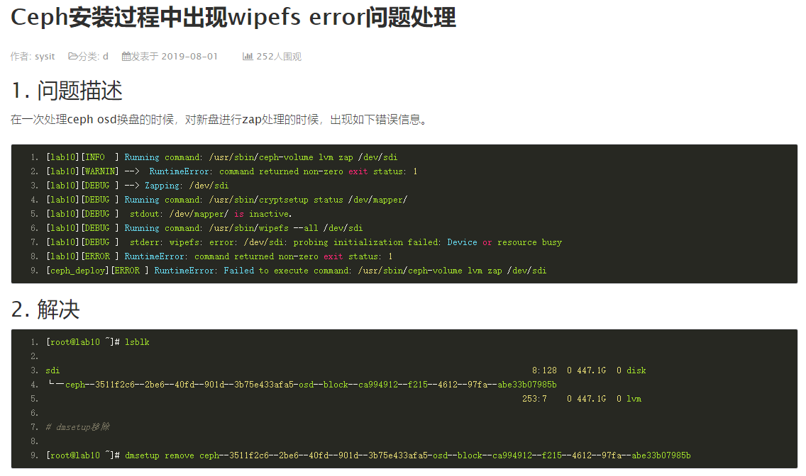

# Ceph 注意事项

Ceph 使用过的磁盘，在 Ceph 删除后，再挂载磁盘会出现以下错误：

```
mount: unknown filesystem type 'LVM2_member'
```

我确定磁盘里面的数据全部不要了，可以这样解决：

```bash
$ sudo lvdisplay
$ sudo lvremove /dev/ceph-5130052e-2309-4709-8cc4-a51a7bae5d79/osd-block-d1dc7e72-2738-4f07-ba8b-dffd46a4a308
```

然后再进行格式化和挂载即可：

```bash
$ sudo mkfs.ext4 /dev/vdb
$ sudo mount /dev/vdb /data2
```


## 报错

警告：

```
1 pool(s) do not have an application enabled
```

解决方法：

```bash
$ ceph osd pool application enable test rgw
```

test 是 pool 的名字。


警告：

```
9 daemons have recently crashed
```

解决方法：

```bash
$ ceph crash ls-new #查看最新的 crash
$ ceph crash info 2020-06-22T17:28:11.652393Z_ce7105bd-bf96-4fb7-9d69-c47457ccb1b4 #查看 crash 的详细信息
$ ceph crash archive-all #清除所有 crash
```


## wipefs 报错




