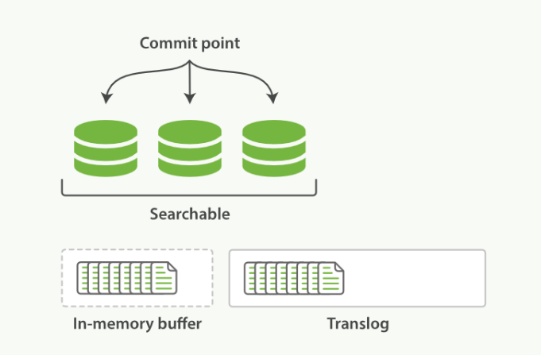
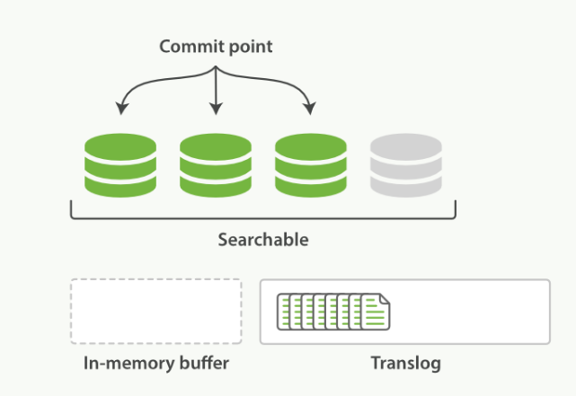
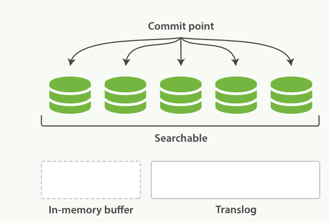

# Translog文件保证数据安全

这篇文章主要介绍Elasticsearch的索引工作机制,它是如何利用translog来保证数据的安全,以及我们在生产环境中如何优化translog的参数来最大化性能,主要会介绍到elastic中常见的2个操作:refresh和flush，以及这2个接口是如何保证数据能够被检索到的。


## 数据持久化

我们把数据写到磁盘后，还要调用 fsync 才能把数据刷到磁盘中，如果不这样做在系统掉电的时候就会导致数据丢失,这个原理相信大家都清楚，  elasticsearch 为了高可靠性必须把所有的修改持久化到磁盘中。

Elasticsearch 底层采用的是 lucene 这个库来实现倒排索引的功能，在 lucene 的概念里每一条记录称为 document (文档)， lucene 使用 segment (分段)来存储数据，用 commit point 来记录所有 segment 的元数据，一条记录要被搜索到，必须写入到 segment 中，这一点非常重要，后面会介绍为什么 elasticsearch 搜索是 near-realtime (接近实时的)而不是实时的。

Elastic search 使用 translog 来记录所有的操作，我们称之为 write-ahead-log，我们新增了一条记录时，es 会把数据写到 translog 和 in-memory buffer (内存缓存区)中，如下图所示:



内存缓存区和 translog 就是 near-realtime 的关键所在，前面我们讲过新增的索引必须写入到 segment 后才能被搜索到，因此我们把数据写入到内存缓冲区之后并不能被搜索到,如果希望该文档能立刻被搜索，需要手动调用 refresh 操作。


## refresh操作

默认情况下，es 每隔一秒钟执行一次 refresh ，可以通过参数`index.refresh_interval`来修改这个刷新间隔，执行 refresh 操作具体做了哪些事情呢?

- 所有在内存缓冲区中的文档被写入到一个新的 segment 中,但是没有调用fsync，因此内存中的数据可能丢失
- segment被打开使得里面的文档能够被搜索到
- 清空内存缓冲区

执行refresh后的状态如下图所示:



refresh 的开销比较大，我在自己环境上测试10W条记录的场景下 refresh 一次大概要 14ms ，因此在批量构建索引时可以把 refresh 间隔设置成 -1 来临时关闭 refresh，等到索引都提交完成之后再打开 refresh ，可以通过如下接口修改这个参数:

```bash
curl -XPUT 'localhost:9200/test/_settings' -d '{
    "index" : {
        "refresh_interval" : "-1"
    }
}'
```

另外当你在做批量索引时，可以考虑把副本数设置成 0 ，因为 document 从主分片( primary shard )复制到从分片( replica shard )时，从分片也要执行相同的分析、索引和合并过程,这样的开销比较大，你可以在构建索引之后再开启副本，这样只需要把数据从主分片拷贝到从分片：

```bash
curl -XPUT 'localhost:9200/my_index/_settings' -d ' {
    "index" : {
        "number_of_replicas" : 0
    }
}'
```

执行完批量索引之后,把刷新间隔改回来:

```bash
curl -XPUT 'localhost:9200/my_index/_settings' -d '{
    "index" : {
        "refresh_interval" : "1s"
    } 
}'
```

你还可以强制执行一次refresh以及索引分段的合并:

```bash
curl -XPOST 'localhost:9200/my_index/_refresh'

curl -XPOST 'localhost:9200/my_index/_forcemerge?max_num_segments=5'
```


## flush操作

随着 translog 文件越来越大时要考虑把内存中的数据刷新到磁盘中，这个过程称为flush，flush过程主要做了如下操作:

- 把所有在内存缓冲区中的文档写入到一个新的 segment 中
- 清空内存缓冲区
- 往磁盘里写入commit point信息
- 文件系统的 page cache(segments) fsync 到磁盘
- 删除旧的 translog 文件，因此此时内存中的 segments 已经写入到磁盘中,就不需要translog来保障数据安全了

flush之后的状态如下所示:



es 有几个条件来决定是否 flush 到磁盘,不同版本的es参数有所不同，大家可以参考es对应版本的文档来查看这几个参数:[es translog](https://www.elastic.co/guide/en/elasticsearch/reference/current/index-modules-translog.html)。

在系统恢复过程中 es 会比较 translog 和 segments 中的数据来保证数据的完整性，为了数据安全 es 默认每隔5秒钟会把 translog 刷新( fsync )到磁盘中，也就是说系统掉电的情况下 es 最多会丢失5秒钟的数据，如果你对数据安全比较敏感,可以把这个间隔减小或者改为每次请求之后都把translog fsync到磁盘，但是会占用更多资源；这个间隔是通过下面2个参数来控制的:

- index.translog.sync_interval 控制translog多久fsync到磁盘,最小为100ms
- index.translog.durability translog 是每5秒钟刷新一次还是每次请求都fsync，这个参数有2个取值:request(每次请求都执行fsync,es要等translog fsync到磁盘后才会返回成功)和async(默认值,translog每隔5秒钟fsync一次)

需要弄清楚 flush 和 fsync 的区别，flush 是把内存中的数据(包括 translog 和 segments )都刷到磁盘，而 fsync 只是把 translog 刷新的磁盘(确保数据不丢失)。


