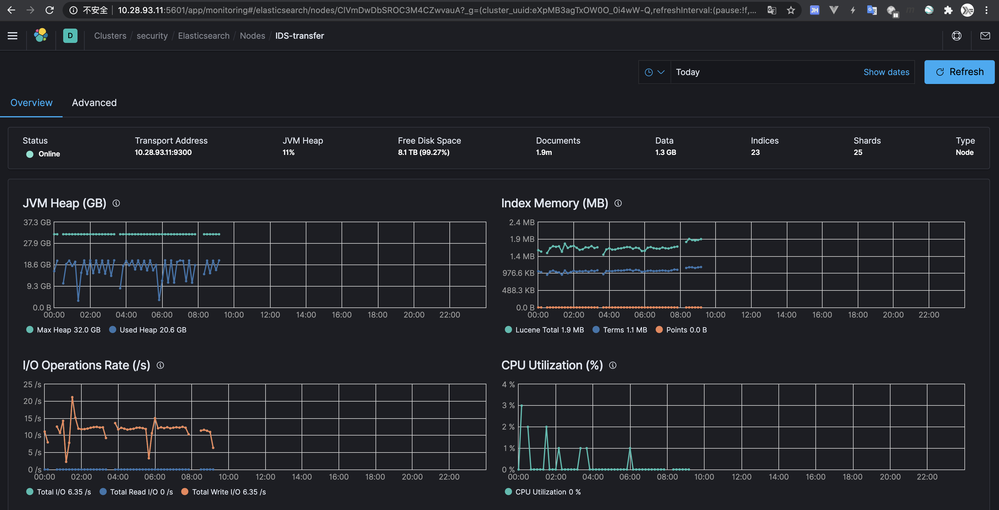
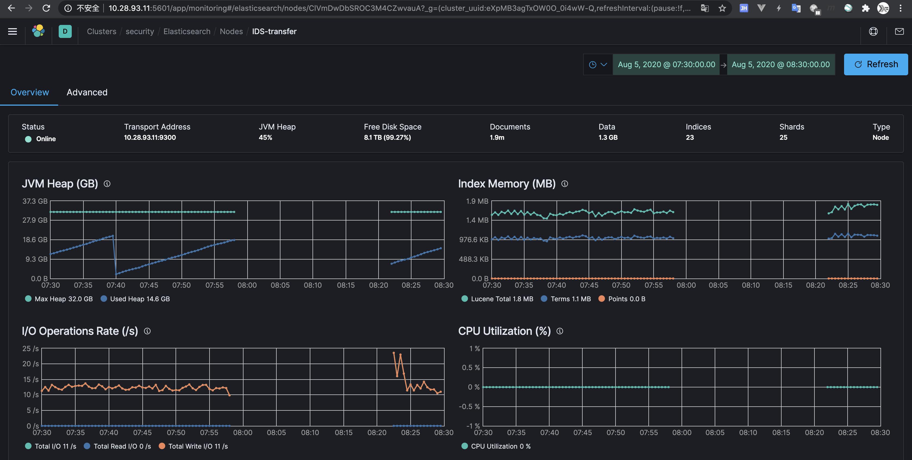
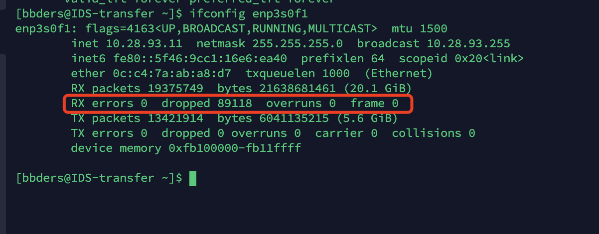
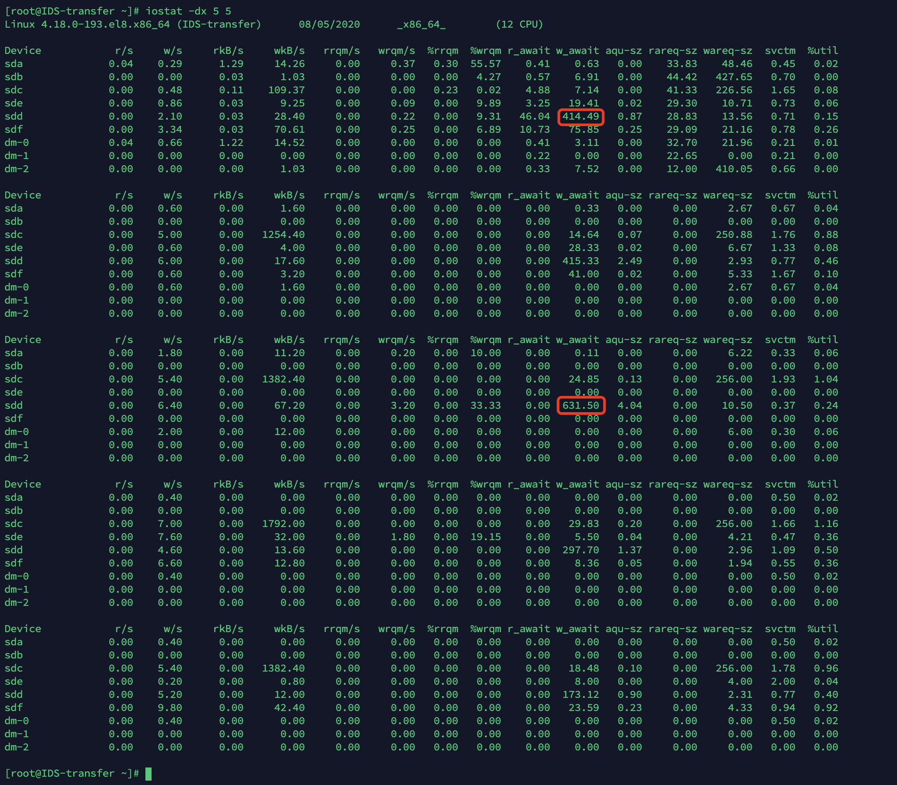
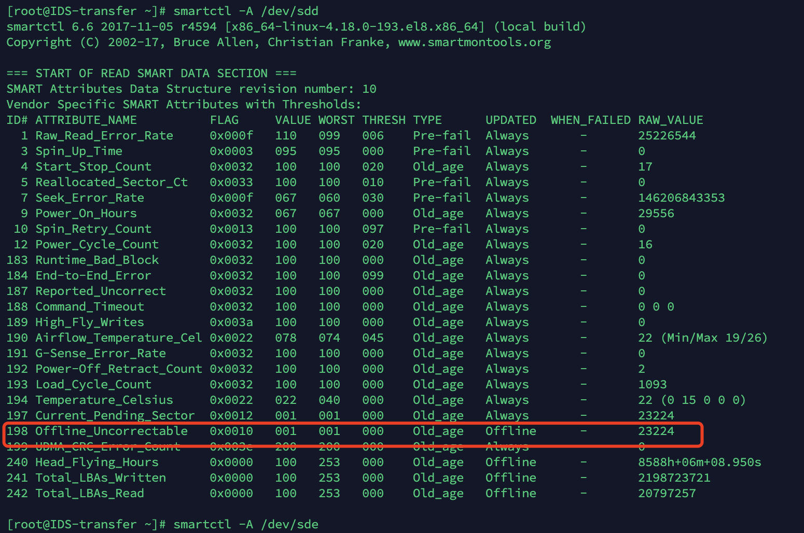

# ES 掉节点排错

ES 总是会出现掉节点的情况，这一秒 up 了，下一秒就要 down，如此循环往复。报错日志也没什么特别的错误，就是那台爱掉的节点一直循环报 no master 的错误，也有向 master 汇报节点状态超时的错误。


## 解决方案

默认配置为：节点每隔 1s 同 master 发送1次心跳，超时时间为30s，测试次数为3次，超过3次，则认为该节点同master已经脱离了。以上为elasticsearch的默认配置。在实际生产环境中，每隔1s，太频繁了，会产生太多网络流量。我们可以在elasticsearch.yml如下修改：

```properties
discovery.zen.fd.ping_timeout: 120s  
discovery.zen.fd.ping_retries: 6  
discovery.zen.fd.ping_interval: 30s  
```

超时时间设为2分钟，超过6次心跳没有回应，则认为该节点脱离master，每隔30s发送一次心跳。


另外参考：https://www.elastic.co/guide/en/elasticsearch/reference/7.x/delayed-allocation.html

避免在掉节点后立马就重新平衡数据，可以设置延迟，比如设置5分钟延迟：

```http
PUT _all/_settings
{
  "settings": {
    "index.unassigned.node_left.delayed_timeout": "5m"
  }
}
```

如果在 5 分钟内，节点恢复了，就不用平衡数据了！


上述方案只能缓解问题，不能真正解决问题，经过 MetricBeat 发现，从昨晚凌晨到九点上班共掉了三次：



7:58 这次掉了 24 分钟之久。




## 问题排查

检测网络延迟和丢包：

````bash
mtr -r 10.28.92.11
mtr -r 10.28.94.11
````

短时间内，发现延迟也不大，也没丢包。

后来猜测，上述情况发生在 ES 平衡数据时，每次数据快平衡到 100% 后，那个节点就要 down 了。

在 ES 平衡数据时，会有大量的网络传输，在大量网络传输的情况下，ES 节点之间的心掉检测就可能有丢包和延迟了。


查看网卡，确实在某个时间段有丢包：



- **RX errors**: 表示总的收包的错误数量，这包括 too-long-frames 错误，Ring Buffer 溢出错误，crc 校验错误，帧同步错误，fifo overruns 以及 missed pkg 等等。
- **RX dropped**: 表示数据包已经进入了 Ring Buffer，但是由于内存不够，上层协议不支持等系统原因，导致在拷贝到内存的过程中被丢弃，netstat -s可以看到更详细的原因。
- **RX overruns**: 表示了 fifo 的 overruns，这是由于 Ring Buffer(aka Driver Queue) 传输的 IO 大于 kernel 能够处理的 IO 导致的，而 Ring Buffer 则是指在发起 IRQ 请求之前的那块 buffer。很明显，overruns 的增大意味着数据包没到 Ring Buffer 就被网卡物理层给丢弃了，而 CPU 无法即使的处理中断是造成 Ring Buffer 满的原因之一，上面那台有问题的机器就是因为 interruprs 分布的不均匀(都压在 core0)，没有做 affinity 而造成的丢包。

在这里就找到了问题原因所在，我这里 RX dropped 太高了，其他两个节点的这个值都是 0。

除了使用 `ifconfig` 命令外，`ip -s address` 也可以查看丢包。


我这台有问题的机器内存情况：


128G 的内存，部署有一个 Elasticsearch、一个 Kibana、一个 Moloch，其中 Elasticsearch 分配了 32G 内存，kibana 和 Moloch 都是使用的默认内存配置。

但是这台机器的 CPU 占用相对比较高：


12 核心的 CPU，cpu 负载在 5 左右，但是进程占用cpu比较低，cpu 的 wa 值比较高，说明是 CPU 在等待其他东西。

其他节点，相同的配置，也运行了相同配置的 ES，但是 CPU 负载很低，只有 0.2 左右。

在这台有问题的节点上手动停掉 ES 之后，发现 CPU 负载就降下来了。

通过横向对比和纵向对比，可以看出，ES 不应该占用这么多 CPU 资源的，但由于内存、网络或磁盘较慢，导致了 CPU 负载较高。

内存这种东西只要程序可以正常运行一般就没问题，而且内存也充足，网络自我感觉也没问题，问题应该就出在磁盘上！

重新启动 ES，待 ES 节点加入集群后，查看磁盘 IO 状况：

```bash
iostat -dx 5 5
```

检测结果如下：



发现 /dev/sdd 这块磁盘的 w_await 特别高，这个值表示平均每次写请求的时间(以毫秒为单位)。这包括请求在队列中花费的时间和执行它们所花费的时间。

/dev/sdd 这块磁盘每次写入几十kb都需要花费半秒左右的时间。

再次查询 CPU，发现负载又高了。

这台有故障的 ES 使用了 /dev/sdc、/dev/sdd、/dev/sde、/dev/sdf 这四块磁盘。我现在去掉 /dev/sdd 这块磁盘，再重启 ES。

去掉这块磁盘后，CPU 负载就降下来了，只有 0.5 左右了。

这时使用 ifconfig 查看 RX dropped 的值是 100856，等半天时间再看这个值。过一段时间，这个值还是有增加。

在 CentOS8 中，没有了 `/var/log/messages`  文件，可以使用下面的命令来查看系统日志：

````bash
journalctl
````

查看到有以下错误：


发现这几块磁盘都有 Offline，其中 /dev/sdd 最多。。。

使用下面的命令查看：

```bash
smartctl -A /dev/sdd
```



有离线不可修正的坏道，磁盘用的太久了，坏掉了。 看来无法挽回了。其他物理机的这项值都是 0 。

原因找到了，可惜由于资金原因，无法换盘。

先这样吧，去掉 /dev/sdd 之后，稍微稳定了一些。


