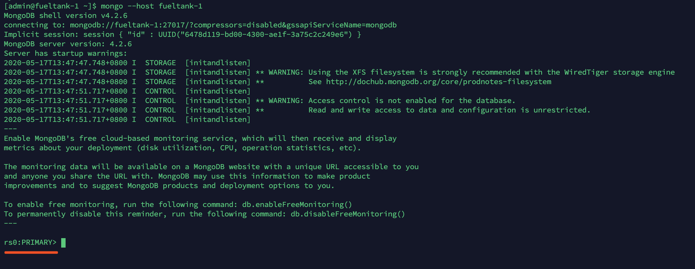
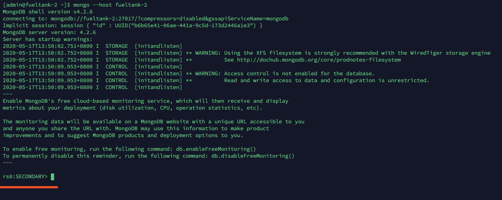

# MongoDB 高可用部署

从 MongoDB 的官方文档 https://docs.mongodb.com/manual/ 中，可以看到 MongoDB 目前有有两种高可用策略：副本集和切片。之前还有主从，但是已经不推荐使用了，官方文档也不再列出了。

其中，Sharding集群也是三种集群中最复杂的。副本集比起主从可以实现故障转移！！！

mongoDB目前已不推荐使用主从模式，取而代之的是副本集模式。副本集其实一种互为主从的关系，可理解为主主。
副本集指将数据复制，多份保存，不同服务器保存同一份数据，在出现故障时自动切换。对应的是数据冗余、备份、镜像、读写分离、高可用性等关键词；

而分片则指为处理大量数据，将数据分开存储，不同服务器保存不同的数据，它们的数据总和即为整个数据集。追求的是高性能。

在生产环境中，通常是这两种技术结合使用，分片+副本集。

参考：https://cloud.tencent.com/developer/article/1026185

---

## 单机版安装

系统为 CentOS 7，安装的 mongo 版本为 4.2，我这里为三台机器安装 MongoDB

编辑 `/etc/yum.repos.d/mongodb-org-4.2.repo` ，加入以下内容：

```
[mongodb-org-4.2]
name=MongoDB Repository
baseurl=https://repo.mongodb.org/yum/redhat/$releasever/mongodb-org/4.2/x86_64/
gpgcheck=1
enabled=1
gpgkey=https://www.mongodb.org/static/pgp/server-4.2.asc
```

然后安装：

```bash
$ sudo yum install -y mongodb-org
```

默认的配置文件为 `/etc/mongod.conf `

更改数据目录：

```bash
$ sudo mkdir /mnt/vde/mongo
$ sudo chown -R mongod:mongod /mnt/vde/mongo
```

编辑配置文件，修改以下行：

```yaml
storage:
  dbPath: /mnt/vde/mongo
```

启动 mongodb：

```bash
$ sudo systemctl start mongod
```

不需要 enable，在 yum 安装时就自动进行了 enable。


## 副本集

我的 hosts 为：

```
172.20.20.162 fueltank-1
172.20.20.179 fueltank-2
172.20.20.145 fueltank-3
```

修改 MongoDB 配置：

首先要允许外部访问：

````
net:
  port: 27017
  bindIp: 0.0.0.0
````

然后指定副本集的名称：

```
replication:
  replSetName: "rs0"
```

在三台机器上都要改，并且重启服务。

```bash
$ sudo systemctl restart mongod
```

待全部重启完成后，连接其中一个示例，我这里选择 fueltank-1:

```bash
$ mongo --host fueltank-1
```

然后执行：

```js
rs.initiate( {
   _id : "rs0",
   members: [
      { _id: 0, host: "fueltank-1:27017" },
      { _id: 1, host: "fueltank-2:27017" },
      { _id: 2, host: "fueltank-3:27017" }
   ]
})
```

返回如下：

```json
{
        "ok" : 1,
        "$clusterTime" : {
                "clusterTime" : Timestamp(1589694813, 1),
                "signature" : {
                        "hash" : BinData(0,"AAAAAAAAAAAAAAAAAAAAAAAAAAA="),
                        "keyId" : NumberLong(0)
                }
        },
        "operationTime" : Timestamp(1589694813, 1)
}
```

查看集群状态：

```
rs.conf()
```

返回如下：

```json
{
        "_id" : "rs0",
        "version" : 1,
        "protocolVersion" : NumberLong(1),
        "writeConcernMajorityJournalDefault" : true,
        "members" : [
                {
                        "_id" : 0,
                        "host" : "fueltank-1:27017",
                        "arbiterOnly" : false,
                        "buildIndexes" : true,
                        "hidden" : false,
                        "priority" : 1,
                        "tags" : {

                        },
                        "slaveDelay" : NumberLong(0),
                        "votes" : 1
                },
                {
                        "_id" : 1,
                        "host" : "fueltank-2:27017",
                        "arbiterOnly" : false,
                        "buildIndexes" : true,
                        "hidden" : false,
                        "priority" : 1,
                        "tags" : {

                        },
                        "slaveDelay" : NumberLong(0),
                        "votes" : 1
                },
                {
                        "_id" : 2,
                        "host" : "fueltank-3:27017",
                        "arbiterOnly" : false,
                        "buildIndexes" : true,
                        "hidden" : false,
                        "priority" : 1,
                        "tags" : {

                        },
                        "slaveDelay" : NumberLong(0),
                        "votes" : 1
                }
        ],
        "settings" : {
                "chainingAllowed" : true,
                "heartbeatIntervalMillis" : 2000,
                "heartbeatTimeoutSecs" : 10,
                "electionTimeoutMillis" : 10000,
                "catchUpTimeoutMillis" : -1,
                "catchUpTakeoverDelayMillis" : 30000,
                "getLastErrorModes" : {

                },
                "getLastErrorDefaults" : {
                        "w" : 1,
                        "wtimeout" : 0
                },
                "replicaSetId" : ObjectId("5ec0d15a593980261fa1f733")
        }
}
```

这时 fueltank-1 的标识符已经变为如下：



fueltank-2 和 fueltank-3 则变为：



PRIMARY 的意思是主要的，SECONDARY 的意思是次要的。


### 测试

在 PRIMARY 上插入语句：

```
rs0:PRIMARY> use one;
rs0:PRIMARY> db.one.insert({"hello": "world"})
rs0:PRIMARY> db.one.find()
```

这时在 SECONDARY 上查询：

````
rs0:SECONDARY> db.one.find()
````

这时会报错：

```
Error: error: {
        "operationTime" : Timestamp(1589695195, 1),
        "ok" : 0,
        "errmsg" : "not master and slaveOk=false",
        "code" : 13435,
        "codeName" : "NotMasterNoSlaveOk",
        "$clusterTime" : {
                "clusterTime" : Timestamp(1589695195, 1),
                "signature" : {
                        "hash" : BinData(0,"AAAAAAAAAAAAAAAAAAAAAAAAAAA="),
                        "keyId" : NumberLong(0)
                }
        }
}
```

因为mongodb默认是从主节点读写数据的，副本节点上不允许读，需要设置副本节点可以读：

```
rs0:SECONDARY> db.getMongo().setSlaveOk();
```

或者：

```
rs0:SECONDARY> rs.slaveOk();
```

但是这种方式只能让 mongo 在本次实例中读取，退出 mongo 后下次又要执行一遍！

解决方法如下：

```
vim ~/.mongorc.js
```

添加如下代码：

````
rs.slaveOk();
````

可以在每台机器上都加入这句代码。

这样就使用从库分担读的压力了。


#### 测试副本集的故障转移功能

在 PRIMARY 上执行：

```
rs0:PRIMARY> use admin;
rs0:PRIMARY> db.shutdownServer()
```

执行完成后，会发现 fueltank-2 变成了 PRIMARY。

再重启 fueltank-1，它会变成 SECONDARY。


## 分片

参考：https://docs.mongodb.com/manual/tutorial/deploy-shard-cluster/

参考：https://jeremyxu2010.github.io/2018/10/mongodb%e9%ab%98%e5%8f%af%e7%94%a8%e9%9b%86%e7%be%a4%e9%83%a8%e7%bd%b2

Sharding cluster是一种可以水平扩展的模式,在数据量很大时特给力,实际大规模应用一般会采用这种架构去构建。sharding分片很好的解决了单台服务器磁盘空间、内存、cpu等硬件资源的限制问题，把数据水平拆分出去，降低单节点的访问压力。每个分片都是一个独立的数据库，所有的分片组合起来构成一个逻辑上的完整的数据库。因此，分片机制降低了每个分片的数据操作量及需要存储的数据量，达到多台服务器来应对不断增加的负载和数据的效果。

**为何需要水平分片**

 1）减少单机请求数,将单机负载,提高总负载 

 2）减少单机的存储空间,提高总存空间

在 MongoDB 的分片集群中，主要分为以下三种组件，缺一不可：

- **shard**：每个分片是整体数据的一部分子集。每个分片都可以部署为副本集。强烈建议在生产环境下将分片部署为副本集且最少部署 2 个分片。
- **mongos**：充当查询路由器，提供客户端应用程序和分片集群之间的接口。应用程序直接连接 mongos 即可，可以部署一个或多个。
- **config servers**：配置服务器存储集群的元数据和配置（包括权限认证相关）。从 MongoDB 3.4 开始，必须将配置服务器部署为副本集（CSRS，全称是 Config Servers Replica Set）。

下面部署一个具有 2 个 shard（3 节点副本集）加 1 个 config server（3 节点副本集）加 3 个 mongos 的分片集群。

如果一个机器上部署一个 mongod 实例，则共需要 12 台机器，我没有那么多机器，只能在一个机器上运行多个组件，只是端口不一样，下面是环境分配大概：

虚拟机一：

| 角色          | 主机名     | 端口  | 副本集名称  |
| ------------- | ---------- | ----- | ----------- |
| mongos        | fueltank-1 | 27017 |             |
| shard1        | fueltank-1 | 27018 | rep_shard1  |
| shard2        | fueltank-1 | 27019 | rep_shard2  |
| config server | fueltank-1 | 20000 | rep_confsvr |

虚拟机二：

| 角色          | 主机名     | 端口  | 副本集名称  |
| ------------- | ---------- | ----- | ----------- |
| mongos        | fueltank-2 | 27017 |             |
| shard1        | fueltank-2 | 27018 | rep_shard1  |
| shard2        | fueltank-2 | 27019 | rep_shard2  |
| config server | fueltank-2 | 20000 | rep_confsvr |

虚拟机三：

| 角色          | 主机名     | 端口  | 副本集名称  |
| ------------- | ---------- | ----- | ----------- |
| mongos        | fueltank-3 | 27017 |             |
| shard1        | fueltank-3 | 27018 | rep_shard1  |
| shard2        | fueltank-3 | 27019 | rep_shard2  |
| config server | fueltank-3 | 20000 | rep_confsvr |

在三台机器上都要运行同样的操作。

需要停掉上面的副本集：

```bash
$ sudo systemctl stop mongod
$ sudo systemctl disable mongod
```

每台机器上需要跑 4 个 mongod 实例。


---


#### 创建 config server 副本集

```
$ sudo cp /usr/lib/systemd/system/mongod.service /usr/lib/systemd/system/mongod-config.service
$ sudo cp /etc/mongod.conf /etc/mongod-config.conf
```

然后需要修改 `/usr/lib/systemd/system/mongod-config.service` 部分配置如下：

```
Environment="OPTIONS=-f /etc/mongod-config.conf"
EnvironmentFile=-/etc/sysconfig/mongod-config
ExecStartPre=/usr/bin/mkdir -p /var/run/mongodb-config
ExecStartPre=/usr/bin/chown mongod:mongod /var/run/mongodb-config
ExecStartPre=/usr/bin/chmod 0755 /var/run/mongodb-config
PIDFile=/var/run/mongodb/mongod-config.pid
```

然后修改 `/etc/mongod-config.conf` 中的部分配置：

```yaml
systemLog:
  path: /var/log/mongodb/mongod-config.log
storage:
  dbPath: /mnt/vde/mongo-config
processManagement:
  pidFilePath: /var/run/mongodb/mongod-config.pid
net:
  port: 20000
  bindIp: 0.0.0.0
replication:
  replSetName: "rep_confsvr"
sharding:
  clusterRole: configsvr
```

创建数据目录：

```bash
$ sudo mkdir /mnt/vde/mongo-config
$ sudo chown -R mongod:mongod /mnt/vde/mongo-config
```

启动 config server mongod：

```bash
$ sudo systemctl enable mongod-config
$ sudo systemctl start mongod-config
```

然后连接实例进行副本集设置：

```bash
$ mongo --host fueltank-1 --port 20000
```

运行：

```js
rs.initiate(
  {
    _id: "rep_confsvr",
    configsvr: true,
    members: [
      { _id : 0, host : "fueltank-1:20000" },
      { _id : 1, host : "fueltank-2:20000" },
      { _id : 2, host : "fueltank-3:20000" }
    ]
  }
)
```

查看副本状态：

```js
rs.conf()
```


---


#### 创建第一个分片的副本集

```bash
$ sudo cp /usr/lib/systemd/system/mongod.service /usr/lib/systemd/system/mongod-shard1.service
$ sudo cp /etc/mongod.conf /etc/mongod-shard1.conf
```

需要修改的 `/usr/lib/systemd/system/mongod-shard1.service` 的部分配置如下：

```
Environment="OPTIONS=-f /etc/mongod-shard1.conf"
EnvironmentFile=-/etc/sysconfig/mongod-shard1
ExecStartPre=/usr/bin/mkdir -p /var/run/mongodb-shard1
ExecStartPre=/usr/bin/chown mongod:mongod /var/run/mongodb-shard1
ExecStartPre=/usr/bin/chmod 0755 /var/run/mongodb-shard1
PIDFile=/var/run/mongodb/mongod-shard1.pid
```

修改 `/etc/mongod-shard1.conf` 的部分配置如下：

```yaml
systemLog:
  path: /var/log/mongodb/mongod-shard1.log
storage:
  dbPath: /mnt/vde/mongo-shard1
processManagement:
  pidFilePath: /var/run/mongodb/mongod-shard1.pid
net:
  port: 27018
  bindIp: 0.0.0.0
replication:
  replSetName: "rep_shard1"
sharding:
  clusterRole: shardsvr
```

创建数据目录：

````bash
$ sudo mkdir /mnt/vde/mongo-shard1
$ sudo chown -R mongod:mongod /mnt/vde/mongo-shard1
````

启动服务：

````bash
$ sudo systemctl enable mongod-shard1
$ sudo systemctl start mongod-shard1
````

然后连接实例进行副本集设置：

```bash
$ mongo --host fueltank-1 --port 27018
```

运行：

````
rs.initiate(
  {
    _id : "rep_shard1",
    members: [
      { _id : 0, host : "fueltank-1:27018" },
      { _id : 1, host : "fueltank-2:27018" },
      { _id : 2, host : "fueltank-3:27018" }
    ]
  }
)
````


---


#### 创建第二个分片的副本集

```bash
$ sudo cp /usr/lib/systemd/system/mongod.service /usr/lib/systemd/system/mongod-shard2.service
$ sudo cp /etc/mongod.conf /etc/mongod-shard2.conf
```

修改 `/usr/lib/systemd/system/mongod-shard2.service` 的部分配置如下：

```
Environment="OPTIONS=-f /etc/mongod-shard2.conf"
EnvironmentFile=-/etc/sysconfig/mongod-shard2
ExecStartPre=/usr/bin/mkdir -p /var/run/mongodb-shard2
ExecStartPre=/usr/bin/chown mongod:mongod /var/run/mongodb-shard2
ExecStartPre=/usr/bin/chmod 0755 /var/run/mongodb-shard2
PIDFile=/var/run/mongodb/mongod-shard2.pid
```

修改 `/etc/mongod-shard2.conf` 的部分配置如下：

```yaml
systemLog:
  path: /var/log/mongodb/mongod-shard2.log
storage:
  dbPath: /mnt/vde/mongo-shard2
processManagement:
  pidFilePath: /var/run/mongodb/mongod-shard2.pid
net:
  port: 27019
  bindIp: 0.0.0.0
replication:
  replSetName: "rep_shard2"
sharding:
  clusterRole: shardsvr
```

创建数据目录：

```bash
$ sudo mkdir /mnt/vde/mongo-shard2
$ sudo chown -R mongod:mongod /mnt/vde/mongo-shard2
```

启动：

````bash
$ sudo systemctl enable mongod-shard2
$ sudo systemctl start mongod-shard2
````

然后进行副本集设置：

```
$ mongo --host fueltank-1 --port 27019
```

运行：

```js
rs.initiate(
  {
    _id : "rep_shard2",
    members: [
      { _id : 0, host : "fueltank-1:27019" },
      { _id : 1, host : "fueltank-2:27019" },
      { _id : 2, host : "fueltank-3:27019" }
    ]
  }
)
```


---


#### 部署 mongos

```bash
$ sudo cp /usr/lib/systemd/system/mongod.service /usr/lib/systemd/system/mongod-route.service
$ sudo cp /etc/mongod.conf /etc/mongod-route.conf
```

修改 `/usr/lib/systemd/system/mongod-route.service` 的部分配置如下：

```
Environment="OPTIONS=-f /etc/mongod-route.conf"
EnvironmentFile=-/etc/sysconfig/mongod-route
ExecStart=/usr/bin/mongos $OPTIONS
ExecStartPre=/usr/bin/mkdir -p /var/run/mongodb-route
ExecStartPre=/usr/bin/chown mongod:mongod /var/run/mongodb-route
ExecStartPre=/usr/bin/chmod 0755 /var/run/mongodb-route
PIDFile=/var/run/mongodb/mongod-route.pid
```

注意这里启动命令是 `mongos`，而不是 `mongod` ！！！

修改 `/etc/mongod-route.conf` 的部分配置如下：

```yaml
systemLog:
  path: /var/log/mongodb/mongod-route.log
processManagement:
  pidFilePath: /var/run/mongodb/mongod-route.pid
net:
  port: 27017
  bindIp: 0.0.0.0
sharding:
  configDB: rep_confsvr/fueltank-1:20000,fueltank-2:20000,fueltank-3:20000
```

这个不需要设置 `replication`。也不需要设置 `storage`

启动服务：

```bash
$ sudo systemctl enable mongod-route
$ sudo systemctl start mongod-route
```


---


#### 分配集群

连接到 mongos，在其中一个 mongos 上执行即可：

```bash
$ mongo --host fueltank-1 --port 27017
```

执行：

````js
mongos> sh.addShard( "rep_shard1/fueltank-1:27018,fueltank-2:27018,fueltank-3:27018")
mongos> sh.addShard( "rep_shard2/fueltank-1:27019,fueltank-2:27019,fueltank-3:27019")
````

其中，sh 是 shard 的缩写。

查看分片状态：

```
mongos> sh.status()
```

这样通过 `fueltank-1:27017`、`fueltank-2:27017`、`fueltank-3:27017` 中的任何一个都可以读写了。

这时候插入数据之后，默认还没有分片：

```
mongos> use cluster_one;
mongos> db.one.find()
```

查看是否分片了：

```
mongos> db.one.getShardDistribution()
Collection cluster_one.one is not sharded.
mongos> db.one.stats().sharded
false
```

发现没有分片，下面对数据库进行分片：

```
mongos> sh.enableSharding("cluster_one")
```

这样对数据库分片后，可以通过下面命令查看：

```
mongos> sh.status()
```

对集合进行分片，先建立索引，再分片：

```
mongos> db.one.createIndex( { "hello": 1 } )
mongos> sh.shardCollection("cluster_one.one", { "hello": 1 } )
```

分片之后再此查看分片状态：

````
mongos> db.one.getShardDistribution()

Shard rep_shard2 at rep_shard2/fueltank-1:27019,fueltank-2:27019,fueltank-3:27019
 data : 120B docs : 3 chunks : 1
 estimated data per chunk : 120B
 estimated docs per chunk : 3

Totals
 data : 120B docs : 3 chunks : 1
 Shard rep_shard2 contains 100% data, 100% docs in cluster, avg obj size on shard : 40B
````

```
mongos> db.one.stats().sharded
true
```


## 总结

还是比较复杂的，重复步骤较多，可以写一个 Ansible 脚本进行安装。


