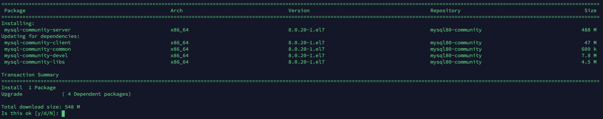

# MySQL 最新版本安装

当前 MySQL 的最新版本为 8.0，下面使用 yum 来安装 MySQL 8.0。

先安装 yum 库，下载地址：https://dev.mysql.com/downloads/repo/yum/

或者使用命令直接下载（CentOS 7）：

```bash
$ wget https://repo.mysql.com//mysql80-community-release-el7-3.noarch.rpm
```

下载下来之后，YUM 本地安装：

```bash
$ sudo yum localinstall mysql80-community-release-el7-3.noarch.rpm
```

然后安装 MySQL：

```bash
$ sudo yum install mysql-community-server
```

此过程将安装以下包：



启动：

```bash
$ sudo systemctl enable mysqld
$ sudo systemctl start mysqld
```

查看初始密码：

```bash
$ grep 'temporary password'  /var/log/mysqld.log
```

然后进入命令行：

```bash
$ mysql -u root -p
```

进去之后先修改密码：

````mysql
mysql> ALTER USER root@localhost identified by 'BBDERS1@bbdops.com';
````

查看用户：

```mysql
mysql> use mysql;
mysql> select user,host from user;
+------------------+-----------+
| user             | host      |
+------------------+-----------+
| mysql.infoschema | localhost |
| mysql.session    | localhost |
| mysql.sys        | localhost |
| root             | localhost |
+------------------+-----------+
4 rows in set (0.00 sec)
```

上边看到，root 仅允许 localhost 访问，下面让 root 允许外网访问：

```mysql
mysql> UPDATE user SET `Host` = '%' WHERE `User` = 'root' LIMIT 1;
mysql> flush privileges;
mysql> select user,host from user;
```

这样外部就可以连接了。


