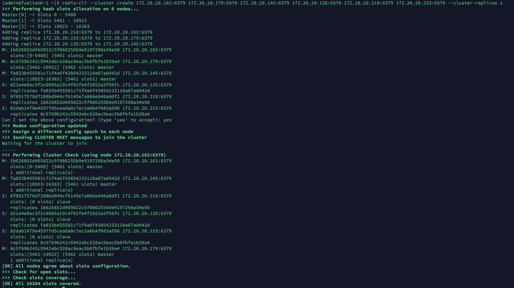
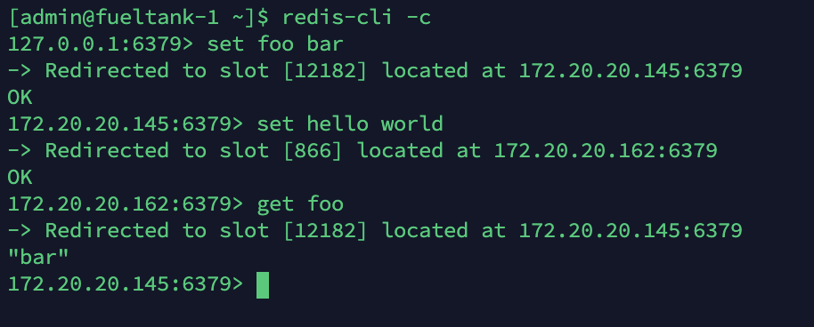
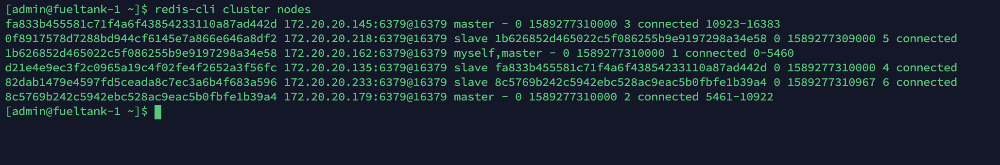
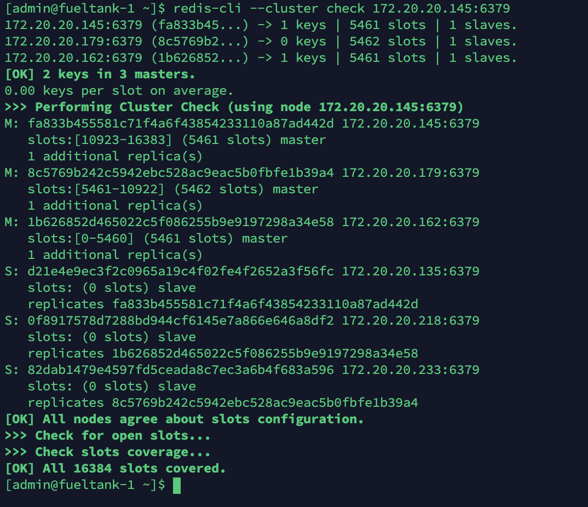
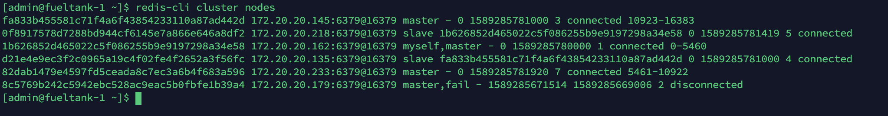
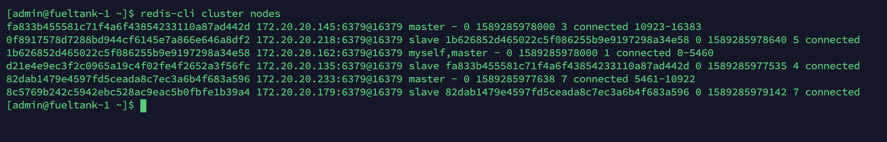

# Redis 高可用

官方文档：https://redis.io/topics/sentinel

Redis 可以通过 Sentinel 来实现高可用。在使用前，需要先为 redis 配置主从复制机，参考： [Redis主从复制.md](Redis主从复制.md) 

先获取配置文件，配置文件地址：http://download.redis.io/redis-stable/sentinel.conf

添加如下配置：

```
logfile "/var/log/sentinel/sentinel.log"
```

`/var/log/sentinel/sentinel.log` 需要手动创建。

然后编写 service ，文件是 `/etc/systemd/system/sentinel.service` 

```
[Unit]
Description=Sentinel for Redis
After=network.target

[Service]
LimitNOFILE=64000
User=root
Group=root
ExecStart=/usr/bin/redis-sentinel /etc/sentinel.conf --daemonize no

[Install]
WantedBy=multi-user.target
```

启动：

```bash
$ sudo systemctl enable sentinel
$ sudo systemctl start sentinel
```

在其他机器上也这样部署一个 sentinel。

然后再关停所有 redis 和 sentinel ，再按 **`Master->Slave->Sentinel`** 顺序启动。

全部启动后，进行测试。

首先查看日志文件：

```bash
$ tail -f /var/log/sentinel/sentinel.log
```

然后观察 master 是谁：

```bash
$ redis-cli -p 26379 sentinel master mymaster
```

然后停掉 master：

```bash
$ redis-cli shutdown
```

这时会看到日志中有新日志出现，再查看 master ，发现已被换掉。并且配置文件 `/etc/sentinel.conf` 中的 master 地址也被换掉了。

从上面看到， sentinel 并没有对 Redis 进行侵入，只是在外面又加了一个进程。


## Cluster

Sentinel 只能实现切换 master，但并不能实现读写分离，负载均衡。

redis中主从、哨兵和集群这三个有什么区别 ？分别有什么优势？适用于什么场景？在实际工作如何选择？

主从模式：备份数据、负载均衡，一个Master可以有多个Slaves。 sentinel发现master挂了后，就会从slave中重新选举一个master。 cluster是为了解决单机Redis容量有限的问题，将数据按一定的规则分配到多台机器。

sentinel着眼于高可用，Cluster提高并发量。


下面动手操作一下 Cluster。

先停掉 sentinel ：

```bash
$ sudo systemctl stop sentinel
$ sudo systemctl disable sentinel
```


官方教程：https://redis.io/topics/cluster-tutorial

首先在每个节点上都要修改配置文件：

```
bind 0.0.0.0
cluster-enabled yes
cluster-config-file nodes.conf
cluster-node-timeout 5000
appendonly yes
```

然后在每个节点上重启 Redis，然后在一个节点上执行：

```bash
$ redis-cli --cluster create 172.20.20.162:6379 172.20.20.179:6379 172.20.20.145:6379 172.20.20.135:6379 172.20.20.218:6379 172.20.20.233:6379 --cluster-replicas 1
```

这里必须为 IP 地址，不能是主机名。

以下为日志：



最后显示了 `All 16384 slots covered` 说明成功了。这意味着至少有一个 master 为16384个可用插槽中的每一个提供服务。


#### 测试集群

使用 redis-cli 连接任一客户端，如下：



查看节点，运行 `redis-cli cluster nodes` ：



检查节点，运行 `redis-cli --cluster check 172.20.20.145:6379` :



在集群模式下，使用 redis 要用以下命令：

```bash
$ redis-cli -c
```


#### 测试删除一个节点

先查看有哪些 master 节点：

```bash
$ redis-cli cluster nodes | grep master
```

然后把其中一个节点弄成故障：

```bash
$ redis-cli debug segfault
```

再次查看节点：

```bash
$ redis-cli cluster nodes
```

发现如下现象：



发现一个 master 节点失败了，他之前的 slave 节点变成了 master 节点。

再重新启动刚才发生故障的节点：

````bash
$ redis-cli cluster nodes
````

再查看节点发现恢复了，只不过角色发生了更换：




更多关于 Redis Cluster 的知识请看：https://redis.io/topics/cluster-spec


