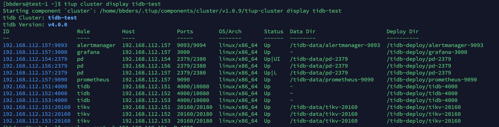

# TiDB 部署

TiDB 是一个 Golang 和 Rust 编写的开源分布式关系型数据库，是一个比较新的技术，从出生起就面向云原生，它的底层是 TiKV，TiKV 是 CNCF 的一个开源项目。

TiDB 采用的是 MySQL 协议，所以使用 MySQL 的程序可以无缝转换。

TiDB 适合高可用、强一致要求较高、数据规模较大等各种应用场景。

并且 TiDB 是国产的，中文文档极其友好，官方文档：https://docs.pingcap.com/zh/tidb/stable


## 整体架构

参考：https://docs.pingcap.com/zh/tidb/stable/tidb-architecture

这里复制下。

与传统的单机数据库相比，TiDB 具有以下优势：

- 纯分布式架构，拥有良好的扩展性，支持弹性的扩缩容
- 支持 SQL，对外暴露 MySQL 的网络协议，并兼容大多数 MySQL 的语法，在大多数场景下可以直接替换 MySQL
- 默认支持高可用，在少数副本失效的情况下，数据库本身能够自动进行数据修复和故障转移，对业务透明
- 支持 ACID 事务，对于一些有强一致需求的场景友好，例如：银行转账
- 具有丰富的工具链生态，覆盖数据迁移、同步、备份等多种场景

在内核设计上，TiDB 分布式数据库将整体架构拆分成了多个模块，各模块之间互相通信，组成完整的 TiDB 系统。对应的架构图如下：


- TiDB Server：SQL 层，对外暴露 MySQL 协议的连接 endpoint，负责接受客户端的连接，执行 SQL 解析和优化，最终生成分布式执行计划。TiDB 层本身是无状态的，实践中可以启动多个 TiDB 实例，通过负载均衡组件（如 LVS、HAProxy 或 F5）对外提供统一的接入地址，客户端的连接可以均匀地分摊在多个 TiDB 实例上以达到负载均衡的效果。TiDB Server 本身并不存储数据，只是解析 SQL，将实际的数据读取请求转发给底层的存储节点 TiKV（或 TiFlash）。
- PD Server：整个 TiDB 集群的元信息管理模块，负责存储每个 TiKV 节点实时的数据分布情况和集群的整体拓扑结构，提供 TiDB Dashboard 管控界面，并为分布式事务分配事务 ID。PD 不仅存储元信息，同时还会根据 TiKV 节点实时上报的数据分布状态，下发数据调度命令给具体的 TiKV 节点，可以说是整个集群的“大脑”。此外，PD 本身也是由至少 3 个节点构成，拥有高可用的能力。建议部署奇数个 PD 节点。
- 存储节点
  - TiKV Server：负责存储数据，从外部看 TiKV 是一个分布式的提供事务的 Key-Value 存储引擎。存储数据的基本单位是 Region，每个 Region 负责存储一个 Key Range（从 StartKey 到 EndKey 的左闭右开区间）的数据，每个 TiKV 节点会负责多个 Region。TiKV 的 API 在 KV 键值对层面提供对分布式事务的原生支持，默认提供了 SI (Snapshot Isolation) 的隔离级别，这也是 TiDB 在 SQL 层面支持分布式事务的核心。TiDB 的 SQL 层做完 SQL 解析后，会将 SQL 的执行计划转换为对 TiKV API 的实际调用。所以，数据都存储在 TiKV 中。另外，TiKV 中的数据都会自动维护多副本（默认为三副本），天然支持高可用和自动故障转移。
  - TiFlash：TiFlash 是一类特殊的存储节点。和普通 TiKV 节点不一样的是，在 TiFlash 内部，数据是以列式的形式进行存储，主要的功能是为分析型的场景加速。


## 在 Linux 中部署 TiDB

参考：https://docs.pingcap.com/zh/tidb/stable/production-deployment-using-tiup

在 Linux 中安装可以更好的对 TiDB 有一个认知，待熟悉之后再往 k8s 上搬。

使用 TiUP 工具来安装 TiDB 集群。下面全部使用一个普通用户执行：

```bash
curl --proto '=https' --tlsv1.2 -sSf https://tiup-mirrors.pingcap.com/install.sh | sh
```

完成后，二进制命令安装在了`/home/bbders/.tiup/bin/tiup`

并且这个脚本还把这个命令在 `~/.bash_profile` 文件中设置到了 PATH 中，使之生效：

```bash
source .bash_profile
```

安装 TiUP cluster 组件：

```
tiup cluster
```

创建 `topology.yaml` 文件，内容如下：

```yaml
global:
  user: "bbders"
  ssh_port: 22
  deploy_dir: "/tidb-deploy"
  data_dir: "/tidb-data"

pd_servers:
  - host: 192.168.112.154
  - host: 192.168.112.155
  - host: 192.168.112.156

tidb_servers:
  - host: 192.168.112.151
  - host: 192.168.112.152
  - host: 192.168.112.153

tikv_servers:
  - host: 192.168.112.151
  - host: 192.168.112.152
  - host: 192.168.112.153

monitoring_servers:
  - host: 192.168.112.156

grafana_servers:
  - host: 192.168.112.156

alertmanager_servers:
  - host: 192.168.112.156
```

创建集群：

```bash
tiup cluster deploy tidb-test v4.0.4 ./topology.yaml
```

检查集群列表：

```bash
tiup cluster list
```

启动集群：

```bash
tiup cluster start tidb-test
```

检查集群的详细情况：

```bash
tiup cluster display tidb-test
```

我的状态如下：



在运行过程


安装 mysql 客户端并登录数据库：

```bash
wget https://repo.mysql.com/mysql57-community-release-el7-11.noarch.rpm
sudo yum localinstall mysql57-community-release-el7-11.noarch.rpm
sudo yum install mysql -y
mysql -u root -h 192.168.112.151 -P 4000
```

随便执行俩操作：

```mysql
mysql> show databases;
mysql> use mysql;
mysql> select user,host from user;
```

在 4.0 之后，官方在 pd 上加了一个 Dashboard，访问地址：http://192.168.112.154:2379/dashboard ，初始密码为空。


## 单机部署

参考：[https://docs.pingcap.com/zh/tidb/stable/quick-start-with-tidb#%E7%AC%AC%E4%BA%8C%E7%A7%8D%E4%BD%BF%E7%94%A8-tiup-cluster-%E5%9C%A8%E5%8D%95%E6%9C%BA%E4%B8%8A%E6%A8%A1%E6%8B%9F%E7%94%9F%E4%BA%A7%E7%8E%AF%E5%A2%83%E9%83%A8%E7%BD%B2%E6%AD%A5%E9%AA%A4](https://docs.pingcap.com/zh/tidb/stable/quick-start-with-tidb#第二种使用-tiup-cluster-在单机上模拟生产环境部署步骤)

步骤和上边一样，只不过配置不一样，配置如下：

````yaml
global:
  user: "s1"
  ssh_port: 22
  deploy_dir: "/tidb-deploy"
  data_dir: "/tidb-data"

server_configs:
  tikv:
    readpool.unified.max-thread-count: 2
    readpool.storage.use-unified-pool: false
    readpool.coprocessor.use-unified-pool: true
    storage.block-cache.capacity: 1GB
    raftstore.capacity: 10GB
  pd:
    replication.location-labels: ["host"]

pd_servers:
  - host: 172.20.21.5

tidb_servers:
  - host: 172.20.21.5
    port: 4000
    status_port: 10080
    numa_node: "0"

tikv_servers:
  - host: 172.20.21.5
    port: 20160
    status_port: 20180
    numa_node: "0"
    config:
      server.labels: { host: "tikv1" }

monitoring_servers:
  - host: 172.20.21.5

grafana_servers:
  - host: 172.20.21.5

alertmanager_servers:
  - host: 172.20.21.5
````


