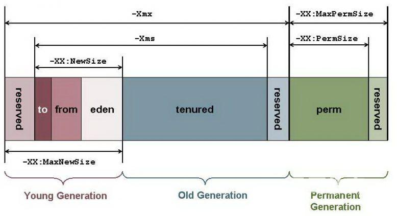

# JVM 参数详解

版本以 JDK1.8 为主，虽然现在 Java 版本很高了，但是最常用的还是 JDK 1.8。

java 内存调整相关参数：

> -X选项 稳定的选项
>
> -XX:选项名称 beta选项，但是有些就一直保留下来了

常见选项：

|                   |                                                              |                                                        |
| ----------------- | ------------------------------------------------------------ | ------------------------------------------------------ |
| 参数              | 说明                                                         | 举例                                                   |
| -Xms              | 设置应用程序**初始**使用的堆内存大小（新生代+老年代）        | -Xms2g                                                 |
| -Xmx              | 设置应用程序能获得的**最大**堆内存 早期JVM不建议超过32G，内存管理效率下降 | -Xms4g                                                 |
| -XX:NewSize       | 设置初始新生代大小                                           |                                                        |
| -XX:MaxNewSize    | 设置最大新生代内存空间                                       |                                                        |
| -Xmnsize          | 同时设置-XX:NewSize 和 -XX:MaxNewSize，代替两者              | -Xmn1g                                                 |
| -XX:NewRatio      | 以比例方式设置新生代和老年代                                 | -XX:NewRatio=2 new/old=1/2                             |
| -XX:SurvivorRatio | 以比例方式设置eden和survivor                                 | -XX:SurvivorRatio=6 eden/survivor=6/1 survivor/new=1/8 |
| -Xss              | 设置线程的栈大小                                             |                                                        |