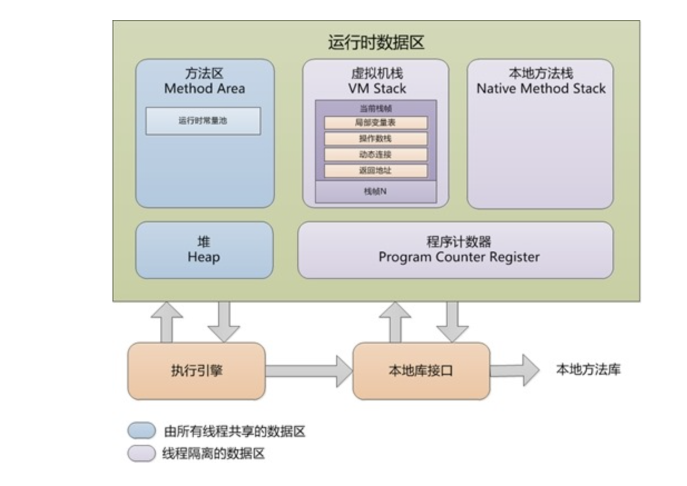

# JVM 自动内存管理机制

完全参考：《深入理解Java虚拟机》第二部分

## 运行时数据区域

分为线程共享的区域和线程独有的区域

**线程共享的区域：方法区，堆**

**线程独有的区域：程序计数器，虚拟机栈，本地方法栈**

#### 1，程序计数器

这块区域记录着当前线程运行的位置，字节码解释器工作时就是通过改变这个计数器的值来选取需要执行的字节码指令。分支，循环，跳转，异常，线程恢复都是依赖这个计数器来完成。

jvm在处理多线程是通过轮流线程轮转，并分配处理器的执行时间的方式实现的。

给定一个时刻，一个CPU核心只会执行一条指令。

因此，每个线程的程序计数器在线程恢复中发挥了重要作用。

还需要注意的地方是，jvm在执行native方法时，程序计数器为空。

因为这个局域只是记录了执行位置或者为空，并不需要增长内存，所以并不存在任何内存溢出的情况，这也是唯一不会出现内存溢出错误的地方

#### 2，虚拟机栈

虚拟机栈中存放的是java方法栈，就是开发者平常熟悉的运行时栈，**栈中包括栈帧**，每个方法执行时都会创建栈帧，**栈帧用于储存**方法执行时用到的局部变量表，操作数栈，动态链接，方法出口等信息。

**每一个方法从调用到执行的过程，就对应着一个栈帧在虚拟机栈中入栈到出栈的过程！**

局部变量表存放了编译期可知的各种基本数据类型和对象引用，其中long和double占两个局部变量空间。

**局部变量表在编译期间就完成了分配**，当进入一个方法时，这个栈帧中的局部变量表的大小是确定的，在方法运行期间不会改变局部变量表的大小。

这个区域会产生两种异常：1，请求的栈深度大于虚拟机栈的深度，2，虚拟机栈想扩展时无法得到内存。

**虚拟机栈 > 栈帧 > (局部变量表，操作数栈，动态链接，方法出口)**

#### 3，本地方法栈

和虚拟机栈是差不多的，用于描述方法运行时的内存模型，只不过这里的方法是native方法。这块区域jvm规范中没有进行强制进行规定，所以他能自由实现，甚至可以和虚拟机栈合并！

#### 4，堆

堆是线程间共享的，Java中所有的对象（除了Class对象，即类和字符串字面量）和数组都储存在堆中，这块区域是jvm内存中最大的一块内存。

但随着**JIT编译器的发展**，和**逃逸分析**技术的成熟，**栈上分配**，**标量替换优化技术**将会导致一些微妙的变化，所有对象都分配在堆上也不在绝对了。

堆是垃圾收集器管理的主要区域，被称为"GC堆"。

**根据垃圾收集器采用的分代收集算法，堆可以细分为：新生代和老年代**，**新生代包括Eden空间，From Survivor空间，To Survivor空间**。

堆还可以分出多个线程私有的分配缓冲区。

堆可以是内存空间上不连续的，当前主流的jvm都是按照可扩展来实现的（通过-Xmx控制最大堆内存，-Xms指定初始堆内存）

如果没有堆内存可用，并且也无法扩展时，将会抛出错误

#### 5，方法区

方法区也是线程间共享的，它用于储存已被虚拟机加载的**类信息**，**常量**，**静态变量**，**即时编译器编译后的代码。**

jdk7的HotSpot中，把原本放在方法区的**字符串常量池**移除了

**运行时常量池**是方法区的一部分，**Class文件中有类的版本，字段，方法，接口等描述信息外，还有一项信息是常量池，用于存放编译器产生的各种字面量和符号引用，这部分内容在类加载后进入方法区的运行时常量池 **

***运行时常量池除了保存Class文件中描述的符号引用外，还会把翻译过来的直接引用也储存在运行时常量池中。\***

运行时常量池具有动态性质，不只是Class文件中的常量池才能进入方法区的运行时常量池，运行期间也可以将新的常量放入到运行时常量池中，比如String的intern()方法！

#### 6，直接内存

直接内存并不是jvm运行时内存区的一部分，但经常被使用。

在JDK1.4中新加入的NIO，引入了一种基于通道和缓冲区的I/O方式，它就可以使用Native函数库直接分配堆外内存，然后通过一个储存在堆中的DirectBytebuffer对象作为这块内存的引用进行操作。这样可以提高性能，避免在java堆和Native堆之间来回复制数据。

直接内存不受Java堆限制，但会受本机内存限制。

## 二，jvm对象揭秘

对象是如何创建？如何布局？如何访问的那？

#### 1,对象的创建

当jvm遇到new指令时，首先去检查这个指令的参数能否在常量池中定位到一个符号引用，并且检查这个类是否被类加载过，若没有，先进行类加载。

在类加载完成后，接下来jvm为新生对象分配内存，对象所需内存大小在类加载完成后便可以确定下来，分配方法有**指针碰撞**(适用于规整的内存)，或**空闲列表**(适用与不整齐的内存)。内存是否归整取决于采用的垃圾收集器是否带有压缩整理的功能。

因此，在使用**Serial，ParNew**，等带Compact过程的收集器时，采用指针碰撞分配内存，在使用**CMS这种基于Mark-Sweep算法**的收集器时，采用空闲列表。

生成对象可能存在并发问题，所以要对其进行同步！这里有两种方式，第一种是对分配内存空间的动作进行同步处理---实际虚拟机采用的是CAS配上失败重试的方式来保证更新操作的原子性，另一种是把内存分配的动作按照线程划分到不同的空间中进行，即前面提到的**本地线程分配缓冲。**

**内存分配完成后，jvm将分配的内存空间都初始化为0(除了对象头),这一操作就是为什么实例域不进行显示的赋值操作即可对其进行访问！**这时访问到的值都是0。

然后，jvm对对象进行设置，把对象所属的类，类的元信息，对象的哈希码，对象的GC分代年龄，储存在对象头中，对象头还有偏向锁的信息！

然后接下来，会执行<init>()方法，对实例域进行初始化

#### 2,对象的布局

对象在堆中的储存布局可分为三部分：对象头，实例数据，对齐填充

**对象头**

对象头有两部分信息，第一部分储存对象自身的运行时数据，包括哈希码，GC分代年龄，锁状态标志，线程持有的锁，偏向线程ID，偏向时间戳等。这部分长度在32位和64位的虚拟机中分别占32bit和64bit，官方称之为“Mark Word”！

由于Mark Word是额外的信息，为保持效率，Mark Word被设计为非固定的数据结构，以便重用内存，对象头储存的信息根据标志位的不同而不同

对象头的第二部分是类型指针，即对象指向他的类元数据的指针，虚拟机通过这个指针来确定对象是那个类的实例。

若对象是一个数组，则在对象头中还必须有一块记录数组长度的数据。

**实例数据**

这部分是对象真正储存的有效信息，其中储存了程序中定义的各种类型的字段内容，无论父类的还是子类的，都需要记录下来。这些字段的储存顺序受**虚拟机分配策略参数**和字段在Java源码中定义的顺序的影响。分配策略是相同宽度的字段被分配在一起，父类中定义的变量在子类之前

**对齐填充**

只是占位符的作用，jvm要求对象的起始地址是8字节的整数倍！

#### 3，对象的访问

java程序通过栈上的reference数据来操作堆上的具体对象。

目前主流的访问方式有两种：**句柄和直接指针**。

若使用句柄，那Java堆中就会划分一块内存作为句柄池，reference储存的是对象的句柄地址，句柄中包含了***对象实例数据***与***类型数据的具体信息***。

若使用直接指针，那Java对象中就需要储存关于类型数据的相关信息。

这两种方式各有优点，使用句柄的好处是：对象移动后不需要改变reference，只需改变句柄中的实例数据指针。使用直接指针的好处是访问速度更快，因为节省了一次指针定位的开销，HotSpot是使用的第二种方式。

## 三，如何判断对象已死

#### 1,引用计数算法

原理是有一个引用就加一，少一个引用就减一，为0是代表对象已死

这个算法简单，判定效率也高，但是当前主流的jvm都没有使用这个算法，主要原因是它很难解决对象之间相互循环引用的问题。

#### 2,可达性分析算法

这个算法是很多语言都选用的算法，原理是从"**GC Roots**"出发，从这个节点向下搜索，搜索所经过的路径叫**引用链，**当一个对象到GC Roots没有任何引用链相连的话就证明对象是不可用的。

GC Roots对象包括以下几种：

1. 虚拟机栈(栈帧中的变量表)中引用的对象
2. 方法区中类静态属性引用的对象
3. 方法区中常量引用的对象
4. 本地方法栈中Native方法引用的对象

#### 3,引用

引用一般即指一个reference类型的数据指向另一块内存的地址，跟指针差不多，但是这种定义太过狭隘，一个对象只有被引用和没有被引用两种状态，但对于其他状态就无能为力了。

比如在应用较大时，内存不够了，开发者想定义一个如果内存装得下就保留在内存中，装不下就抛弃对象的引用，那怎么办？

JDK1.2之后扩充了引用的概念，将引用分为：

**强引用，软引用(SoftReference)，弱引用(WeakReference)，虚引用(PhantomReference)**

强引用就是开发这经常遇到的引用，如：Object obj = new Object()

软引用(SoftReference)来描述一些有用但非必须的对象。在内存即将溢出之前，会将软引用关联的对象进行垃圾回收，若回收之后还是没有足够的内存，就抛出内存溢出错误。

弱引用(WeakReference)也是非必须对象，比软引用还弱，弱引用关联的对象只能存活到下次垃圾收集之前，在下次垃圾收集工作时，无论内存是否够用，都将其回收

虚引用(PhantomReference)是最弱的引用，无法通过虚引用来获得对象实例，虚引用的唯一作用是在这个对象被收集器回收时能受到一个系统通知

#### 4,生存与死亡

在可达性分析算法中不可达的对象，也并非是"非死不可"的！

收集一个对象要经过两次标记，第一次可达性分析进行标记一次。

若一个对象的finalize()方法被判断为"有必要执行"(对象没有覆盖finalize())时。那这个对象会被放在一个叫做**F-Queue**的队列之中，稍后由一个**jvm自建的，低优先级的Finalizer线程**迭代执行队列中对象的finalize方法(并不承诺其执行完毕)，再稍后GC才对F-Queue中的对象进行标记再垃圾回收。

所以finalize()方法是拯救自己的最后一条出路，比如将自己的this关联到任一引用链上即可。

但不要重写finalize()方法！！！

#### 5,回收方法区

对方法区的垃圾收集"性价比"比较低。

方法区的垃圾收集主要收集两部分内容：废弃常量和无用的类

是否为废弃常量的判断比较简单，但是判断无用的类比较难，需要满足以下方面：

1. 该类的所有实例都已经被回收
2. 加载该类的ClassLoader已经被回收
3. 该类对应的Class对象没有在任何地方被引用，无法在任何地方通过反射访问该类的方法

可以通过参数来指定这块地址是否应该被回收！

在大量使用**反射，动态代理，CGLib等ByteCode框架，动态生成的JSP，OSGI这类频繁自定义ClassLoader**的场景中需要jvm具备类卸载的功能，保证方法区不会溢出！

## 四，垃圾收集算法

#### 1,标记-清除算法

其算法原理前面已经说过，它是最基础的垃圾收集算法，**后续的算法都是基于这个思路改造的**！**不是说前面的讲的标记算法无用！**

它有两个不足，一是效率问题，二是空间问题，会产生碎片

#### 2,复制算法

原理就是将内存分为两等块，每次只使用其中的一块，放这一块用完了，就将存活的对象复制到另一块，然后把已使用过的内存空间一次性清理掉，这样只对整个半区进行回收，不用考虑内存碎片，实现简单，运行高效，但内存空间浪费了一半！

没必要将其分为1:1,现代的jvm一般把内存分为一块较大的**Eden空间(伊甸园,诞生的地方)**和两块较小的**Survivor(幸存者)空间**。

每次使用其中的Eden和一块Survivor，当回收时，Eden和Survivor中还存活的对象放到另一块Survivor中。

HotSpot默认Eden与Survivor的大小比例是8:1:1,只有10%内存会被浪费。若存活对象较多，Survivor不够用时，**需要依赖其他内存(老年代)进行分配担保**！

#### 3,标记-整理算法

在对象存活率较高的情况下，复制算法需要较多的复制操作，效率会变低。

根据老年代的特点，可以使用标记-整理算法

其原理和标记-清除一样，但不进行清楚步骤，而是把存活的对象都想一端移动，然后清除边界之外的内存。

#### 4,分代收集算法

根据对象存活周期的不同将内存划分为几块，一般是分为新生代和老年代。

新生代死去的对象较多，那就用复制算法，老年代中的对象存活时间较长，并且没有额外的空间对他进行担保，就必须使用标记-清理，或标记-整理算法进行回收

## 五，HotSpot的算法实现

#### 1,枚举根节点

在前面知道了GC Roots需要从全局性引用(常量和静态属性)与执行上下文(栈帧中的局部变量表)中。这些地方区域比较大，如果逐个检查这里面的引用，那必然消耗很多时间！

可达性分析需要进行GC停顿，因为不能出现分析引用过程中，引用关系还在不断变换。这点是导致GC进行时必须停顿所有Java执行线程,Sun称这件事为"Stop the World"。即使在号称不发生停顿的CMS收集器中，枚举跟节点时也是必须停顿的。

目前主流的jvm都使用**准确式GC**，所以当执行系统停顿下来后，并不需要一个不漏的检查完所有执行上下文和全局的引用位置，虚拟机应当有办法知道那些地方存放着对象引用，HotSpot中是使用一组称为OopMap的数据结构来达到这个目的的！

**2,安全点**

## 六，垃圾收集器

新生代垃圾收集器：Serial，ParNew，Parallel Scavenge

老年代垃圾收集器：CMS，Serial Old，Parallel Old

全能收集器：G1

搭配使用：Serial，ParNew可以和CMS搭配使用，三种新生代收集器都可以跟Serial Old收集器搭配使用，Parallel Old 只能和Parallel搭配使用

#### 1,Serial

最古老的垃圾收集器，单线程的，他进行垃圾收集时，必须暂停其他线程，Serial采用复制算法，Serial Old采用标记-整理算法，

虽然很垃圾，但是这个垃圾收集器还是client模式下默认的新生代收集器。

他的有点是简单，还有在单线程模式下很高效。

#### 2,ParNew

ParNew是Serial的多线程版本，除了多线程外，两个垃圾收集器的其他功能基本一致，两者也公用了很多代码。

ParNew是server模式下的首选新生代收集器，原因之一是除了Serial之外，唯一能和CMS配合的新生代垃圾收集器，CMS是第一款真正意义上的并发收集器！

ParNew默认开启的收集线程数与CPU的数量相同

#### 3,Parallel Scavenge

CMS等收集器的关注点是尽可能地缩短垃圾收集时用户线程的停顿时间，而Parallel Scavenge收集器的目的则是达到一个可控的吞度量。

高吞度量可以高效的利用CPU时间，尽快完成程序的运算任务，主要适合在后台运算而不需要太多的交互的任务

Parallel Scavenge有GC自适应的調解策略。

#### 4,Serial Old

Serial Old是Serial Old的老年代版本，单线称，使用标记-整理算法，给client模式下的jvm使用。

#### 5,Parallel Old

Parallel Old 是Parallel Scavenge的老年代版本，使用多线程的标记-整理算法

Parallel Old和Parallel Scavenge配合，是"吞吐量"优先的收集器

#### 6, CMS

CMS是一种以获取最短停顿时间为目标的收集器，被成为"并发低停顿收集器"。

CMS使用"标记-清除"算法，其过程分为四步：

1. 初始标记
2. 并发标记
3. 重新标记
4. 并发清除

初始标记和重新标记这两个步骤仍然需要"stop the world"，

初始标记仅仅只标记一下GC Roots能直接关联到的对象，速度很快。

并发标记是对GC Roots进行追踪的过程。

重新标记阶段为了修正并发标记期间因用户程序继续运作而导致标记产生变动的那一部分对象的标记记录，这个阶段的停顿时间就比初始标记阶段的时间长一点了！但远比并发标记的时间短。

这四个过程中，使用时间最长的是并发标记和并发清除，但是这两个阶段的收集器线程是和用户线程一起工作的。

但CMS还有缺点：

1. CMS收集器对CPU资源非常敏感，因为其要占用一部分CPU核心，在CPU核心少时就会严重降低效率。为了应付这种事情，jvm提供了一种叫做"**增量式并发收集器**"的CMS收集器的变种，原理就是在并发标记和并发清除时让GC线程和用户线程交替运行。但这种收集器效果一般，已不推荐使用
2. CMS无法处理浮动垃圾，在并发标记阶段，垃圾还在不断产生，CMS无法在这次清理掉他们，只能等下次
3. CMS会产生内存碎片，因为其使用的是"标记-清除"算法

#### G1

G1收集器是JDK1.7中的新功能。G1是面向服务端应用的垃圾收集器。G1的特点：

1. 并行与并发：G1能利用多核CPU的优势，也能在单CPU中并发执行
2. 分代收集：能够收集新生代和老年代，不需要其他收集器配合
3. 空间整合：G1使用复制算法搭配"标记-整理"算法
4. 可预测的停顿：G1除了与CMS目标一致外，还建立了可预测的停顿时间模型，能让垃圾收集时间不超过多少时间

G1收集器还保留了新生代和老年代的概念，但Java堆的内存布局与其人收集器差别很大，他将java堆划分为多个大小相等的独立区域，新生代和老年代不再是物理隔离的了，而是**一部分Region(不需要连续)的集合**