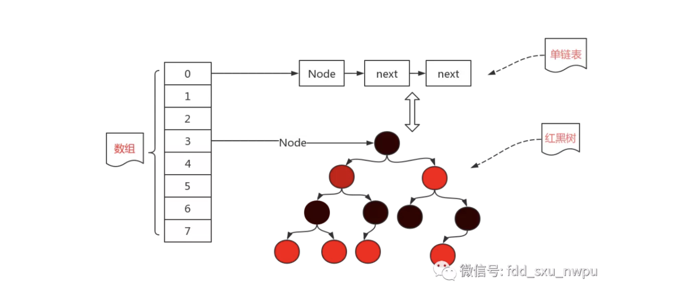

# HaseMap 实现原理

哈希表（hash table）也叫散列表，是一种非常重要的数据结构，应用场景及其丰富，许多缓存技术（比如memcached）的核心其实就是在内存中维护一张大的哈希表，而HashMap的实现原理也常常出现在各类的面试题中，重要性可见一斑。

> **在JDK1.6，JDK1.7中，HashMap采用位桶+链表实现，即使用链表处理冲突，**同一hash值的链表都存储在一个链表里。但是当位于一个桶中的元素较多，即hash值相等的元素较多时，通过key值依次查找的效率较低。**而JDK1.8中，HashMap采用位桶+链表+红黑树实现，当链表长度超过阈值（8）时，将链表转换为红黑树**，这样大大减少了查找时间。

## 储存结构

## 容量(Capacity)和负载因子(Load factor)

简单的说，Capacity就是buckets的数目，Load factor就是buckets填满程度的最大比例。如果对迭代性能要求很高的话不要把`capacity`设置过大，也不要把`load factor`设置过小。当bucket填充的数目（即hashmap中元素的个数）大于`capacity*load factor`时就需要调整buckets的数目为当前的2倍。

#### initialCapacity初始容量

官方要求我们要输入一个2的N次幂的值，比如说2、4、8、16等等这些，但是我们忽然一个不小心，输入了一个20怎么办？没关系，虚拟机会根据你输入的值，找一个离20最近的2的N次幂的值，比如说16离他最近，就取16为初始容量。

默认的初始容量就是 16。

#### loadFactor负载因子

负载因子，默认值是0.75。负载因子表示一个散列表的空间的使用程度，有这样一个公式：initailCapacity*loadFactor=HashMap的容量。
所以负载因子越大则散列表的装填程度越高，也就是能容纳更多的元素，元素多了，链表大了，所以此时索引效率就会降低。反之，负载因子越小则链表中的数据量就越稀疏，此时会对空间造成烂费，但是此时索引效率高。

为什么默认值会是0.75呢？

Poisson_distribution这不就是泊淞分布嘛。而且最关键的就是

当桶中元素到达8个的时候，概率已经变得非常小，也就是说用0.75作为加载因子，每个碰撞位置的链表长度超过８个是几乎不可能的。当桶中元素到达8个的时候，概率已经变得非常小，也就是说用0.75作为加载因子，每个碰撞位置的链表长度超过８个是几乎不可能的。

#### 扩容上线

在java 1.8中，如果链表的长度超过了8，那么链表将转换为红黑树。（桶的数量必须大于64，小于64的时候只会扩容）！！！

## 解决hash冲突

解决地址冲突的前提是计算的hash值出现了重复。

**在数据结构中，我们处理hash冲突常使用的方法有：开发定址法、再哈希法、链地址法、建立公共溢出区。而hashMap中处理hash冲突的方法就是链地址法。**

