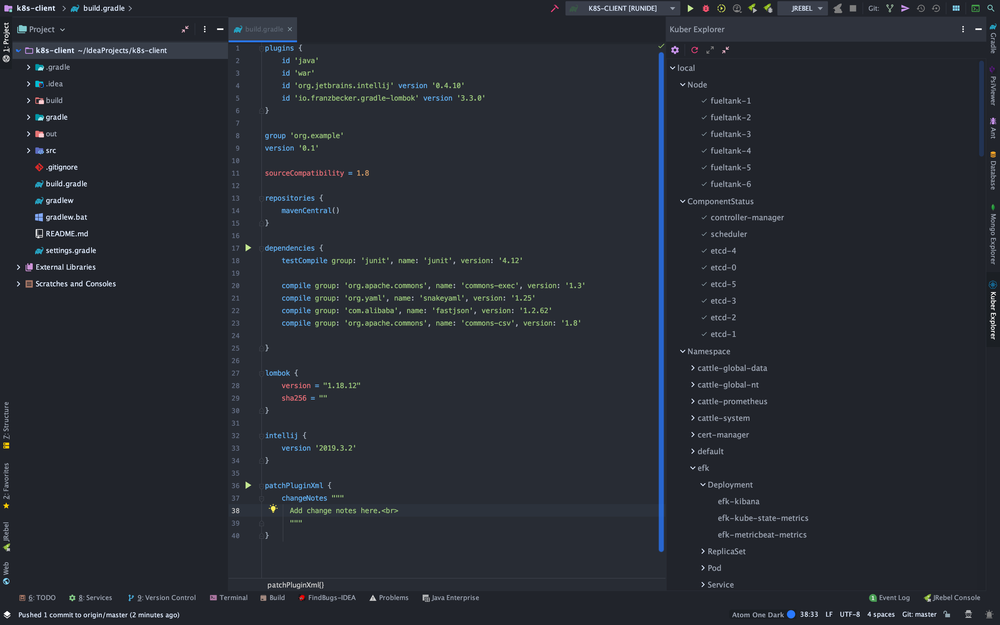
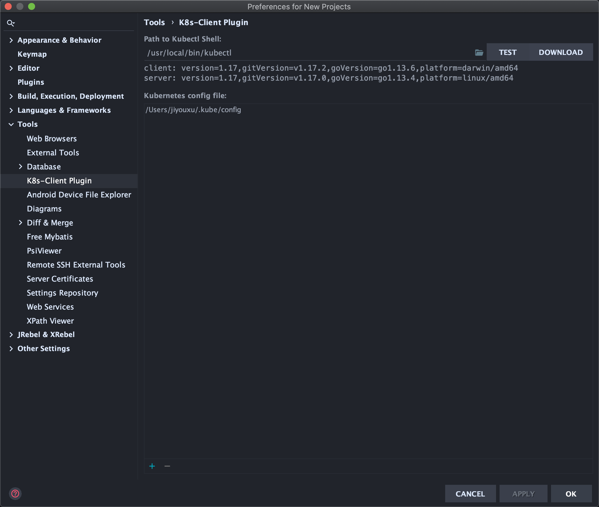

# IDEA 插件开发之 K8s-Client

IDEA 的图形界面是基于古老的 Java AWT 和 SWING，这俩东西简直难用且难看的发指，但是没办法，想开发 IDEA 的插件图形界面必须用到这俩东西，幸亏大学时期学 Java 时学过一点这俩东西，还算有点基础。

IDEA 插件开发的文档还是比较少的，官方文档做的也不够好，很乱，所以最好的学习方法就是看别人的插件代码来模仿。

---

## K8s-Client

想做一款 k8s 的客户端插件，功能通过调用本地的 `kubectl` 来实现。

代码地址在：https://github.com/xujiyou/idea-k8s-client

下面先看一下界面效果：

1，展示界面（右侧）



2，设置界面



暂时一共就这俩界面，配合 Metarial Theme 也挺酷炫的。

下面找几个关键点代码摘抄下来，这几点都是花了大把时间调试出来的，这里记录下来，全部代码可以看上边的代码库。

首先，要创建一个插件工程，推荐使用 Gradle 创建插件工程，这里网上教程很多，就不赘述了。

然后在 Gradle 加入必要的依赖包。

下面分节介绍关键点。

---

### 右侧工具栏

要创建工具栏，就要创建一个` toolWindow` 。

在 src - main - resources - META-INNF - plugin.xml 中的 extensions 加入以下代码：

```xml
<toolWindow id="Kuber Explorer" icon="/icons/kubernetes.svg" anchor="right" factoryClass="work.xujiyou.view.KubernetesToolWindowFactory"/>
```

icon 是放在 resources 目录下的，anchor 表示按钮在工具栏的位置。

类 KubernetesToolWindowFactory 要继承 ToolWindowFactory ，具体代码如下：

```java
package work.xujiyou.view;

import com.intellij.openapi.project.Project;
import com.intellij.openapi.wm.ToolWindow;
import com.intellij.openapi.wm.ToolWindowFactory;
import com.intellij.ui.content.Content;
import com.intellij.ui.content.ContentFactory;
import org.jetbrains.annotations.NotNull;

/**
 * KubernetesToolWindowFactory class
 *
 * @author jiyouxu
 * @date 2020/2/12
 */
public class KubernetesToolWindowFactory implements ToolWindowFactory {

    public static final KubernetesExplorerPanel KUBERNETES_EXPLORER_PANEL = new KubernetesExplorerPanel();

    @Override
    public void createToolWindowContent(@NotNull Project project, @NotNull ToolWindow toolWindow) {

        ContentFactory contentFactory = ContentFactory.SERVICE.getInstance();
        Content content = contentFactory.createContent(KUBERNETES_EXPLORER_PANEL, null, false);
        toolWindow.getContentManager().addContent(content);
    }

    @Override
    public void init(ToolWindow window) {
        System.out.println("init");
    }

    @Override
    public boolean shouldBeAvailable(@NotNull Project project) {
        return true;
    }

    @Override
    public boolean isDoNotActivateOnStart() {
        return false;
    }
}
```

这个类主要用来装入一个 Panel 。

主要代码集中在 KubernetesExplorerPanel，

在这个类中，主要干了三件事：布局，按钮，树形组件。

布局主要就是用的 AWT 的 BorderLayout 布局组件。

按钮的安放可以参考以下代码：

```java
private void installActions() {
        final TreeExpander treeExpander = new TreeExpander() {
            @Override
            public void expandAll() {
                kubernetesTree.expandRow(0);
            }

            @Override
            public boolean canExpand() {
                if (completeConfig()) { return false; }
                return !kubernetesTree.isExpanded(0);
            }

            @Override
            public void collapseAll() {
                kubernetesTree.collapseRow(0);
            }

            @Override
            public boolean canCollapse() {
                if (completeConfig()) { return false; }
                return !kubernetesTree.isCollapsed(0);
            }
        };

        CommonActionsManager actionsManager = CommonActionsManager.getInstance();
        final AnAction expandAllAction = actionsManager.createExpandAllAction(treeExpander, rootPanel);
        final AnAction collapseAllAction = actionsManager.createCollapseAllAction(treeExpander, rootPanel);
        Disposer.register(this, () -> {
            collapseAllAction.unregisterCustomShortcutSet(rootPanel);
            expandAllAction.unregisterCustomShortcutSet(rootPanel);
        });
        DefaultActionGroup actionGroup = new DefaultActionGroup("KubernetesExplorerGroup", false);
        RefreshServerAction refreshServerAction = new RefreshServerAction(this);
        if (ApplicationManager.getApplication() != null) {
            actionGroup.add(new OpenPluginSettingsAction());
            actionGroup.addSeparator();
            actionGroup.add(refreshServerAction);
            actionGroup.add(expandAllAction);
            actionGroup.add(collapseAllAction);

        }

        GuiUtils.installActionGroupInToolBar(actionGroup, toolBarPanel, ActionManager.getInstance(), "KubernetesExplorerActions", true);
    }
```

树的创建主要参考以下代码：

```java
   private Tree createTree() {
        Tree tree = new Tree(kubernetesTreeModel) {

            private final URL pluginSettingsUrl = GuiUtils.class.getResource("/general/add.png");
            private final JLabel emptyLabel = new JLabel(
                    String.format("<html><center>No Kubernetes config available<br><br>You may use  to add config</center></html>", pluginSettingsUrl)
            );

            @Override
            protected void paintComponent(Graphics g) {
                super.paintComponent(g);

                if (KubernetesConfiguration.getInstance().getServerConfigurations().size() != 0) {
                    return;
                }

                emptyLabel.setFont(getFont());
                emptyLabel.setBackground(getBackground());
                emptyLabel.setForeground(getForeground());
                Rectangle bounds = getBounds();
                Dimension size = emptyLabel.getPreferredSize();
                emptyLabel.setBounds(0, 0, size.width, size.height);

                int x = (bounds.width - size.width) / 2;
                Graphics g2 = g.create(bounds.x + x, bounds.y + 20, bounds.width, bounds.height);
                try {
                    emptyLabel.paint(g2);
                } finally {
                    g2.dispose();
                }
            }
        };

        tree.getEmptyText().clear();
        tree.getSelectionModel().setSelectionMode(TreeSelectionModel.SINGLE_TREE_SELECTION);
        tree.setName("kubernetesTree");
        tree.setRootVisible(false);
        tree.setCellRenderer((tree1, value, selected, expanded, leaf, row, hasFocus) -> {
            KubernetesNode kubernetesNode = (KubernetesNode) value;
            JLabel nameLabel = new JLabel(kubernetesNode.getName());
            if (kubernetesNode.getIcon() == null) {
                return nameLabel;
            } else {
                JPanel jPanel = new JPanel(new FlowLayout(FlowLayout.LEFT));
                jPanel.add(new JLabel(kubernetesNode.getIcon()));
                jPanel.add(nameLabel);
                return jPanel;
            }
        });

        tree.addTreeExpansionListener(new TreeExpansionListener() {
            @Override
            public void treeExpanded(TreeExpansionEvent event) {
                tree.setPaintBusy(true);
                ApplicationManager.getApplication().executeOnPooledThread(() -> {
                    KubernetesNode kubernetesNode = (KubernetesNode) event.getPath().getLastPathComponent();
                    kubernetesNode.findResources();
                    tree.setPaintBusy(false);
                    tree.updateUI();
                });
            }

            @Override
            public void treeCollapsed(TreeExpansionEvent event) {
                System.out.println("treeCollapsed");
            }
        });

        tree.addTreeSelectionListener(event -> {
            KubernetesNode kubernetesNode = (KubernetesNode) event.getPath().getLastPathComponent();

            JPopupMenu popupMenu = new JPopupMenu();
            JMenuItem menuItem = new JMenuItem(kubernetesNode.getName());
            popupMenu.add(menuItem);

            tree.setComponentPopupMenu(popupMenu);
        });

        return tree;
    }
```

Tree 中使用了 KubernetesTreeModel，这个类就设计的比较精巧了，通过一个 RootNode 和各个子级的 children 来实现一个树。

算了，太多了，不说了，想看具体实现的去看代码吧。
